# الدليل التقني الشامل للـBackend — مشروع 3D وRoom Preview وSeller Chat

> وثيقة تعليمية مبنية على الكود الفعلي بتاريخ 22 يونيو 2026. تشرح ما هو مطبق الآن، وتفصل بوضوح بين تطبيق `3d` وخدمة `chat/service` المستقلة، وبين الواقع الحالي والعمل المستقبلي. لا تتضمن أي قيمة سرية.

## طريقة قراءة الدليل

- **مطبق فعلياً:** توجد له ملفات ومسارات تنفيذية في الكود.
- **مطبق جزئياً:** توجد أجزاء منه، لكن التشغيل الكامل يحتاج إعداداً أو خدمة خارجية.
- **يحتاج تأكيد:** لا يمكن حسمه من المستودع وحده، مثل مكان استضافة الإنتاج والنسخ الاحتياطي.
- **مستقبلي — غير مطبق حالياً:** تصميم أو نقطة توسع موجودة، لكن لا يوجد اتصال إنتاجي بها، مثل SAP.

---

## 1. مقدمة مبسطة عن النظام

التطبيق منصة ويب مبنية بـNext.js، ولها مساران رئيسيان:

1. **Room Preview:** شاشة معرض تنشئ جلسة ورمز QR، ثم يرفع العميل صورة غرفة ويختار منتج أرضيات، ويولّد Gemini صورة للغرفة بالأرضية الجديدة.
2. **Seller Chat:** البائع يسجل الدخول ويسأل عن المخزون. تطبيق Next.js يتحقق من هوية البائع ثم يمرر السؤال إلى خدمة FastAPI مستقلة تملك منطق الشات وبيانات المخزون.

الأطراف المستخدمة هي العميل، البائع، شاشة المعرض، ومدير النظام.

### الفرق بين الأجزاء

| الجزء | المعنى المبسط | مثال فعلي |
|---|---|---|
| الواجهة الأمامية (Frontend) | ما يراه المستخدم ويتفاعل معه في المتصفح | شاشة QR، نموذج البائع، زر إنشاء الصورة |
| الخلفية (Backend) | الكود الخادمي الذي يتحقق ويقرأ ويكتب ويتصل بالخدمات | ملفات `app/api/**/route.ts` والخدمات داخل `lib/` |
| قاعدة البيانات (Database) | التخزين الدائم للبيانات المنظمة | PostgreSQL لجلسات Room Preview والبائعين، وقاعدة مخزون منفصلة لخدمة FastAPI |
| خدمة خارجية (External Service) | نظام يعمل خارج عملية Next.js | Gemini وRedis وR2 وخدمة FastAPI |
| واجهة برمجية (API) | عقد طلب واستجابة بين نظامين | `POST /api/room-preview/sessions` |

مثال حقيقي:

```text
العميل يطلب رفع صورة غرفة
        ↓
Next.js يتحقق من رمز جلسة Room Preview
        ↓
Next.js يصدر رابط PUT مؤقتاً إلى R2
        ↓
الجوال يرفع الصورة مباشرة إلى Object Storage
        ↓
الجوال يؤكد الرفع، وNext.js يحفظ رابط الصورة في PostgreSQL
```

الدليل من الكود:
- `app/api/room-preview/sessions/[sessionId]/room/upload-url/route.ts`
- `app/api/room-preview/sessions/[sessionId]/room/confirm-upload/route.ts`
- `lib/room-preview/session-repository.ts`

---

## 2. ملخص معماري للنظام

| المكوّن | ما هو؟ | وظيفته في المشروع | أين يعمل؟ | أين يوجد في الكود؟ |
|---|---|---|---|---|
| Next.js 16 | إطار تطبيق ويب وخادم API | الصفحات وRoute Handlers وServer Actions | خادم Node.js | `app/`, `package.json` |
| PostgreSQL الخاصة بـ3d | قاعدة بيانات علائقية | الجلسات والعملاء والشاشات والبائعون والتشخيص | خدمة قاعدة بيانات | `prisma/schema.prisma`, `lib/server/prisma.ts` |
| Prisma 7 | ORM/عميل قاعدة بيانات | تحويل استدعاءات TypeScript إلى SQL | داخل Next.js | `prisma/schema.prisma`, `lib/server/prisma.ts` |
| Redis | مخزن سريع مشترك | Pub/Sub وRate Limits والأقفال وSemaphore | خدمة Redis خارجية | `lib/redis.ts`, `lib/ip-rate-limit.ts` |
| R2/S3-compatible | تخزين كائنات | صور الغرف ونتائج Gemini | Cloudflare R2 أو S3 | `lib/storage.ts` |
| Gemini | خدمة ذكاء اصطناعي | توليد صورة Room Preview، وكذلك فهم سؤال الشات في FastAPI | Google API | `lib/room-preview/render-providers/`, `../chat/service/app/ai/` |
| FastAPI | خدمة Python مستقلة | الشات والمخزون والاستيراد وبعض ميزات AI | عملية/استضافة مستقلة | `../chat/service/app/` |
| SQLAlchemy | ORM في FastAPI | قراءة وكتابة قاعدة بيانات المخزون | داخل FastAPI | `../chat/service/app/core/db.py` |
| SSE | بث أحادي الاتجاه طويل الاتصال | دفع تحديثات الجلسة إلى شاشة المعرض | Next.js والمتصفح | `app/api/room-preview/sessions/[sessionId]/events/route.ts` |
| Sentry | مراقبة أخطاء وأداء | التقاط أخطاء Next.js عند ضبط DSN | خدمة خارجية | `sentry.server.config.ts`, `instrumentation.ts` |
| Sharp | معالجة صور على الخادم | قراءة الأبعاد والتدوير والتصغير والتحويل | داخل Node.js | `lib/room-preview/upload-service.ts`, `lib/room-preview/render-providers/gemini-image-utils.ts` |

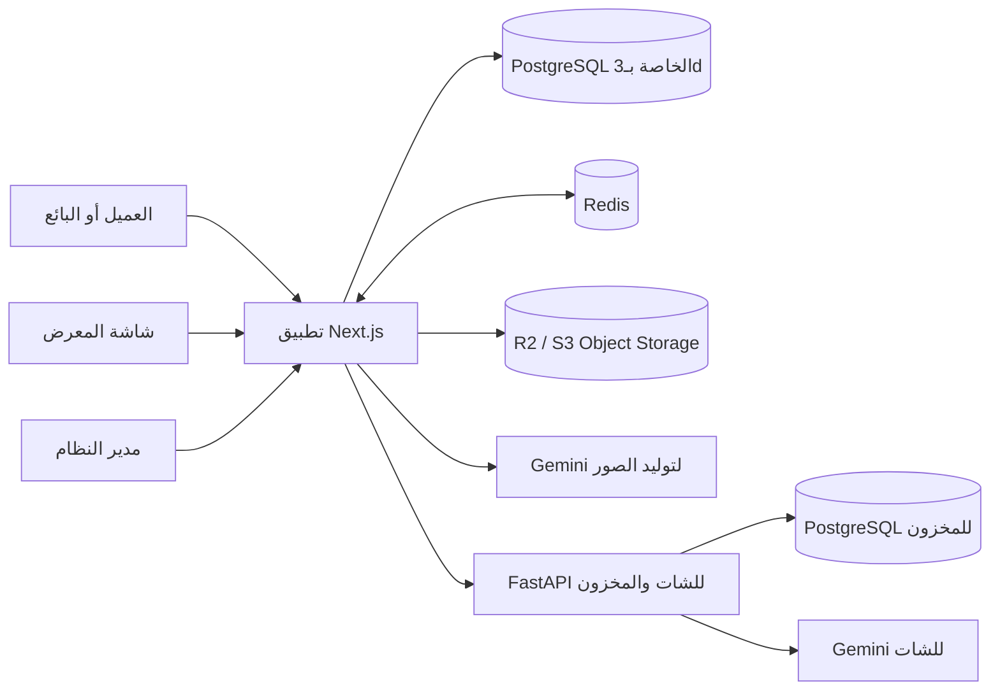

الدليل من الكود:
- `package.json`
- `prisma/schema.prisma`
- `lib/storage.ts`
- `lib/redis.ts`
- `lib/seller/fastapi.ts`
- `../chat/service/app/main.py`

---

## 3. قاموس المصطلحات التقنية

| المصطلح | المعنى المبسط | لماذا نستخدمه؟ | أين يستخدم؟ | التطبيق الفعلي |
|---|---|---|---|---|
| Backend | منطق يعمل على الخادم ولا يراه المتصفح | حماية الأسرار وتطبيق قواعد العمل | Next.js وFastAPI | Route Handlers وخدمات `lib/` |
| API | عنوان وطريقة وبيانات متفق عليها | ربط الواجهة بالخلفية أو خدمتين | جميع `app/api` | JSON أو SSE |
| Route Handler | دالة تعالج HTTP داخل Next.js | استقبال GET/POST/PATCH/DELETE | `app/api/**/route.ts` | تصدير `GET` أو `POST` مثلاً |
| Server Action | دالة خادمية تستدعيها صفحة Next.js | معالجة نماذج إدارية | تسجيل دخول Admin | `app/(admin)/admin/login/actions.ts` |
| PostgreSQL | قاعدة بيانات علائقية دائمة | الاتساق والعلاقات والاستعلام | 3d وFastAPI بقواعد منفصلة | `DATABASE_URL`, `PY_DATABASE_URL` |
| ORM | طبقة تحول كوداً إلى استعلامات قاعدة بيانات | تقليل SQL اليدوي وإعطاء أنواع | Prisma وSQLAlchemy | `prisma.seller.findUnique`, SQLAlchemy query |
| Prisma | ORM وليست قاعدة بيانات | نماذج وأنواع وهجرات واتصال | تطبيق 3d | `prisma/schema.prisma` |
| Model | وصف كيان مخزن كجدول | تحديد الحقول والعلاقات | Prisma وSQLAlchemy | `Seller`, `RoomPreviewSession`, `InventoryItem` |
| Migration | تغيير مؤرخ لبنية قاعدة البيانات | نشر تغييرات قابلة للتتبع | قاعدة 3d | `prisma/migrations/` |
| Connection Pool | مجموعة اتصالات يعاد استخدامها | منع فتح اتصال جديد لكل طلب | PostgreSQL | `pg.Pool` في `lib/server/prisma.ts` |
| JWT | رمز موقع يحمل Claims ويمكن التحقق منه | جلسة البائع واتصال Next.js بـFastAPI | Seller وFastAPI | مكتبتا `jose` و`PyJWT` |
| HMAC | توقيع يعتمد على سر مشترك | كشف تعديل الرموز | Admin وRoom Preview وJWT HS256 | `createHmac`, Web Crypto, JWT |
| Hashing | تحويل أحادي الاتجاه | تخزين كلمات المرور دون النص الأصلي | Seller | `bcryptjs` بكلفة 12 |
| Cookie HttpOnly | Cookie لا يستطيع JavaScript قراءتها | تقليل سرقة الجلسة عبر XSS | Seller/Admin/Room Preview | خيارات Cookie في ملفات الجلسة |
| Validation | التحقق من شكل وقيم المدخلات | منع بيانات غير صالحة | Zod وPydantic | `safeParse`, نماذج FastAPI |
| Redis | مخزن key/value سريع في الذاكرة | تنسيق عدة نسخ من التطبيق | حدود وأقفال وأحداث | `ioredis` |
| TTL | مدة بقاء مفتاح قبل حذفه | إزالة عدادات وأقفال تلقائياً | Redis | cooldown وsemaphore وrate limit |
| Pub/Sub | نشر رسالة لقناة ومشتركون يستقبلونها | تمرير تحديث بين Instances | Room Preview | `session-events.ts` |
| SSE | قناة خادم→متصفح فوق HTTP | تحديث شاشة المعرض دون طلب متكرر | Room Preview | EventSource وReadableStream |
| Polling | تكرار GET دورياً | بديل عند فشل SSE | شاشة وجوال Room Preview | `session-polling.ts` |
| Backoff | زيادة زمن الانتظار بين المحاولات | تخفيف الضغط عند الفشل | Redis وGemini وPolling | retryStrategy وretry loops |
| Object Storage | تخزين ملفات بمفاتيح لا بمجلد محلي | ملفات مشتركة ودائمة وقابلة للتوسع | صور Room Preview | R2/S3 |
| Bucket | حاوية للكائنات | تنظيم وصلاحيات التخزين | R2 | `R2_BUCKET_NAME` |
| Object Key | اسم فريد للكائن داخل Bucket | الوصول والحذف | رفع الصور والنتائج | `uploads/room-preview/...` |
| Presigned URL | رابط مؤقت موقّع لعملية محددة | رفع مباشر دون كشف مفاتيح R2 | رفع صورة الغرفة | رابط PUT صالح 300 ثانية |
| CORS | سياسة متصفح للطلبات بين Origins | السماح/المنع للرفع المباشر | R2 وAPI | إعداد R2 + headers في Next.js |
| Idempotency | منع تنفيذ نفس العملية مرتين | منع رندرين بسبب ضغط متكرر | Render | Redis lock + انتقال DB ذري |
| Semaphore | عداد فتحات تنفيذ متزامنة | حماية سعة Gemini | Render | Redis ZSET، افتراضياً 8 فتحات |
| Retry | إعادة المحاولة بعد فشل مؤقت | مقاومة timeout/5xx | Gemini | حتى 3 محاولات لكل نموذج |
| Timeout | حد أقصى للانتظار | منع تعليق الطلب | Gemini وFastAPI وDB | AbortController وPromise race |
| Background Work | عمل يستمر بعد إرسال الاستجابة | إعادة 202 بسرعة | Render | `after()` في Next.js |
| Cron | جدولة دورية لطلب أو مهمة | تشغيل cleanup | مسار موجود، الجدولة غير معرّفة | `app/api/room-preview/cleanup/route.ts` |
| Rate Limit | تحديد عدد عمليات ضمن مدة | منع إساءة الاستخدام والتكلفة | Login/Session/Render/Import | Redis أو memory حسب الجزء |
| Feature Flag | متغير يشغل/يعطل ميزة | نشر آمن أو تعطيل خدمة | Redis/Seller Chat/RAG | `ENABLE_REDIS`, `SELLER_CHAT_ENABLED` وغيرها |
| Observability | Logs وMetrics وTraces لفهم التشغيل | اكتشاف الأعطال | Pino وSentry وتشخيص الجلسات | `lib/logger.ts`, `SessionEvent` |
| Upstream | خدمة يعتمد عليها Backend | توصيف أخطاء FastAPI/Gemini/R2 | Seller Chat وRender | 502/503/504 الآمنة |

### Hashing في هذا المشروع

**المعنى المبسط:** كلمة مرور البائع تتحول إلى Hash لا يمكن عكسه إلى كلمة المرور الأصلية.

```text
كلمة المرور التي يكتبها البائع
        ↓
bcrypt.compare()
        ↓
مقارنتها مع passwordHash في PostgreSQL
        ↓
نجاح أو فشل
```

يستخدم المشروع `bcryptjs` مع 12 Salt Rounds، ويرفض أكثر من 72 بايت حتى لا يطبق bcrypt اقتطاعاً صامتاً. أما **Encryption** فيمكن عكسه بالمفتاح، ولذلك لا يناسب حفظ كلمات المرور.

ما أقوله للمدير: «كلمة مرور البائع لا تحفظ كنص واضح؛ المحفوظ Hash بـbcrypt ولا يمكن استخراج الأصل منه.»

الدليل من الكود:
- `lib/seller/password.ts`
- `app/api/seller/auth/login/route.ts`
- `prisma/schema.prisma`

---

## 4. Backend الخاص بـNext.js

الـPage يعرض مساراً للمستخدم، والـComponent جزء واجهة قابل لإعادة الاستخدام، بينما API Route يعالج HTTP على الخادم. Route Handler يقرأ `request.json()` أو headers أو cookies، يتحقق من المدخل والجلسة، يستدعي طبقة خدمة/Repository، ثم يعيد `NextResponse.json()`.

مثال تسجيل دخول البائع:

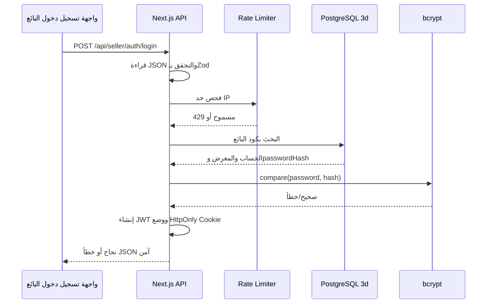

الأخطاء المتوقعة تتحول إلى 400/401/403/429. الأخطاء غير المتوقعة تسجل داخلياً ولا يفترض أن تعيد Stack Trace للمتصفح.

الدليل من الكود:
- `app/api/seller/auth/login/route.ts`
- `lib/seller/validation.ts`
- `lib/seller/session.ts`
- `lib/server/prisma.ts`

---

## 5. PostgreSQL وPrisma

PostgreSQL هي مخزن البيانات الحقيقي. Prisma تصف الجداول وتولد عميلاً Type-safe؛ حذف Prisma لا يحذف مفهوم قاعدة البيانات، لكنه يزيل طبقة الوصول الحالية.

### مفاهيم قاعدة البيانات في التنفيذ

- **Primary Key:** معرّف فريد، مثل `Seller.id`.
- **Foreign Key:** رابط يفرض وجود الطرف الآخر، مثل `Seller.showroomId`.
- **Unique Constraint:** يمنع التكرار، مثل `sellerCode` و`phoneE164`.
- **Index:** يسرع البحث، مثل status وexpiresAt.
- **Nullable Field:** قد يكون فارغاً، مثل `location` أو `customerId`.
- **Enum:** قيم محددة في بنية DB؛ المستخدم فعلياً لـ`SellerStatus` فقط. حالات Room Preview مخزنة String ويتحقق منها TypeScript.
- **Transaction:** مجموعة عمليات تنجح أو تفشل معاً؛ مستخدمة في تنظيف Render Jobs العالقة وفي استيراد FastAPI.
- **Migration:** SQL مؤرخ داخل `prisma/migrations`.
- **Connection Pool:** `pg.Pool` افتراضياً 3 اتصالات لكل عملية، قابل للضبط بـ`DATABASE_POOL_SIZE`.

### نماذج قاعدة 3d

| Model | ماذا يمثل؟ | أهم الحقول | العلاقات | من يستخدمه؟ |
|---|---|---|---|---|
| Screen | شاشة معرض مسجلة | secretHash, dailyBudget, lastRenderAt | جلسات عديدة | إنشاء الجلسة وحدود الرندر وAdmin |
| RoomPreviewSession | دورة تجربة واحدة | status, selectedRoom, selectedProduct, renderResult | Screen/UserSession/Customer/Jobs/Events | Room Preview |
| RenderJob | محاولة توليد | status, input, result, failureReason | Session واحدة | Render pipeline والتشخيص |
| SessionEvent | سجل زمني تقني | eventType, level, metadata | Session | Diagnostics |
| SessionIssue | مشكلة مجمعة | issueType, severity, status | Session | Recovery/Admin |
| UserSession | هوية بوابة الجوال | name, role, phone/employeeCode | Session وEvents | Gate/Analytics |
| Customer | عميل عائد | phoneE164, lastSeenAt, expiresAt | Sessions/Experiences | ذاكرة العميل |
| CustomerExperience | نتيجة محفوظة للعميل | room/product/result URLs | Customer | سجل آخر التجارب |
| Event | Analytics journey event | eventType, metadata | UserSession | التحليلات |
| Showroom | معرض البائع | code, name | Sellers | Seller/Admin |
| Seller | حساب بائع | sellerCode, passwordHash, status, tokenVersion | Showroom | Login/Seller Chat/Admin |

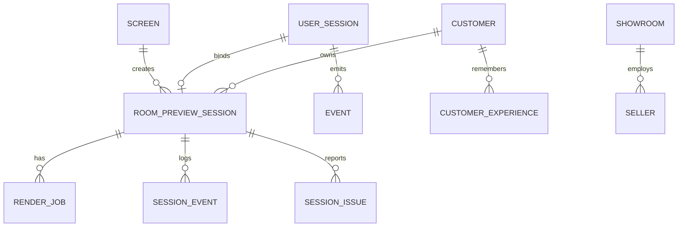

قاعدة 3d تحتوي هوية البائع والمعارض وجلسات Room Preview والعملاء والتشخيص. لا تحتوي مخزون Seller Chat. المخزون في PostgreSQL أخرى تصل إليها FastAPI عبر `PY_DATABASE_URL`، وفيها `InventoryItem`, `ChatMessage`, `DataImportLog`, `InventoryBackup` بحسب نماذج SQLAlchemy الفعلية.

إذا توقفت قاعدة 3d، تفشل المصادقة وإنشاء/تحديث الجلسات ولوحة الإدارة. وإذا توقفت قاعدة FastAPI، يتعطل الشات والمخزون والاستيراد، بينما Room Preview قد يستمر لأن قاعدته منفصلة.

الدليل من الكود:
- `prisma/schema.prisma`
- `prisma/migrations/`
- `lib/server/prisma.ts`
- `../chat/service/app/core/db.py`
- `../chat/service/app/models/`

---

## 6. تسجيل الدخول والأمان

### جلسة البائع (Seller Session)

1. يرسل المتصفح كود البائع وكود المعرض وكلمة المرور.
2. يتحقق Zod من الشكل.
3. يطبق حد 5 محاولات/60 ثانية لكل IP.
4. يبحث Prisma عن Seller.
5. يجري bcrypt comparison دائماً، حتى للحساب غير الموجود باستخدام Dummy Hash لتقليل كشف وجود الحساب بالزمن.
6. يتحقق من المعرض والحالة `active`.
7. ينشئ JWT HS256 لمدة 7 أيام، Claims الموثوقة هي `sub` و`tokenVersion`، مع issuer=`3d-app` وaudience=`seller`.
8. يخزن في `seller_session` كـHttpOnly وSameSite=Lax وSecure في الإنتاج.
9. كل طلب محمي يعيد قراءة Seller من قاعدة 3d، فلا يثق بالاسم أو المعرض من Cookie.
10. Logout يمسح Cookie. رفع `tokenVersion` أو تعطيل الحساب يبطل الجلسة عند الطلب التالي.

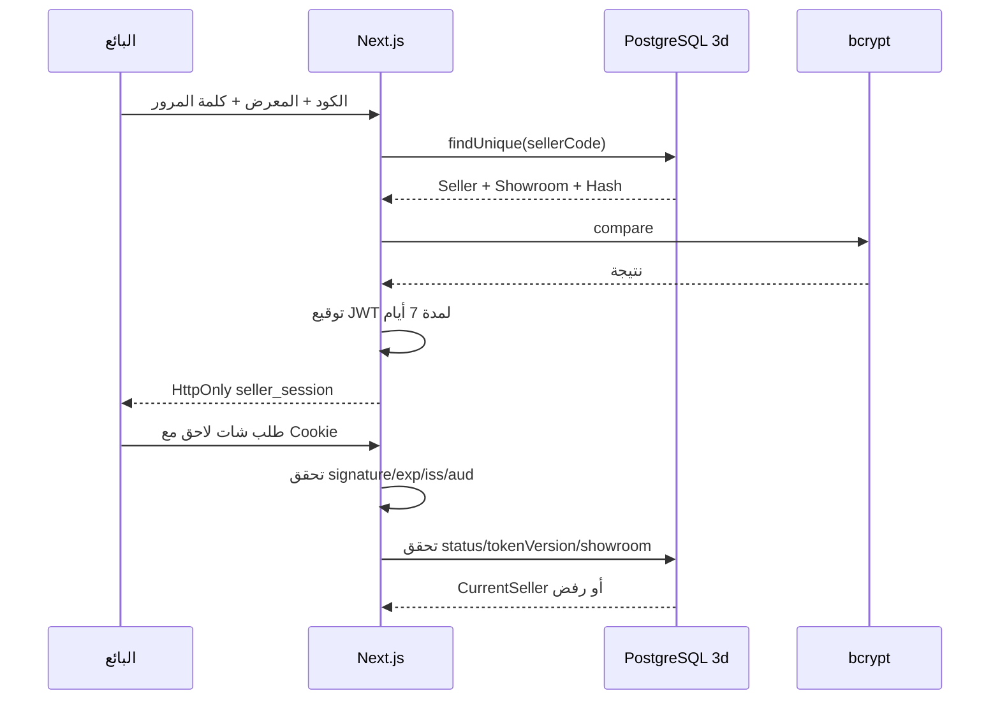

### جلسة Admin

Admin مختلف: اسم المستخدم وكلمة المرور من Environment Variables، لا من جدول. يقارن الخادم SHA-256 ثابت الطول بـ`timingSafeEqual`، ثم يصدر رمز HMAC مخصصاً لمدة 8 ساعات في `admin_session`، HttpOnly وSameSite=Strict. هذا ليس JWT قياسياً كاملاً رغم اسم `ADMIN_JWT_SECRET`؛ صيغته payload موقّع.

### Room Preview Token

رمز HMAC-SHA256 حتمي مبني على `sessionId` ولا يخزن في DB. يصل عبر Bearer أو header أو HttpOnly cookies بحسب الشاشة/الجوال.

### الرموز بين Next.js وFastAPI

- **External Seller JWT:** 60 ثانية، يحمل subject namespaced وshowroomId، ولا يحمل صلاحية Admin.
- **Internal Admin JWT:** 60 ثانية، role=admin لمسارات import/status/metrics.
- الأسرار الثلاثة `SELLER_SESSION_SECRET`, `EXTERNAL_SELLER_JWT_SECRET`, `INTERNAL_JWT_SECRET` حدود ثقة منفصلة، ويتحقق `lib/env.ts` من اختلافها في الإنتاج.

**Salt:** bcrypt يولده داخل Hash. **Cost factor:** 12. **Signature:** تثبت عدم تعديل JWT. **Claims:** البيانات داخل الرمز. **Issuer/Audience:** يحددان المصدر والمستقبل. **Expiration:** يمنع بقاء الرمز إلى الأبد. **Token Version:** يلغي جلسات Seller القديمة.

الدليل من الكود:
- `app/api/seller/auth/login/route.ts`
- `lib/seller/password.ts`
- `lib/seller/session.ts`
- `lib/seller/account-access.ts`
- `lib/admin/auth.ts`
- `app/(admin)/admin/login/actions.ts`
- `lib/room-preview/session-token.ts`
- `lib/seller/fastapi.ts`
- `lib/admin/fastapi-internal.ts`

---

## 7. دورة Room Preview Backend

1. شاشة المعرض تستدعي إنشاء Session؛ تحفظ DB حالة `waiting_for_mobile` وتصدر token وQR.
2. فتح رابط QR يضع token للجوال، لكن الاتصال الفعلي يتم بعد نجاح Gate.
3. Gate ينشئ/يربط `UserSession`، وقد ينشئ/يحدث Customer، ثم يطالب الانتقال إلى `mobile_connected` ذرياً.
4. الجوال يرفع صورة أو يختار Demo Room، فتنتقل إلى `room_selected`.
5. يختار المنتج، فتنتقل إلى `product_selected`.
6. زر الإنشاء يستدعي render API. بعد الأقفال والحدود تنتقل إلى `ready_to_render` ويعود HTTP 202.
7. `after()` يشغّل pipeline؛ انتقال DB ذري إلى `rendering` ثم RenderJob.
8. Gemini يعيد صورة؛ تحفظ في Storage وتنتقل الجلسة إلى `result_ready`.
9. SSE وPolling يظهران النتيجة على الشاشة والجوال.
10. Cleanup يحول `result_ready` إلى `completed` بعد 90 ثانية، أو الحالات القديمة إلى `expired`، أو العالقة إلى `failed`.

### الحالات الفعلية

| الحالة | معناها | كيف تبدأ؟ | التالية المعتادة | الفشل |
|---|---|---|---|---|
| created | قيمة مدعومة لكن الإنشاء الحالي يبدأ غالباً waiting | بيانات قديمة/مسار محتمل | waiting/mobile_connected | expiry |
| waiting_for_mobile | QR ينتظر Gate ناجحة | إنشاء session | mobile_connected | idle→expired |
| mobile_connected | Gate أكملت وربط الجوال تم | claim ذري | room_selected | expired |
| room_selected | صورة غرفة صالحة محفوظة | room API/confirm upload | product_selected | خطأ اختيار/expired |
| product_selected | المنتج محفوظ | product API | ready_to_render | validation/rate limit |
| ready_to_render | الطلب قبل بدء العامل | render API | rendering | stuck→failed |
| rendering | Gemini pipeline يعمل | DB atomic claim | result_ready | failed |
| result_ready | النتيجة محفوظة ومتاحة | نجاح Gemini | completed أو إعادة اختيار منتج | — |
| completed | عرض النتيجة اكتمل | cleanup بعد نافذة العرض | نهائية | — |
| failed | الرندر فشل أو علق | pipeline/cleanup | retry إلى room/product/ready بحسب الفعل | قد يتكرر الفشل |
| expired | الجلسة انتهت/ألغيت | وقت/cleanup/abandon | نهائية | — |

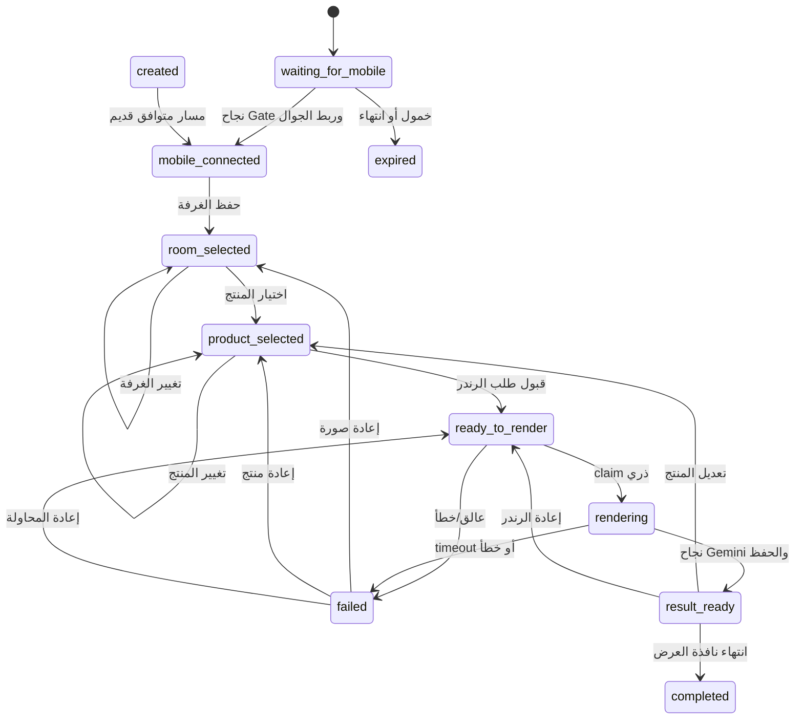

ملاحظة: `customerRoleSelected` مشتق حالياً من وجود `SessionEvent` باسم `gate_customer_role_selected` وليس عموداً مستقلاً. مسار Gate الأساسي يميز `customer` و`employee` في `UserSession`. يجب عدم مساواة فتح الرابط وحده بنجاح Gate.

الدليل من الكود:
- `lib/room-preview/types.ts`
- `lib/room-preview/session-machine.ts`
- `lib/room-preview/session-service.ts`
- `lib/room-preview/render-service.ts`
- `lib/room-preview/session-cleanup.ts`
- `lib/room-preview/mobile-gate-service.ts`

---

## 8. رفع الصور وObject Storage

في التطوير يمكن `lib/storage.ts` الكتابة إلى `public/`، لكن الكود يمنع التخزين المحلي في الإنتاج لأنه غير دائم وغير مشترك بين Instances. الإنتاج يدعم R2 أو S3-compatible. **S3-compatible** يعني أن الخدمة تستخدم بروتوكول AWS S3 حتى لو كان المزود Cloudflare.

المسار الأساسي للإنتاج:

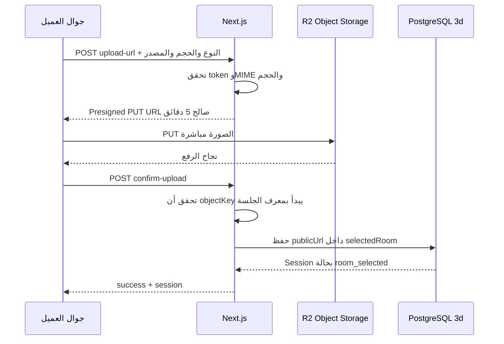

- القراءة الحالية تعتمد `R2_PUBLIC_URL`؛ أي أن الصور المطلوبة للعرض/Gemini لها URL عام. لا يوجد Presigned GET في تنفيذ Room Preview الحالي.
- رابط PUT صالح 300 ثانية.
- CORS يجب أن يسمح Origin المتصفح وطريقة PUT؛ الخطأ يظهر غالباً كفشل شبكة/status 0 في المتصفح.
- المسار المباشر يتحقق قبل إصدار الرابط من MIME والحجم، ويتحقق عند التأكيد من key وURL. لكنه **لا يجلب الكائن بعد الرفع للتحقق من Magic Bytes أو الأبعاد أو حتى وجوده**؛ هذه فجوة تحقق مقارنة بمسار الرفع عبر الخادم الذي يستخدم Sharp وMagic Bytes. ينبغي تسجيلها كملاحظة أمنية، لا كحماية موجودة.
- عند فشل الرفع لا تتغير الجلسة إلى `room_selected`، وتظهر رسالة آمنة، ويمكن للعميل إعادة المحاولة.

الدليل من الكود:
- `lib/storage.ts`
- `lib/room-preview/upload-service.ts`
- `app/api/room-preview/sessions/[sessionId]/room/upload-url/route.ts`
- `app/api/room-preview/sessions/[sessionId]/room/confirm-upload/route.ts`

---

## 9. تكامل Gemini وتوليد الصورة

الـBackend يحمّل صورة الغرفة وصورة المنتج، يطبق EXIF rotation ويصغرهما عبر Sharp، ويبني Prompt من نوع المنتج واسمه ومنطقة الأرضية إن وجدت وأبعاد الصورة. الوضع الافتراضي `balanced`: ضلع طويل 1280 للغرفة و768 للمنتج. النموذج الافتراضي هو `gemini-3.1-flash-image-preview`، ويمكن تغييره بالبيئة.

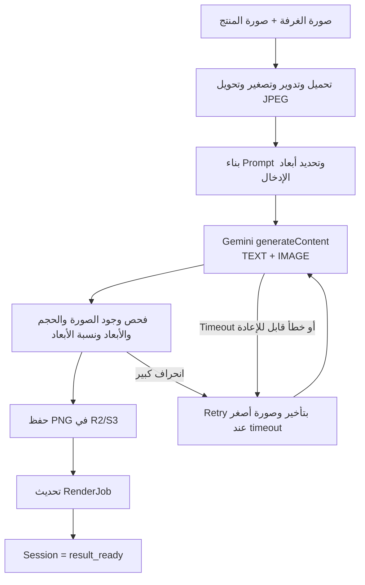

النقاط الفعلية:

- حتى 3 محاولات لكل نموذج، مع تأخير أساسي 3 ثوانٍ للأخطاء القابلة للإعادة.
- timeout افتراضي 60 ثانية للمحاولة الأولى و90 لللاحقة؛ القيم قابلة للضبط ومقيدة في الكود.
- النتيجة يجب أن تتجاوز 10KB وأبعادها 400px على الأقل.
- انحراف Aspect Ratio أكبر من الحدود يسبب إعادة صارمة أو رفضاً؛ الحد التحذيري 2% والرفض 5%.
- Semaphore موزع في Redis، افتراضياً 8 عمليات Gemini متزامنة، وTTL 330 ثانية.
- لا يوجد Hedged Request متوازٍ فعلي في المسار الحالي؛ توجد إشارات دعم للإلغاء الخارجي واختبارات تاريخية، لكن provider الحالي ينفذ حلقة Retry متسلسلة. كتابة «Hedged Request مستخدم» ستكون غير صحيحة.
- عند النجاح تحفظ الصورة تحت `uploads/room-preview/renders/`.
- عند الفشل يسجل السبب داخلياً في RenderJob/SessionEvent/SessionIssue، وتتحول الجلسة إلى `failed`; واجهة المستخدم لا تستلم Stack Trace.
- التكلفة مرتبطة بعدد الاستدعاءات وحجم الصور والمحاولات. الحدود لكل Session/Device/Screen وSemaphore تقلل الإنفاق، لكن لا توجد أسعار ثابتة في الكود.

الدليل من الكود:
- `lib/room-preview/render-providers/gemini-config.ts`
- `lib/room-preview/render-providers/gemini-provider.ts`
- `lib/room-preview/render-providers/gemini-image-utils.ts`
- `lib/room-preview/prompt-template-v2.ts`
- `lib/room-preview/gemini-semaphore.ts`
- `lib/room-preview/render-service.ts`

---

## 10. Redis والعمليات اللحظية

Redis أسرع في عدادات قصيرة العمر ورسائل Pub/Sub لأنه يعمل أساساً في الذاكرة، لكنه لا يستبدل PostgreSQL: لا يمثل المصدر الدائم للعلاقات والنتائج. المشروع يستخدم ثلاثة اتصالات منفصلة: publisher وsubscriber وcommand.

ما يخزنه/ينفذه:

- عدادات Rate Limit بـ`INCR` و`EXPIRE`.
- Active Sessions لكل IP في ZSET.
- Render Lock بـ`SET NX EX`.
- Device cooldown.
- Gemini Semaphore في ZSET.
- قنوات Pub/Sub لكل Session.

لا يخزن Redis Session payload كمرجع دائم؛ payload الحقيقي في PostgreSQL.

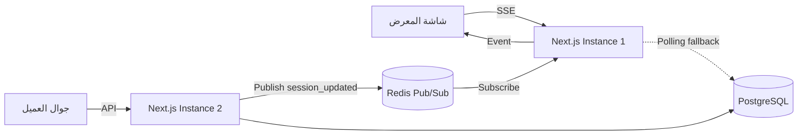

عند تعطل Redis:

- قاعدة البيانات وRoom Preview وGemini قد تستمر.
- IP rate limit يعود إلى memory داخل كل عملية.
- Redis render lock يتجاوز الفحص، لكن انتقال DB الذري `ready_to_render → rendering` يبقى حاجز التكرار.
- Gemini Semaphore وdevice cooldown يفشلان Open؛ الحماية تصبح أضعف.
- Pub/Sub يعود إلى event bus محلي، فلا تعبر الأحداث بين Instance مختلفة؛ Polling يعوض قراءة الحالة من DB.

الذاكرة المحلية لا تكفي مع أكثر من خادم لأن كل Instance لها Map مختلفة. Redis هو نقطة التنسيق المشتركة.

الدليل من الكود:
- `lib/redis.ts`
- `lib/ip-rate-limit.ts`
- `lib/room-preview/session-events.ts`
- `lib/room-preview/render-rate-limit.ts`
- `lib/room-preview/gemini-semaphore.ts`

---

## 11. SSE وPolling

SSE اتصال HTTP طويل يرسل من الخادم إلى المتصفح. WebSocket ثنائي الاتجاه ويحتاج بروتوكول/بنية أكثر تعقيداً؛ هنا الجوال يرسل التغييرات عبر HTTP عادي، والشاشة تحتاج استقبال تحديثات فقط، لذا SSE مناسب.

| التقنية | الاتجاه | التعقيد | الاستخدام الفعلي |
|---|---|---|---|
| SSE | خادم → متصفح | متوسط | `session_updated` وkeepalive للشاشة |
| WebSocket | ثنائي | أعلى | غير مستخدم لمسار Room Preview |
| Polling | متصفح → خادم دورياً | بسيط لكن أكثر طلبات | fallback ومتابعة render result |

مسار SSE يرسل retry=3000ms وkeepalive كل 15 ثانية، ويمنع Proxy buffering عبر `X-Accel-Buffering: no`. إذا قطع Proxy الاتصال، EventSource يعيد الاتصال؛ وإذا فشل اشتراك Redis يغلق الخادم stream حتى ينتقل العميل إلى polling. Polling ذكي حسب الحالة من 1–4 ثوانٍ، ويضاعف الفترة ×4 عندما تكون الصفحة hidden. متابعة الرندر تبدأ 2.5 ثانية ثم 5 ثم 10 ثوانٍ.

الدليل من الكود:
- `app/api/room-preview/sessions/[sessionId]/events/route.ts`
- `lib/room-preview/session-polling.ts`
- `features/room-preview/screen/useScreenSession.ts`

---

## 12. Seller Chat وFastAPI

FastAPI ليست داخل عملية Next.js؛ هي خدمة Python فعلية في المشروع الشقيق `chat/service`. المتصفح لا يتصل بها مباشرة، حتى لا يرى URL أو JWT أو يستطيع إرسال sellerId/showroomId مزور.

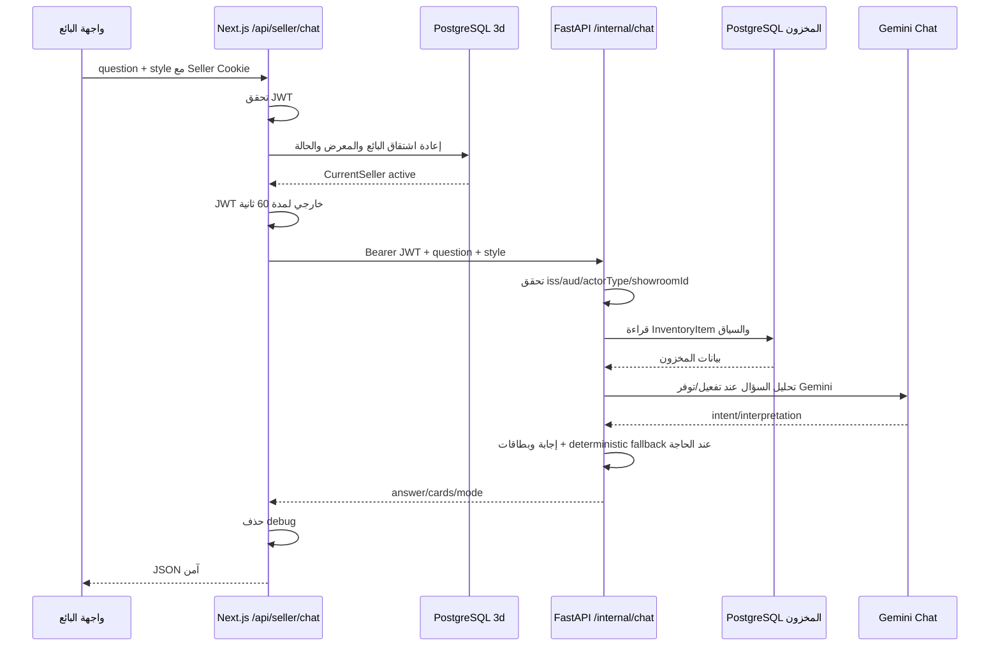

FastAPI تستخدم PostgreSQL عبر SQLAlchemy. `InventoryItem` هو المصدر الحالي، وExcel import يكتب إليه. اقتراح الأكواد يستدعي endpoint يعيد أكواداً فقط دون الكميات، بمهلة 8 ثوانٍ ويفشل إلى قائمة فارغة. سؤال الشات مهلة Next.js له 45 ثانية، ويعود 504 للtimeout و503 لعدم الوصول/الإعداد و502 لاستجابة upstream غير صالحة.

FastAPI نفسها تستخدم Gemini `gemini-2.5-flash` افتراضياً للشات، ولديها deterministic fallback عند غياب المفتاح أو فشل AI. ميزات Web Knowledge وLangChain وVoice وTechnical RAG موجودة ومطفأة افتراضياً؛ Seller Chat الجديد في 3d لا يعرض كل هذه المسارات.

إذا تعطلت FastAPI يتوقف Seller Chat واقتراح الأكواد وAdmin import/status/metrics المتعلقة بالشات، لكن Room Preview يستمر لأنه لا يعتمد عليها. Admin يتصل بـFastAPI برمز Internal Admin مختلف.

الدليل من الكود:
- `app/api/seller/chat/route.ts`
- `lib/seller/fastapi.ts`
- `lib/seller/auth.ts`
- `lib/admin/fastapi-internal.ts`
- `../chat/service/app/api/routers/chat.py`
- `../chat/service/app/repositories/inventory_repository.py`
- `../chat/service/app/core/security.py`

---

## 13. لوحة Admin والـBackend

كل Admin API يتحقق من `admin_session` الموقعة. Seller Cookie أو Room Preview token لا يمنح Admin. العمليات الفعلية: إدارة Sellers/Showrooms/Screens، import inventory preview/apply/history/cancel، chatbot status/metrics، render performance، وsystem health.

| API group | الوظيفة | المسموح | الخدمات |
|---|---|---|---|
| `/api/admin/chatbot/sellers*` | عرض/إنشاء/تعديل البائعين | Admin | PostgreSQL 3d + bcrypt |
| `/api/admin/chatbot/showrooms*` | عرض/إنشاء/تعديل المعارض | Admin | PostgreSQL 3d |
| `/api/admin/screens*` | إدارة شاشات Room Preview وميزانيتها | Admin | PostgreSQL 3d |
| `/api/admin/chatbot/import/*` | معاينة/تأكيد/إلغاء/تاريخ الاستيراد | Admin | FastAPI + DB المخزون |
| `/api/admin/chatbot/status` | حالة الشات + أعداد محلية | Admin | FastAPI + PostgreSQL 3d |
| `/api/admin/chatbot/metrics` | مؤشرات نشاط الشات | Admin | FastAPI + PostgreSQL 3d |
| `/api/admin/render-performance` | أداء RenderJobs | Admin | PostgreSQL 3d |
| `/api/admin/system-health` | صحة 3d وإعداداته | Admin | DB/Redis/config checks |

الدليل من الكود:
- `lib/admin/require-admin.ts`
- `app/api/admin/`
- `lib/admin/fastapi-internal.ts`

---

## 14. Rate Limiting والحماية من إساءة الاستخدام

| النطاق | الحد الفعلي | المفتاح/المخزن | عند غياب Redis |
|---|---|---|---|
| Seller login | 5/60 ثانية | IP، Redis ثم memory | يعمل داخل كل process |
| Admin login | 5/60 ثانية | IP، Redis ثم memory | يعمل داخل كل process |
| Session creation | 10/60 ثانية | IP | memory fallback |
| Active sessions | 5 متزامنة/IP | Redis ZSET | الفحص يتجاوز Fail-open |
| Render/session | افتراضياً 2 | عمود DB `renderCount` | يستمر لأنه DB |
| Render/device | cooldown 5 دقائق | Redis | يتجاوز عند الفشل |
| Render/screen | budget يومي افتراضياً 15 + cooldown | PostgreSQL | يستمر |
| Render/global concurrency | افتراضياً 8 | Redis Semaphore | يتجاوز عند الفشل |
| Duplicate render | lock 330 ثانية | Redis + DB atomic claim | DB guard يبقى |
| FastAPI import confirm | 5/ساعة | ذاكرة عملية FastAPI | غير موزع |
| FastAPI restore confirm | 3/ساعة | ذاكرة عملية FastAPI | غير موزع |

HTTP 429 يعني أن الطلب مفهوم لكنه تجاوز الحد، وغالباً يتضمن `Retry-After`. يوجد flag تطويري لتعطيل حدود Room Preview؛ يجب ألا يستخدم في الإنتاج. لا تعرض هذه الوثيقة تفاصيل مفاتيح Redis القابلة للاستغلال أكثر من التصميم العام.

الدليل من الكود:
- `lib/ip-rate-limit.ts`
- `app/api/room-preview/sessions/route.ts`
- `app/api/room-preview/sessions/[sessionId]/render/route.ts`
- `lib/room-preview/render-rate-limit.ts`
- `lib/room-preview/gemini-semaphore.ts`
- `../chat/service/app/core/rate_limit.py`

---

## 15. Background Jobs وCleanup

لا توجد Queue أو Worker مستقل. الرندر يعمل داخل `after()` في Invocation نفسها بحد `maxDuration=300`. هذا Background Work مرتبط بعمر منصة Next.js وليس Worker دائم.

Cleanup route ينفذ:

- كشف المشاكل العالقة.
- تحويل `ready_to_render/rendering` الأقدم من 7 دقائق إلى `failed`.
- تحويل `result_ready` الأقدم من 90 ثانية إلى `completed`.
- إنهاء `waiting_for_mobile` الخاملة أكثر من دقيقة.
- إنهاء باقي الجلسات الحية بعد `expiresAt`.
- تسجيل mobile stale دون إنهاء الجلسة.

لا يحذف المسار حالياً سجلات Sessions أو الصور أو Customer/CustomerExperience المنتهية؛ هو يغير حالات ويسجل مشاكل. عبارة «ينظف النتائج المنتهية ويحذف الملفات» غير صحيحة حالياً.

```mermaid
flowchart TD
    CRON[Scheduler خارجي] -->|GET + Secret| ROUTE[/api/room-preview/cleanup]
    ROUTE --> AUTH{CLEANUP_SECRET أو CRON_SECRET صحيح؟}
    AUTH -->|لا| DENY[401]
    AUTH -->|نعم| DETECT[detectStuckSessions]
    DETECT --> STUCK[العالق → failed]
    DETECT --> READY[result_ready القديم → completed]
    DETECT --> IDLE[waiting الخامل → expired]
    DETECT --> EXP[expiresAt → expired]
    DETECT --> PRES[تسجيل mobile stale]
    STUCK --> EVENT[DB events + SSE publish]
    READY --> EVENT
    IDLE --> EVENT
    EXP --> EVENT
```

في التطوير، `instrumentation.ts` يشغل interval كل 5 دقائق لبعض عمليات cleanup. في الإنتاج التعليق يقول إن Vercel Cron مسؤول، لكن `vercel.json` الحالي `{}` ولا يعرّف cron. لذلك **جدولة الإنتاج تحتاج تأكيد وإعداد فعلي**.

الدليل من الكود:
- `app/api/room-preview/cleanup/route.ts`
- `lib/room-preview/session-cleanup.ts`
- `lib/room-preview/render-job-cleanup.ts`
- `instrumentation.ts`
- `vercel.json`

---

## 16. معالجة الأخطاء

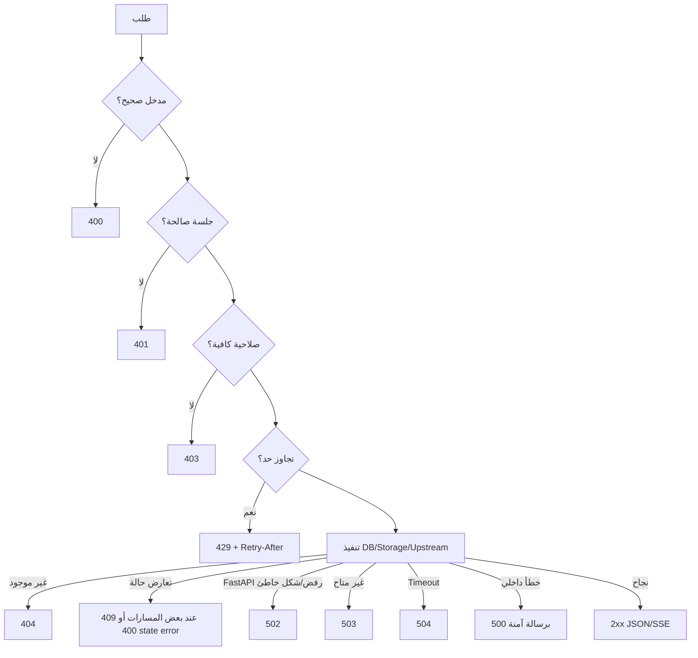

| الرمز | المعنى في المشروع |
|---|---|
| 400 | JSON/validation/state غير صالح |
| 401 | token/cookie غير موجود أو غير صالح |
| 403 | حساب Seller disabled أو صلاحية Admin غير موجودة |
| 404 | Session/Customer/Product/endpoint dev غير موجود |
| 409 | تعارض uniqueness/import أو عملية متزامنة في بعض Admin flows |
| 429 | login/session/render/import limit |
| 500 | خطأ داخلي أو DB/storage غير متوقع |
| 502 | FastAPI أجابت بخطأ أو JSON غير صالح |
| 503 | خدمة/feature غير متاحة أو health degraded |
| 504 | FastAPI timeout |

Pino يسجل structured logs. SessionEvent/Issue تحفظ تفاصيل تشغيل Room Preview. Sentry يتهيأ عند startup إذا وجد `NEXT_PUBLIC_SENTRY_DSN` ويرسل traces بنسبة مختلفة حسب البيئة. رسائل upstream الداخلية تصنف ثم تستبدل برسالة عربية آمنة في Seller Chat.

الدليل من الكود:
- `lib/logger.ts`
- `lib/room-preview/session-diagnostics.ts`
- `app/api/seller/chat/route.ts`
- `lib/seller/fastapi.ts`
- `sentry.server.config.ts`
- `instrumentation.ts`

---

## 17. Health Checks والمراقبة

**Liveness** يجيب: هل العملية حية؟ **Readiness** يجيب: هل الاعتماديات اللازمة جاهزة؟

| الفحص | الوصول | ما يفحص فعلياً | الحالات |
|---|---|---|---|
| `GET /api/health` | عام | `SELECT 1` لقاعدة 3d، وRedis فقط إن كان configured | `ok/degraded`, check `ok/error`; 200 أو 503 |
| `GET /api/admin/system-health` | Admin | DB latency، Redis latency، إعداد Storage، وجود Gemini key، env، session counts | `ok` boolean؛ 200 أو 207 |
| FastAPI `GET /healthz` | عام | العملية فقط | `ok` |
| FastAPI `GET /readyz` | عام | DB المخزون + memory limiter status | `ready/degraded/unhealthy`; 200 أو 503 |
| Admin chatbot status | Admin | DB/Inventory/import/Gemini configured داخل FastAPI | `ready/degraded/not_configured` |

مهم: System Health لا ينفذ upload اختبارياً ولا Gemini generation ولا FastAPI call شاملاً ضمن `/api/admin/system-health`; Storage وGemini فحص إعداد فقط. R2 CORS له endpoint داخلي منفصل، وFastAPI لها status API عبر Admin. لذلك لا نصفها بأنها Active end-to-end checks.

الدليل من الكود:
- `app/api/health/route.ts`
- `app/api/admin/system-health/route.ts`
- `app/api/internal/r2-cors-test/route.ts`
- `app/api/admin/chatbot/status/route.ts`
- `../chat/service/app/api/routers/health.py`
- `../chat/service/app/api/routers/admin_meta.py`

---

## 18. Environment Variables والأسرار

لا توجد قيم في هذا الدليل.

| المجموعة | أمثلة أسماء | ماذا تتحكم به؟ | حساسة؟ | الاستخدام |
|---|---|---|---|---|
| Database | `DATABASE_URL`, `DIRECT_URL`, `DATABASE_POOL_SIZE` | قاعدة 3d والهجرات والـpool | URL حساس | Prisma/pg |
| Room tokens | `SESSION_TOKEN_SECRET`, `SESSION_EXPIRY_MINUTES` | توقيع ومدة Room Preview | السر حساس | session token/repository |
| Admin | `ADMIN_USERNAME`, `ADMIN_PASSWORD`, `ADMIN_JWT_SECRET` | دخول وجلسة Admin | نعم | Server Actions/Admin APIs |
| Seller | `SELLER_SESSION_SECRET`, `SELLER_CHAT_ENABLED` | جلسة البائع وfeature flag | السر حساس | Seller backend |
| FastAPI bridge | `CHATBOT_FASTAPI_URL`, `EXTERNAL_SELLER_JWT_SECRET`, `INTERNAL_JWT_SECRET` | الاتصال وحدود الثقة | الأسرار حساسة؛ URL server-only | Seller/Admin bridge |
| Gemini render | `GEMINI_API_KEY`, `ROOM_PREVIEW_GEMINI_IMAGE_MODEL`, `GEMINI_IMAGE_MODELS`, timeout/quality variables | نموذج الرندر وجودته ومهله | API key حساس | Gemini provider |
| Redis | `REDIS_URL`, `ENABLE_REDIS`, `GEMINI_MAX_CONCURRENT` | التنسيق والحدود | URL حساس | Redis clients |
| Storage | `STORAGE_PROVIDER`, `R2_ENDPOINT`, `R2_BUCKET_NAME`, `R2_ACCESS_KEY_ID`, `R2_SECRET_ACCESS_KEY`, `R2_PUBLIC_URL` | R2/S3 | access/secret حساسان | Storage/upload |
| Cleanup | `CLEANUP_SECRET`, `CRON_SECRET` | حماية المهمة | نعم | cleanup route |
| Monitoring | `NEXT_PUBLIC_SENTRY_DSN`, `SENTRY_ORG`, `SENTRY_PROJECT`, `LOG_LEVEL` | Sentry/logging | DSN public by design؛ CI credentials خارج القائمة تحتاج حماية | instrumentation |
| Flags | `ROOM_PREVIEW_SINGLE_SCREEN_MODE`, `ROOM_PREVIEW_DISABLE_RATE_LIMIT`, `ROOM_PREVIEW_DEBUG_RENDER_ARTIFACTS` | سلوك تشغيلي/تشخيص | ليست أسراراً لكن خطرة إن أسئ ضبطها | Room Preview |
| Public | `NEXT_PUBLIC_BASE_URL`, `NEXT_PUBLIC_SENTRY_DSN` | قيم تصل للمتصفح | لا توضع فيها أسرار | QR/client/Sentry |
| FastAPI | `PY_DATABASE_URL`, `APP_ENV`, `GEMINI_API_KEY`, `GEMINI_MODEL`, JWT secrets، AI feature flags | قاعدة المخزون والشات | URLs/keys/secrets حساسة | `chat/service` |

أي متغير يبدأ `NEXT_PUBLIC_` قد يدمجه Next.js في JavaScript العميل. Server-only variables لا تكون آمنة إذا طبعت في logs أو أرجعت في API. الأسرار لا توضع في Git أو README أو البريد أو Screenshot أو Frontend.

**Secret Rotation:** تغيير Seller secret يبطل كل cookies القديمة. تغيير external/internal secret يحتاج تنسيق Next.js وFastAPI في نفس نافذة النشر. تغيير storage أو DB credentials يحتاج تحديث الخدمة ثم اختبار readiness. تغيير Room Preview secret يبطل tokens للجلسات المفتوحة.

الدليل من الكود:
- `lib/env.ts`
- `next.config.ts`
- `lib/storage.ts`
- `lib/redis.ts`
- `../chat/service/app/core/config.py`
- `.gitignore`

---

## 19. جرد APIs الفعلي

### Room Preview وUpload

| Method | Path | الوظيفة | Auth | DB/Service |
|---|---|---|---|---|
| POST | `/api/room-preview/sessions` | إنشاء Session/token | Rate limit؛ screen token اختياري | PostgreSQL/Redis |
| GET | `/api/room-preview/sessions/[sessionId]` | قراءة Session | session token بحسب route | PostgreSQL |
| GET/POST | `/api/room-preview/sessions/[sessionId]/activate` | تفعيل رابط الجوال ووضع Cookie | token في الرابط/body | Cookie/DB/events |
| POST | `/api/room-preview/sessions/[sessionId]/screen-token` | وضع screen Cookie | session token | Cookie |
| POST | `/api/room-preview/sessions/[sessionId]/connect` | claim اتصال الجوال | session token | PostgreSQL/Redis events |
| POST | `/api/room-preview/mobile/gate` | تسجيل عميل/موظف وربط الجلسة | session token | PostgreSQL |
| GET | `/api/room-preview/mobile/products` | قائمة منتجات Room Preview | query/session context | ملفات/كتالوج Room Preview |
| POST | `/api/room-preview/mobile/request-retry` | استعادة اختيار وإعادة المحاولة | session token | PostgreSQL |
| POST | `/api/room-preview/sessions/[sessionId]/room` | Demo أو multipart room | session token | Storage/PostgreSQL |
| POST | `/api/room-preview/sessions/[sessionId]/room/upload-url` | إصدار Presigned PUT | session token | R2 |
| POST | `/api/room-preview/sessions/[sessionId]/room/confirm-upload` | تثبيت رابط الصورة | session token | PostgreSQL |
| POST | `/api/room-preview/sessions/[sessionId]/product` | حفظ المنتج | session token | كتالوج/PostgreSQL |
| POST | `/api/room-preview/sessions/[sessionId]/render` | قبول وتشغيل الرندر | session token + limits | DB/Redis/Gemini/Storage |
| GET | `/api/room-preview/sessions/[sessionId]/events` | SSE updates | header أو screen Cookie | Redis/Memory/DB |
| POST | `/api/room-preview/sessions/[sessionId]/heartbeat` | presence | mobile/screen token | PostgreSQL |
| POST | `/api/room-preview/sessions/[sessionId]/abandon` | إنهاء الجلسة | session token | PostgreSQL |
| POST | `/api/room-preview/sessions/[sessionId]/diagnostics` | تسجيل diagnostics مسموحة | تحقق payload/context | PostgreSQL |
| POST | `/api/room-preview/sessions/[sessionId]/test-render` | مسار اختبار | dev فقط + token | Render flow |
| GET | `/api/room-preview/dev-entry` | إنشاء دخول تطوير | dev فقط | PostgreSQL |
| GET | `/api/room-preview/cleanup` | تنظيف الحالات | cleanup/cron secret؛ مفتوح فقط إن لم يضبطا | PostgreSQL/Redis events |

### Seller وAuthentication وFastAPI Bridge

| Method | Path | الوظيفة | Auth | DB/Service |
|---|---|---|---|---|
| POST | `/api/seller/auth/login` | دخول البائع | credentials + IP limit | PostgreSQL/bcrypt |
| POST | `/api/seller/auth/logout` | مسح Cookie | لا يلزم | Cookie |
| GET | `/api/seller/auth/me` | البائع الحالي | seller Cookie | PostgreSQL |
| POST | `/api/seller/chat` | سؤال المخزون | seller Cookie | PostgreSQL 3d + FastAPI |
| GET | `/api/seller/inventory/code-suggestions` | اقتراح الأكواد | seller Cookie | FastAPI inventory |

### Admin

| Method | Path | الوظيفة | Auth | DB/Service |
|---|---|---|---|---|
| GET/POST | `/api/admin/chatbot/sellers` | قائمة/إنشاء بائع | Admin | PostgreSQL 3d |
| PATCH | `/api/admin/chatbot/sellers/[id]` | تعديل/تعطيل/تغيير بائع | Admin | PostgreSQL 3d |
| GET/POST | `/api/admin/chatbot/showrooms` | قائمة/إنشاء معرض | Admin | PostgreSQL 3d |
| PATCH | `/api/admin/chatbot/showrooms/[id]` | تعديل معرض | Admin | PostgreSQL 3d |
| POST | `/api/admin/chatbot/import/preview` | معاينة Excel | Admin | FastAPI |
| POST | `/api/admin/chatbot/import/apply` | تأكيد الاستيراد | Admin | FastAPI/Inventory DB |
| POST | `/api/admin/chatbot/import/cancel` | إلغاء preview محلي | Admin | Next.js state/response |
| GET | `/api/admin/chatbot/import/history` | تاريخ الاستيراد | Admin | FastAPI/Inventory DB |
| GET | `/api/admin/chatbot/status` | حالة الشات | Admin | 3d DB + FastAPI |
| GET | `/api/admin/chatbot/metrics` | مؤشرات الشات | Admin | 3d DB + FastAPI |
| GET/POST | `/api/admin/screens` | قائمة/إنشاء شاشات | Admin | PostgreSQL 3d |
| PATCH/DELETE | `/api/admin/screens/[screenId]` | تعديل/حذف شاشة | Admin | PostgreSQL 3d |
| GET | `/api/admin/render-performance` | أزمنة الرندر | Admin | PostgreSQL 3d |
| GET | `/api/admin/system-health` | حالة النظام | Admin | DB/Redis/config |

### Health/Internal

| Method | Path | الوظيفة | Auth | Service |
|---|---|---|---|---|
| GET | `/api/health` | صحة عامة مختصرة | عام | DB/Redis |
| GET | `/api/internal/r2-cors-test` | تشخيص R2/CORS | `DEBUG_SECRET` في الإنتاج | R2 config/network |

### FastAPI التي يستخدمها 3d

| Method | Path | المستهلك | Auth | البيانات |
|---|---|---|---|---|
| POST | `/internal/chat` | Seller Chat | external seller أو internal JWT | Inventory DB/Gemini |
| GET | `/internal/inventory/code-suggestions` | autocomplete | external seller أو internal JWT | أكواد المخزون |
| POST | `/internal/import/inventory/preview` | Admin | internal admin JWT | Excel/DB |
| POST | `/internal/import/inventory/confirm` | Admin | internal admin JWT | DB/backup/import |
| GET | `/internal/import/inventory/history` | Admin | internal admin JWT | DataImportLog |
| GET | `/internal/admin/chatbot-status` | Admin | internal admin JWT | DB/config |
| GET | `/internal/admin/chatbot-metrics` | Admin | internal admin JWT | ChatMessage |
| GET | `/healthz`, `/readyz` | التشغيل | عام | process/DB/limiter |

توجد مسارات FastAPI إضافية للمخزون والوثائق والصوت، لكنها ليست كلها مستهلكة من واجهة 3d الحالية، لذلك لا نخلط بين «موجودة في FastAPI» و«مستخدمة في التطبيق الجديد».

الدليل من الكود:
- `app/api/`
- `lib/admin/fastapi-internal.ts`
- `lib/seller/fastapi.ts`
- `../chat/service/app/api/routers/`

---

## 20. دورة الطلب Request Lifecycle

### أ. تسجيل دخول البائع

- البداية: صفحة login ترسل JSON.
- API: `/api/seller/auth/login`.
- التحقق: Zod، IP limit، bcrypt، showroom، status.
- DB: Seller + Showroom في قاعدة 3d.
- الاستجابة: Cookie + redirectTo.
- الأخطاء: 400/401 generic/403 disabled/429.
- الملفات: `app/api/seller/auth/login/route.ts`, `lib/seller/password.ts`, `lib/seller/session.ts`.

### ب. رفع غرفة وتوليد النتيجة

- البداية: الجوال يطلب Presigned URL ويرفع إلى R2.
- API: upload-url ثم confirm-upload ثم product ثم render.
- التحقق: session HMAC، file metadata، state machine، locks/limits.
- DB: selectedRoom/product، RenderJob، statuses/events/issues.
- الخدمات: R2، Redis، Gemini.
- الاستجابة: 202 سريع، ثم SSE/Polling حتى result_ready.
- الأخطاء: upload 4xx/5xx، 429 limits، failed/timeout في الجلسة.
- الملفات: upload routes، `render/route.ts`, `render-service.ts`, Gemini provider.

### ج. سؤال Seller Chat

- البداية: البائع يرسل question/style.
- API: `/api/seller/chat`.
- التحقق: seller Cookie ثم DB، Zod strict.
- DB: قاعدة 3d للهوية، قاعدة FastAPI للمخزون وChatMessage.
- الخدمات: FastAPI وقد تستخدم Gemini Chat.
- الاستجابة: answer/cards بعد حذف debug.
- الأخطاء: 401/400/502/503/504 برسالة آمنة.
- الملفات: `app/api/seller/chat/route.ts`, `lib/seller/fastapi.ts`, `../chat/service/app/api/routers/chat.py`.

---

## 21. خريطة ملفات Backend

| الملف أو المجلد | دوره | متى أراجعه؟ |
|---|---|---|
| `app/api/` | جميع HTTP APIs في Next.js | عند تتبع endpoint |
| `prisma/schema.prisma` | حقيقة جداول 3d وعلاقاتها | عند سؤال البيانات |
| `prisma/migrations/` | تاريخ إنشاء/تغيير DB | عند النشر أو اختلاف schema |
| `lib/server/prisma.ts` | اتصال وPool | مشاكل DB connections |
| `lib/env.ts` | متطلبات startup | فشل الإقلاع |
| `lib/seller/` | auth/session/FastAPI bridge | Seller Login/Chat |
| `lib/admin/` | Admin auth وFastAPI bridge وqueries | لوحة الإدارة |
| `lib/room-preview/session-*` | الحالة والتخزين والأحداث | دورة Session |
| `lib/room-preview/render-*` | طلب وتشغيل وتتبع الرندر | Gemini/Render failure |
| `lib/room-preview/render-providers/` | Gemini وتجهيز الصور | جودة/timeout/model |
| `lib/storage.ts` | Local/R2/S3 | upload/result storage |
| `lib/redis.ts` | Redis clients | realtime/limits |
| `lib/ip-rate-limit.ts` | IP limits/active sessions | 429 أو Redis outage |
| `instrumentation.ts` | startup env/Sentry/dev cleanup | الإقلاع |
| `next.config.ts` | headers/images/Sentry/build config | Proxy/security/CORS |
| `../chat/service/app/main.py` | FastAPI entry | تشغيل خدمة الشات |
| `../chat/service/app/core/` | config/security/DB/rate limit | تشغيل وأمان FastAPI |
| `../chat/service/app/api/routers/` | FastAPI endpoints | تتبع الشات/import/health |
| `../chat/service/app/models/` | نماذج DB المخزون | مكان بيانات المخزون |
| `../chat/service/app/ai/` | Chat AI/RAG/voice | سلوك إجابات الشات |

---

## 22. نظرة التهديدات والحماية

| الخطر | مثال | الحماية الموجودة | الحالة |
|---|---|---|---|
| سرقة كلمة مرور من DB | تسريب Seller table | bcrypt cost 12، لا plaintext | مطبق |
| Account enumeration | معرفة هل الكود موجود | رسالة 401 عامة + dummy hash | مطبق |
| سرقة Cookie عبر JS | XSS | HttpOnly | مطبق؛ لا يغني عن منع XSS |
| تزوير Session token | تعديل sessionId | HMAC وتحقق timing-safe | مطبق |
| Seller يرسل showroomId مزور | body manipulation | الهوية تعاد من DB؛ schema strict | مطبق |
| Seller يصل Admin | JWT خارجي يحمل role مزور | أسرار ومبادئ منفصلة + require_admin | مطبق |
| ضغط render مرتين | double tap/network retry | Redis lock + DB atomic claim | مطبق |
| استنزاف Gemini | جلسات كثيرة | session/device/screen/global limits | مطبق؛ بعضه يضعف دون Redis |
| ملف مزيف | Content-Type مزور | server-upload magic bytes/Sharp | مطبق لمسار server upload فقط؛ المباشر يحتاج تعزيز |
| ربط object لغير session | objectKey خارجي | prefix sessionId | مطبق |
| كشف أسرار في health | public diagnostics | health العام مختصر، التفاصيل Admin | مطبق |
| Clickjacking/MIME sniffing | iframe/file script | DENY + nosniff + HSTS prod | مطبق |
| تسريب تفاصيل upstream | FastAPI stack | تصنيف ورسالة آمنة وحذف debug | مطبق |
| Cron غير محمي | تشغيل cleanup عشوائياً | secret comparison | مطبق عند ضبط secret؛ مفتوح إن لم يضبط أي سر |
| أسرار في Git | `.env` committed | `.gitignore` | مطبق كوقاية، يحتاج Secret Scanning تشغيلياً |

الدليل من الكود:
- `next.config.ts`
- `lib/seller/password.ts`
- `lib/seller/fastapi.ts`
- `lib/room-preview/api-guard.ts`
- `app/api/room-preview/cleanup/route.ts`

---

## 23. ماذا يحدث عند تعطل كل خدمة؟

| الخدمة المتعطلة | ما يتوقف؟ | ما يستمر؟ | كيف نعرف؟ | الحل الأولي |
|---|---|---|---|---|
| PostgreSQL 3d | Login Seller، Room Preview، Admin | صفحات ثابتة وFastAPI نفسها | `/api/health`, logs | فحص DB/pool/network |
| Redis | realtime cross-instance وبعض الحدود | DB وrender غالباً + polling | health/admin warning/logs | استعادة Redis؛ إبقاء polling |
| R2/S3 | رفع الصور وحفظ النتائج | Login/Chat وبيانات DB | upload/render errors | فحص credentials/CORS/quota |
| Gemini Render | إنشاء صورة جديدة | Session/Gate/Seller Chat قد يستمر | session failed/issues/logs | فحص key/model/quota/status ثم retry |
| FastAPI | Seller Chat/import/status | Room Preview وSeller login | 502/503/504 وAdmin status | تشغيل FastAPI وفحص readyz/network |
| FastAPI Inventory DB | الشات والمخزون/import | Room Preview وFastAPI liveness | `/readyz` unhealthy | استعادة DB/connection |
| Gemini Chat فقط | AI chat | deterministic fallback في FastAPI؛ Room Preview إن key/provider منفصل صالح | mode/fallback metrics | فحص key/model؛ الاعتماد على fallback مؤقتاً |
| Sentry | التقاط الأخطاء الخارجي | التطبيق نفسه | غياب events | فحص DSN/egress |
| Cleanup scheduler | تراكم حالات عالقة/غير منتهية | الطلبات اليومية حتى تتراكم | Admin counts/issues | جدولة route وتشغيل يدوي آمن |
| الإنترنت/egress | Gemini/R2/FastAPI/managed DB حسب الموقع | أجزاء محلية محدودة | health/timeouts | استعادة الشبكة/DNS/firewall |

---

## 24. النشر والاستضافة

Next.js يحتاج Node.js مناسباً لـNext 16، تثبيت dependencies، `prisma generate`, `next build`, ثم `next start` (المنفذ الافتراضي 3000). قاعدة البيانات تحتاج migrations منفصلة ومدروسة. أمام Node غالباً Reverse Proxy أو منصة managed تنهي HTTPS على 443 وتوجه إلى التطبيق. Domain يعتمد على DNS.

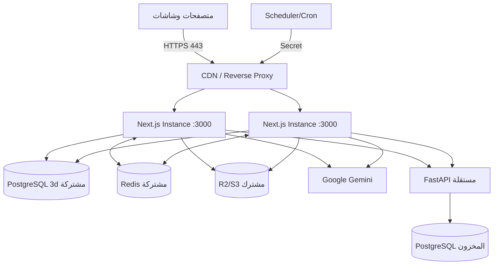

- **Staging:** بيئة اختبار بأسرار وقواعد وBuckets منفصلة.
- **Production:** بيئة العملاء مع مراقبة ونسخ احتياطي وتغيير مضبوط.
- **Rollback:** إعادة نسخة التطبيق لا تعني عكس Migration تلقائياً؛ تغييرات DB تحتاج خطة توافق.
- **Stateless scaling:** Cookies موقعة وDB مشتركة تسمح بعدة Instances، لكن Redis وObject Storage المشتركان مطلوبان لتناسق realtime والملفات.
- نسخ مجلد المشروع لا يكفي: نحتاج runtime، dependencies، env، DB migrations، Redis، storage، network، TLS، scheduler، observability.
- FastAPI لها `Procfile` يشغل Uvicorn على `$PORT`. مكان استضافتها الحالي **يحتاج تأكيد**.
- الاتصالات الصادرة: PostgreSQL، Redis، R2/S3، Google Gemini، FastAPI، Sentry؛ وFastAPI إلى قاعدة المخزون وGemini وربما Tavily عند تفعيلها.
- نسخة Node الفعلية في الإنتاج، الـreverse proxy، RPO/RTO، ومزود النسخ الاحتياطي تحتاج تأكيد.

الدليل من الكود:
- `package.json`
- `lib/server/prisma.ts`
- `next.config.ts`
- `../chat/service/Procfile`
- `../chat/service/requirements.txt`

---

## 25. SAP

SAP غير مربوطة حالياً. لا توجد Environment Variables أو API calls إلى SAP في تطبيق 3d أو FastAPI. يوجد فقط `SAPInventoryRepository` placeholder يرمي `NotImplementedError`، بينما التنفيذ المستخدم هو `PostgresInventoryRepository`.

نقطة الربط المنطقية مستقبلاً هي طبقة `InventoryRepository` داخل FastAPI، أو عملية مزامنة من SAP إلى جدول `InventoryItem`. الاستضافة تعني أين تعمل الخدمات؛ ربط SAP يعني عقد بيانات، مصادقة، شبكة، صلاحيات، وتناسق أعمال، وهما قراران مختلفان.

الخيارات التي يجب أن يناقشها SAP وIT دون اختيار مسبق: OData، REST، BAPI/RFC، IDoc، SAP BTP، Middleware، VPN، IP Allowlist، وهل القراءة مباشرة أم مزامنة مجدولة. يلزم أيضاً تعريف warehouse mapping، availability semantics، latency، ownership، وfallback.

**مستقبلي — غير مطبق حالياً.**

الدليل من الكود:
- `../chat/service/app/repositories/inventory_repository.py`
- `../chat/service/app/api/routers/admin_meta.py`
- `docs/sap-integration-meeting-guide.md`

---

## 26. أسئلة متوقعة من المدير وإجابات جاهزة

### 1) أين تخزن بيانات العملاء؟
**المبسطة:** في PostgreSQL الخاصة بتطبيق 3d، والصور في R2/S3.  
**التقنية:** Customer/UserSession/RoomPreviewSession في Prisma، والحقول تحمل URLs لا bytes.  
**الدليل:** `prisma/schema.prisma`, `lib/storage.ts`.

### 2) هل نخزن كلمات مرور البائعين؟
**المبسطة:** نخزن Hash فقط.  
**التقنية:** `passwordHash` باستخدام bcryptjs cost 12.  
**الدليل:** `lib/seller/password.ts`, `prisma/schema.prisma`.

### 3) هل يستطيع المطور قراءة كلمة المرور الأصلية؟
**المبسطة:** لا يمكن عكس bcrypt Hash. يمكن فقط اختبار كلمة مرور مدخلة.  
**التقنية:** `bcrypt.compare()` لا decrypt.  
**الدليل:** `lib/seller/password.ts`.

### 4) ماذا يحدث إذا توقفت Gemini؟
**المبسطة:** يفشل توليد الصورة برسالة آمنة ويمكن إعادة المحاولة؛ باقي النظام لا يسقط كله.  
**التقنية:** retry/timeout ثم Session=`failed` وRenderJob failure.  
**الدليل:** `gemini-provider.ts`, `render-service.ts`.

### 5) هل التطبيق يحتاج GPU؟
**المبسطة:** خادم التطبيق لا يحتاج GPU لأن Gemini خدمة خارجية.  
**التقنية:** Node/Python يجهزان الصور والطلبات؛ inference عند Google.  
**الدليل:** `@google/genai`, `google-genai` dependencies.

### 6) لماذا نحتاج Redis؟
**المبسطة:** لتنسيق الأحداث والحدود بين أكثر من نسخة من الخادم.  
**التقنية:** Pub/Sub, locks, rate limits, semaphore.  
**الدليل:** `lib/redis.ts` وما يستهلكه.

### 7) لماذا نحتاج FastAPI منفصلة؟
**المبسطة:** منطق وبيانات المخزون والشات موجودان في خدمة Python مستقلة.  
**التقنية:** Next.js BFF يصدر JWT قصير العمر إلى `/internal/*`.  
**الدليل:** `lib/seller/fastapi.ts`, `../chat/service/app/`.

### 8) هل يمكن تشغيل النظام داخل الشركة؟
**المبسطة:** نعم مع توفير Node وPython وقاعدتين وRedis وStorage واتصالات خارجية، أو بدائل داخلية.  
**التقنية:** يلزم تصميم deployment وegress وTLS وbackup؛ ليس مجرد نسخ ملفات.  
**الدليل:** dependencies وملفات config.

### 9) هل الصور محفوظة على السيرفر؟
**المبسطة:** التطوير قد يستخدم القرص؛ الإنتاج يجب أن يستخدم R2/S3.  
**التقنية:** guard يمنع local provider في production.  
**الدليل:** `lib/storage.ts`.

### 10) هل SAP مربوطة؟
**المبسطة:** لا.  
**التقنية:** repository الحالي PostgreSQL وSAP class placeholder فقط.  
**الدليل:** `inventory_repository.py`.

### 11) هل يمكن تشغيل أكثر من شاشة؟
**المبسطة:** نعم؛ Screen model وميزانية لكل شاشة موجودان.  
**التقنية:** session قد ترتبط بـscreenId، مع dailyBudget/cooldown.  
**الدليل:** `prisma/schema.prisma`, `screen-repository.ts`.

### 12) ماذا يحدث إذا تعطل الإنترنت؟
**المبسطة:** الخدمات السحابية لا تعمل؛ قد تبقى واجهات محملة وبعض بيانات محلية، لكن التدفقات الأساسية تتعطل.  
**التقنية:** Gemini/R2/managed DB/Redis/FastAPI تحتاج network حسب الاستضافة.  
**الدليل:** service clients.

### 13) هل يمكن تشغيل أكثر من نسخة Next.js؟
**المبسطة:** نعم بشرط DB وRedis وStorage مشتركة.  
**التقنية:** in-memory fallback وحدها لا تنسق Instances.  
**الدليل:** `lib/redis.ts`, `session-events.ts`.

### 14) كيف نمنع الاستخدام الزائد للذكاء الاصطناعي؟
**المبسطة:** حدود للجلسة والجهاز والشاشة وعدد العمليات المتزامنة.  
**التقنية:** DB counts + Redis cooldown/lock/semaphore + screen budget.  
**الدليل:** render route/rate-limit/semaphore.

### 15) من يتحمل النسخ الاحتياطي؟
**المبسطة:** يحتاج اتفاقاً مع IT ومزودي DB/Storage؛ الكود لا يعرّف سياسة RPO/RTO.  
**التقنية:** Inventory import يصنع backups منطقية، لكنه ليس Backup كاملاً للخدمات.  
**الدليل:** `InventoryBackup`; **يحتاج تأكيد**.

### 16) كيف نعرف أن الخدمة متعطلة؟
**المبسطة:** health endpoints وAdmin health وlogs وSentry.  
**التقنية:** DB/Redis readiness جزئي؛ ليست كل الفحوص end-to-end.  
**الدليل:** health routes وSentry config.

### 17) هل توجد أسرار داخل Git؟
**المبسطة:** `.env*` مستبعدة، لكن الجزم بعدم وجود سر تاريخي يحتاج Secret Scan وتدوير أي سر مكشوف.  
**التقنية:** هذا التحليل لم يعرض قيماً ولم يفحص تاريخ Git كاملاً.  
**الدليل:** `.gitignore`; **يحتاج تأكيد أمني**.

### 18) لماذا نحتاج HTTPS؟
**المبسطة:** لحماية Cookies والبيانات والصور من التنصت والتعديل.  
**التقنية:** Secure cookies وHSTS في production.  
**الدليل:** `next.config.ts`, session cookie options.

### 19) هل بيانات المخزون داخل PostgreSQL 3d؟
**المبسطة:** لا؛ في PostgreSQL منفصلة خلف FastAPI.  
**التقنية:** InventoryItem SQLAlchemy عبر `PY_DATABASE_URL`.  
**الدليل:** FastAPI models/db.

### 20) ما الفرق بين Staging وProduction؟
**المبسطة:** Staging للاختبار، Production للعملاء. يجب فصل البيانات والأسرار.  
**التقنية:** الكود يفرق NODE_ENV/APP_ENV، لكن بنية البيئتين الفعلية تحتاج IT.  
**الدليل:** env/config files.

### 21) هل Room Preview يتوقف إذا توقفت FastAPI؟
**المبسطة:** لا؛ FastAPI تخص Seller Chat والمخزون.  
**التقنية:** Render يتصل مباشرة بـGemini ولا يستدعي FastAPI.  
**الدليل:** render provider وseller bridge.

### 22) هل النتيجة محفوظة دائماً؟
**المبسطة:** الرابط وCustomerExperience يمكن أن يبقيا، لكن lifecycle حذف الملفات والسجلات المنتهية غير مطبق في cleanup الحالي.  
**التقنية:** expiresAt موجود، ولا يوجد delete job مقابل له.  
**الدليل:** schema وsession-cleanup.

### 23) ماذا لو ضغط العميل زر الإنشاء مرتين؟
**المبسطة:** توجد حواجز تمنع طلبين فعليين.  
**التقنية:** UI lock، Redis NX lock، DB atomic status claim.  
**الدليل:** ResultStep/useRenderAction/render route/repository.

### 24) هل Health Check تختبر Gemini فعلياً؟
**المبسطة:** لا؛ تفحص وجود الإعداد فقط، لتجنب تكلفة طلب تجريبي.  
**التقنية:** `Boolean(GEMINI_API_KEY)` في Admin health.  
**الدليل:** `app/api/admin/system-health/route.ts`.

### 25) هل Cleanup تعمل تلقائياً في الإنتاج؟
**المبسطة:** المسار جاهز، لكن جدول Cron غير موجود في `vercel.json` الحالي.  
**التقنية:** يلزم scheduler خارجي يرسل secret.  
**الدليل:** cleanup route، `vercel.json`; **يحتاج تأكيد من IT**.

---

## 27. ملخص للحفظ قبل الاجتماع

### أهم 20 معلومة

1. Next.js يحتوي الواجهة وBackend API معاً، وFastAPI خدمة مستقلة للشات والمخزون.
2. PostgreSQL هي قاعدة البيانات؛ Prisma مجرد ORM لقاعدة 3d.
3. مخزون Seller Chat ليس في قاعدة 3d، بل في قاعدة PostgreSQL خلف FastAPI.
4. Seller password محفوظة bcrypt Hash بكلفة 12، لا نصاً واضحاً.
5. Admin credentials حالياً Environment Variables وليست Seller table.
6. Seller/Admin/Room Preview/FastAPI لها رموز وحدود ثقة منفصلة.
7. صور الإنتاج يجب أن تحفظ في R2/S3، لا قرص الخادم.
8. رفع R2 المباشر يستخدم Presigned PUT صالحاً 5 دقائق.
9. Room Preview session هي state machine محفوظة في PostgreSQL.
10. render API يعيد 202 ثم يشغل Gemini في `after()`.
11. Redis ينسق Pub/Sub والحدود والأقفال وGemini semaphore.
12. دون Redis يستمر جزء كبير، لكن realtime والحدود تصبح single-instance/best-effort.
13. SSE هو المسار اللحظي، وPolling هو fallback.
14. Gemini يستلم صورتي الغرفة والمنتج وPrompt ويرجع صورة تحفظ في Storage.
15. يوجد Retry وTimeout وفحص أبعاد، ولا يوجد Hedged Request متوازٍ حالياً.
16. Seller Chat يمر دائماً عبر Next.js ولا يكشف FastAPI للمتصفح.
17. تعطّل FastAPI لا يوقف Room Preview.
18. Cleanup route موجود، لكن جدولة production تحتاج إعداداً.
19. SAP غير مربوطة؛ نقطة التوسع هي InventoryRepository في FastAPI.
20. النسخ الاحتياطي وRPO/RTO ومكان الاستضافة الفعلي قرارات تحتاج IT.

### شرح النظام خلال 30 ثانية

«لدينا تطبيق Next.js يدير Room Preview وحسابات البائعين والإدارة. بياناته في PostgreSQL، وصوره في R2، ويستخدم Redis للتنسيق وGemini لتوليد صور الغرف. Seller Chat يمر من Next.js إلى FastAPI مستقلة تملك مخزوناً في قاعدة أخرى. الأسرار والجلسات مفصولة، وSAP غير مربوطة حالياً.»

### شرح النظام خلال دقيقتين

«شاشة المعرض تنشئ Session وتعرض QR. بعد بوابة الجوال يرفع العميل صورة إلى R2 ويختار منتجاً؛ Next.js يحفظ الحالة في PostgreSQL. عند الرندر يطبق حدوداً وأقفالاً، يعيد 202، ثم يجهز الصورتين وPrompt ويرسلها إلى Gemini، يتحقق من النتيجة ويحفظها ويحدث Session. Redis ينقل التحديث عبر SSE بين نسخ الخادم، مع Polling كبديل. البائع له تسجيل دخول bcrypt وJWT HttpOnly؛ سؤال الشات يمر عبر API محمية تصدر JWT لمدة قصيرة إلى FastAPI، وهي تقرأ مخزونها وتعيد الإجابة. لوحة Admin لها جلسة منفصلة. النظام يحتاج DB وRedis وStorage وGemini وFastAPI وHTTPS وجدولة cleanup. SAP عمل مستقبلي منفصل.»

### شرح النظام خلال 5 دقائق

ابدأ بتقسيمه إلى نطاقين: Room Preview وSeller Chat. اشرح أن Next.js هو BFF والـAPI الرئيسي، وأن قاعدة 3d تخزن الجلسات والعملاء والبائعين، بينما FastAPI وقاعدتها تملكان المخزون. انتقل بدورة Room Preview من QR إلى Gate ثم R2 ثم المنتج ثم 202/Gemini ثم SSE/result. اشرح طبقات الحماية: HMAC token، HttpOnly cookies، bcrypt، Zod/Pydantic، Redis locks/rate limits، DB atomic transitions، وحدود الشاشة. ثم اشرح Seller Chat: Seller cookie→إعادة تحقق DB→JWT خارجي 60s→FastAPI→Inventory/Gemini/fallback. اختم بالتشغيل: خدمات مشتركة عند scaling، health جزئي، cleanup route يحتاج scheduler، SAP غير مطبقة، والنسخ الاحتياطي/RPO/RTO/hosting ownership تحتاج قرار IT.

---

## 28. قائمة الأشياء غير المؤكدة

| النقطة | لماذا غير مؤكدة؟ | من يجب أن يؤكدها؟ |
|---|---|---|
| نسخة Node.js في الإنتاج | لا يوجد `engines` أو صورة نشر نهائية | التطوير وIT |
| مكان استضافة Next.js | توجد مؤشرات Vercel لكن لا تعريف نشر نهائي | IT |
| مكان وموارد FastAPI | Procfile يحدد الأمر فقط | مالك FastAPI وIT |
| جدولة Cleanup في الإنتاج | `vercel.json` فارغ | IT/DevOps |
| RPO/RTO والنسخ الاحتياطي | قرار تشغيلي خارج الكود | الإدارة وIT |
| نسخ PostgreSQL وR2 الاحتياطية | تعتمد على المزود والسياسة | IT/مزود الخدمة |
| Fixed outbound IP | يعتمد على الاستضافة والشبكة | IT |
| Reverse Proxy وحدود SSE timeout | لا توجد إعدادات proxy في repo | IT/DevOps |
| مزود PostgreSQL/Redis/R2 الإنتاجي | أسماء env لا تثبت الحساب/المنطقة الفعلية | IT |
| Secret scanning لتاريخ Git | `.gitignore` لا يفحص commits السابقة | Security/DevOps |
| Lifecycle حذف الصور والعملاء بعد expiresAt | expiresAt موجود لكن deletion job غير موجود | Product/Legal/IT |
| التحقق العميق من R2 direct upload | المسار لا يعيد جلب الملف | Security/Development |
| تنبيهات Sentry الفعلية وملكية On-call | config موجود، سياسة التنبيه خارج الكود | IT/Operations |
| فصل Staging عن Production | مفهوم مطلوب لكن الموارد غير معرفة | IT |
| طريقة SAP | غير مطبقة | SAP وIT |
| تعريف المخزون المتاح وربط المستودعات بـSAP | قرار أعمال وSAP | Operations/SAP |
| تراخيص/تكلفة Gemini وحدود الحساب | ليست في الكود وتتغير حسب العقد | الإدارة/Cloud owner |

---

## خلاصة تدقيق الواقع مقابل الوثائق السابقة

الوثائق الحالية تتفق إجمالاً مع الكود في فصل FastAPI، مكان المخزون، حاجة Redis/R2، وعدم وجود SAP. أهم تعارض/تنبيه تشغيلي هو أن بعض التعليقات تقول إن Vercel Cron يدير cleanup في الإنتاج، بينما `vercel.json` الحالي فارغ. كذلك بعض الصياغات القديمة كانت متحفظة حول Polling، بينما الكود الحالي يثبت Polling fallback فعلياً. وأي وصف للـcleanup بأنه يحذف النتائج أو العملاء أو ملفات Storage مبالغة؛ التنفيذ الحالي يغير الحالات ويسجل الأحداث فقط.

أكثر مصادر التحليل اعتماداً:

- `prisma/schema.prisma`
- `app/api/room-preview/sessions/[sessionId]/render/route.ts`
- `lib/room-preview/session-machine.ts`
- `lib/room-preview/render-service.ts`
- `lib/room-preview/render-providers/gemini-provider.ts`
- `lib/redis.ts`
- `lib/seller/session.ts`
- `lib/seller/fastapi.ts`
- `app/api/admin/`
- `../chat/service/app/`
