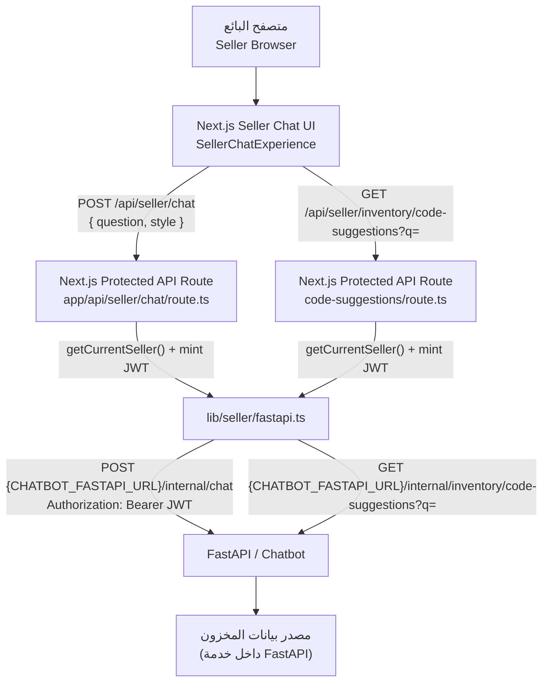

# الكود الموجود

> وثيقة تقنية لقسم **Seller Chat** داخل مشروع الـ3D.
> توثّق ما هو **مطبّق فعلياً في الكود فقط**، وتفصل بوضوح بين:
> **موجود حالياً** / **غير مطبّق حالياً** / **مطلوب لاحقاً لربط SAP**.
> لا يحتوي هذا الملف على أي Endpoint أو حقل أو سلوك غير موجود في المشروع.
> آخر تحديث للوثيقة: 2026-06-22.

---

## 1. نظرة عامة

**Seller Chat** هو مساعد محادثة (Chat) داخل تطبيق الـ3D مخصّص لموظفي المبيعات (البائعين) للاستعلام عن **الأصناف والمخزون (Inventory)**.

* **من يستخدمه:** البائع (Seller) بعد تسجيل الدخول إلى منطقة `/seller` المحمية.
* **نوع الأسئلة المدعومة:** أسئلة نصّية باللغة العربية حول الأصناف والمخزون (مثل: المتوفّر من كود صنف، التوفّر حسب المستودع، الكميات القادمة). يُرسَل مع كل سؤال حقل `style` (نبرة الرد: `creative` / `balanced` / `precise`) لا يؤثّر على حقائق المخزون.
* **كيف يستعلم عن الأصناف والمخزون:** الواجهة لا تتصل بمصدر البيانات مباشرة، بل تستدعي Next.js API محمي، والذي بدوره يستدعي خدمة **FastAPI** الخاصة بالـChatbot عبر اتصال Server-to-Server.
* **علاقته بتطبيق الـ3D:** هو قسم **مدمج داخل نفس مشروع الـ3D** (Next.js)، ويعيد استخدام جلسة البائع وقاعدة بيانات الـ3D للهوية والصلاحيات. خدمة FastAPI ومصدر بيانات المخزون يقعان في خدمة منفصلة (الـChatbot) خارج هذا الـrepository.

ملاحظة من الكود: واجهة الشات منقولة عن سلوك الـChatbot **بدون** مسارات الـTechnical Documents والصوت (Voice) والـWeb — راجع القسم 6.

---

## 2. المعمارية الحالية

التدفّق الفعلي كما هو في الكود:

```text
Seller Browser
→ Next.js Seller Chat UI            (app/seller/chat/page.tsx + components/seller/chat/*)
→ Next.js protected API route       (app/api/seller/chat/route.ts)
→ FastAPI                           (CHATBOT_FASTAPI_URL + /internal/chat)
→ Current inventory data source     (داخل خدمة FastAPI — خارج هذا الـrepo)
```



نقاط أساسية مثبّتة في الكود:

* المتصفح **لا يرى** عنوان FastAPI ولا الـJWT ولا الـSecret (كل ذلك `server-only`).
* الهوية (`sellerId` + `showroomId`) تُشتق من جلسة البائع المُتحقَّق منها في قاعدة بيانات الـ3D، **وليست** من جسم الطلب (الـschema يرفض أي حقول إضافية عبر `.strict()`).

---

## 3. المصادقة والصلاحيات

### مسار دخول البائع
* **Endpoint:** `POST /api/seller/auth/login` — الملف: `app/api/seller/auth/login/route.ts`.
* المدخلات: `sellerCode`, `showroomCode`, `password` (راجع `lib/seller/validation.ts`).
* عند النجاح: يُنشئ token ويضبط الـcookie ويعيد `{ ok: true, redirectTo: "/seller/chat" }`.
* حماية ضد التعداد (Enumeration): كل حالات الفشل في الاعتماد تعيد `401` عام، والحساب المعطّل يعيد `403` بعد التحقق من الاعتماد. ويوجد Rate-limit على مستوى الـIP (`lib/ip-rate-limit.ts`).

### نوع Session المستخدم
* Cookie باسم `seller_session` (httpOnly) — الملف: `lib/seller/session.ts`.
* داخله **JWT (HS256)** يحمل فقط: `sub` (معرّف البائع) و`tokenVersion`.
* `issuer = "3d-app"`, `audience = "seller"`, مدة الصلاحية 7 أيام.
* عند كل طلب محمي، تُعاد قراءة هوية البائع (الاسم، الكود، المعرض، الحالة) من قاعدة البيانات عبر `resolveSellerAccess` (`lib/seller/account-access.ts`) — لا يُوثَق بأي حقل من الـJWT عدا `sub` و`tokenVersion`.

### كيفية حماية `/seller/chat`
* `app/seller/layout.tsx` يستدعي `requireSeller()` (Server) لكل ما تحت `/seller`.
* `app/seller/chat/page.tsx` يستدعي `requireSeller()` أيضاً، ويُمرّر `seller.name` و`seller.showroomCode` للواجهة.
* `requireSeller()` (`lib/seller/auth.ts`) يعيد التوجيه إلى `/login?type=seller&reason=login-required` عند غياب/انتهاء/إبطال الجلسة أو عند حساب غير نشط.

### كيفية حماية Next.js API
* كل من `app/api/seller/chat/route.ts` و`app/api/seller/inventory/code-suggestions/route.ts` يستدعي `getCurrentSeller()`؛ وإن كانت النتيجة `null` يعيد `401`.

### نوع JWT المرسل إلى FastAPI
* يُسكّ token قصير العمر **منفصل** عبر `mintExternalSellerToken` (`lib/seller/fastapi.ts`):
  * `sub = "3d-seller:<seller.id>"`، `actorType = "external_seller"`، `showroomId = seller.showroomId`.
  * `issuer = "3d-app"`, `audience = "fastapi"`, الخوارزمية `HS256`، مدة الصلاحية ~60 ثانية.
  * يُوقَّع بـ`EXTERNAL_SELLER_JWT_SECRET` فقط، وهو حد ثقة منفصل عن `SELLER_SESSION_SECRET` وعن `INTERNAL_JWT_SECRET` (لا مشاركة مفاتيح؛ وفي الإنتاج يُفرض اختلافها).

> `issuer` و`audience` المذكورة أعلاه ظاهرة فعلياً في الكود (`session.ts` و`fastapi.ts`).
> لا تُعرض أي قيم Secrets أو Tokens في هذه الوثيقة.

---

## 4. واجهة الشات الحالية

* **الصفحة الفعلية:** `app/seller/chat/page.tsx` (تحمّل خط Cairo بشكل scoped وتُصيّر `SellerChatExperience`).
* **المكوّن الرئيسي (المنسّق):** `components/seller/chat/SellerChatExperience.tsx` — يملك حالة المحادثة ويقوم بالـround-trip الشبكي الوحيد (`POST /api/seller/chat`).
* **المكوّنات الرئيسية:**
  * `ChatHeader.tsx` — شريط علوي بزر رجوع.
  * `ChatMessages.tsx` — شاشة الترحيب + قائمة الرسائل + بطاقات المنتجات + حالة التحميل + حالة الخطأ القابلة لإعادة المحاولة.
  * `ChatComposer.tsx` — حقل الإدخال (RTL) + إرسال السؤال + الـtypeahead للأكواد.
  * `CodeAutocomplete.tsx` — قائمة اقتراحات الأكواد المنبثقة.
  * `InventoryProductCard.tsx` — بطاقة الصنف/المخزون.
* **كيفية إرسال السؤال:** يستدعي `SellerChatExperience` الدالة `fetch("/api/seller/chat", { method: "POST", body: { question, style } })` (السطر ~172).
* **حالات Loading وError:**
  * أثناء الطلب تُعرض فقاعة تحميل ("جاري البحث…") ويُعطَّل الإدخال.
  * عند `401`: إعادة توجيه إلى `/login?type=seller`.
  * عند خطأ تحقق (`400`): تُعرض رسالة الخطأ كرسالة من المساعد.
  * عند فشل آخر: تُعرض حالة خطأ مع زر "إعادة المحاولة".
* **Product Cards:** تُعرض من `cards` في الرد عبر `InventoryProductCard` (الحقول مُعرّفة في `lib/seller/chat/inventory-types.ts` — `InventoryDTO`).
* **Code Autocomplete:** منطق الكشف/الاستبدال في `lib/seller/chat/code-suggest.ts`؛ يستدعي `CODE_ENDPOINT = "/api/seller/inventory/code-suggestions"` (مُعرّف في `ChatComposer.tsx`)، مع debounce وإلغاء (Abort)، ويفشل بصمت (قائمة فارغة) دون منع الإرسال.
* **الاقتراحات (Suggestions):** قائمة أسئلة عربية جاهزة معرّفة داخل `SellerChatExperience.tsx` تُعرض في شاشة الترحيب فقط، واختيار أحدها يرسل السؤال مباشرة.
* **سياق المحادثة:** الرسائل تُحفظ في حالة المكوّن (state) للعرض فقط. الطلب المُرسَل إلى الـAPI يحمل **سؤالاً واحداً + style فقط** (راجع `sellerChatSchema`)؛ لا يُرسَل تاريخ المحادثة إلى الـbackend.

---

## 5. الـEndpoints الموجودة فعلياً

> كل المسارات أدناه موجودة فعلياً في `app/api/seller/**`. الأعمدة مستخرجة من الكود.

| Method | Path | Authentication | Purpose | Request | Response | Downstream |
| ------ | ---- | -------------- | ------- | ------- | -------- | ---------- |
| POST | `/api/seller/auth/login` | عامة + Rate-limit بالـIP | تسجيل دخول البائع وضبط cookie الجلسة | JSON: `sellerCode`, `showroomCode`, `password` (راجع `lib/seller/validation.ts`) | نجاح: `{ ok: true, redirectTo: "/seller/chat" }` ويضبط cookie `seller_session`. أخطاء: `400` مدخلات، `401` اعتماد غير صحيح، `403` `{ error, code: "disabled" }`، `429` مع `Retry-After` | لا يوجد (قاعدة بيانات الـ3D عبر Prisma) |
| POST | `/api/seller/auth/logout` | لا تتطلب جلسة (تمسح الـcookie فقط) | إنهاء جلسة البائع | لا جسم | `{ ok: true }` ويُلغي cookie `seller_session` | لا يوجد |
| GET | `/api/seller/auth/me` | جلسة البائع (`getCurrentSeller`) | جلب بيانات البائع الحالية للعرض | لا معلمات | `{ seller: { id, name, sellerCode, showroomCode } }`، أو `401` | لا يوجد (إعادة اشتقاق من قاعدة بيانات الـ3D) |
| POST | `/api/seller/chat` | Feature flag + جلسة البائع | إرسال سؤال المخزون والحصول على الرد/البطاقات | JSON: `{ question: string(1..500), style?: "creative"\|"balanced"\|"precise" }` عبر `sellerChatSchema` (`.strict()`) | عند النجاح: نتيجة FastAPI بعد إزالة `debug` (يضمن وجود `answer: string`؛ الحقول الأخرى مثل `cards`, `mode`, `intent`, `productCode`, `warehouse` تأتي من FastAPI). أخطاء آمنة: `503`, `401`, `400`, `504` (timeout), `502` (upstream) | `POST {CHATBOT_FASTAPI_URL}/internal/chat` |
| GET | `/api/seller/inventory/code-suggestions?q=` | Feature flag + جلسة البائع | اقتراح أكواد المنتجات (typeahead) | Query: `q` (نص الجزء المكتوب) | مصفوفة `CodeSuggestion[]` = `{ code: string, label: string }` (CODE فقط، بدون كميات). عند الفشل: قائمة فارغة `[]`. أو `503` عند تعطيل الميزة، `401` بدون جلسة | `GET {CHATBOT_FASTAPI_URL}/internal/inventory/code-suggestions?q=` |

### بنية رد `POST /api/seller/chat`
* الكود في الـ3d يتحقق فقط من أن `answer` نوعه `string` ويحذف الحقل `debug`، ثم يعيد بقية كائن FastAPI كما هو.
* بنية `cards` المتوقّعة في الواجهة هي `InventoryDTO` (راجع `lib/seller/chat/inventory-types.ts`: `productCode`, `productName`, `warehouse`, `quantityAvailable`, `reservedQuantity`, `availableToSell`, `incomingQuantity`, `expectedArrivalDate`, `status`, ...).
* البنية النهائية الكاملة لرد FastAPI تُحدَّد من خدمة FastAPI نفسها (خارج هذا الـrepo). **يجب الرجوع إلى النوع أو الاستجابة الفعلية في الملف المذكور** (`lib/seller/fastapi.ts` + `lib/seller/chat/inventory-types.ts`) لأي تفصيل غير مضمون في كود الـ3d.

### الـEndpoints الخارجية (FastAPI) التي يستدعيها Next.js
* `POST {CHATBOT_FASTAPI_URL}/internal/chat`
* `GET {CHATBOT_FASTAPI_URL}/internal/inventory/code-suggestions?q=`

> هذان المساران مستخرجان حرفياً من `lib/seller/fastapi.ts`. لم يُفترَض أي اسم مسار.

---

## 6. مصدر البيانات الحالي

* البيانات **لا تأتي من Excel أو Database داخل مشروع الـ3D**. مشروع الـ3D لا يحتوي على مصدر بيانات المخزون.
* مصدر البيانات بالنسبة للـ3D هو **خدمة FastAPI** عبر `CHATBOT_FASTAPI_URL` ومساري `/internal/chat` و`/internal/inventory/code-suggestions`.
* كيف تصل البيانات إلى الشات: الواجهة → Next.js route محمي → token خارجي قصير العمر → استدعاء FastAPI Server-to-Server → يُعاد الرد (نص + `cards`) للواجهة.
* أين تُحدَّث حالياً: داخل خدمة FastAPI/الـChatbot (المخزن الفعلي — Excel أو Database — يقع هناك وهو **خارج نطاق هذا الـrepository**؛ الوثيقة لا تجزم بنوعه لعدم وجوده في هذا الكود).
* وضع الرد: حقل `mode` في الرد يأخذ `"ai"` (يُعرض في الواجهة كـ"AI: Gemini") أو `"deterministic"` (يُعرض كـ"Fallback").
* **SAP غير مربوطة حالياً** (لا يوجد أي اتصال بـSAP في الكود — راجع القسم 10).
* **Technical Documents وWeb Knowledge:** غير مفعّلة في Seller Chat. واجهة الشات منقولة عن الـChatbot **بدون** مسارات الـtechnical-document والـvoice والـweb (مذكور في تعليقات `SellerChatExperience.tsx` و`app/api/seller/chat/route.ts`).

---

## 7. تدفق طلب نموذجي

مثال على سؤال: **«كم المتوفّر من CODE؟»** (دون أي أرقام مخزون مختلقة):

1. المستخدم (البائع) يكتب السؤال ويضغط إرسال في `ChatComposer`.
2. `SellerChatExperience` يستدعي الـEndpoint الحقيقي `POST /api/seller/chat` بجسم `{ question, style }`.
3. الـroute يتحقق من Feature flag (`isSellerChatEnabled`) ثم من جلسة البائع (`getCurrentSeller`)؛ ويتحقق من الجسم عبر `sellerChatSchema`.
4. يُسكّ JWT داخلي قصير العمر (`mintExternalSellerToken`) بهوية مشتقّة من قاعدة البيانات (`sub` + `showroomId`).
5. يُرسَل الطلب إلى `POST {CHATBOT_FASTAPI_URL}/internal/chat` مع `Authorization: Bearer <token>` وبمهلة (timeout) محدودة.
6. خدمة FastAPI تعالج السؤال وتعيد ردّاً (يحتوي `answer` وقد يحتوي `cards`, `mode`...).
7. الـroute يحذف `debug` ويعيد الرد؛ والواجهة تعرض النص و/أو **Product Cards** (`InventoryProductCard`).

---

## 8. معالجة الأخطاء الحالية

من الكود الفعلي (`app/api/seller/chat/route.ts` و`lib/seller/fastapi.ts` وبقية الـroutes):

| الحالة | السلوك في الكود |
| ------ | --------------- |
| الميزة معطّلة (Feature flag) | `503` `{ error: "خدمة المحادثة غير متاحة حالياً." }` |
| غير مصرّح / لا جلسة (Unauthorized / Invalid session) | `401` `{ error: "يجب تسجيل الدخول..." }` |
| جسم/مدخلات غير صحيحة (Invalid request body) | `400` مع أول رسالة خطأ من الـschema |
| اعتماد دخول غير صحيح (login) | `401` رسالة عامة؛ والحساب المعطّل `403` `code: "disabled"`؛ والـRate-limit `429` |
| FastAPI غير متاح / خطأ إعداد (unreachable / preflight_config) | `503` |
| انتهاء المهلة (Timeout / AbortError) | `504` |
| فشل مصادقة upstream أو حالة upstream أو رد غير صالح (upstream_auth / upstream_status / upstream_invalid) | `502` |
| فشل اقتراحات الأكواد (code-suggestions) | يتدهور إلى قائمة فارغة `[]` دون منع الإرسال |

> لا تُسرَّب أي تفاصيل upstream (URL/Token/Stack trace) إلى المتصفح؛ تُعاد رسالة عربية آمنة موحّدة عند فشل FastAPI.
> لم تُضَف أي Error Codes غير موجودة في الكود.

---

## 9. Environment Variables

> الأسماء فقط — بدون أي قيم. جميعها مستخدمة فعلياً في مسار Seller Chat.

| Variable | Used by | Purpose | Required |
| -------- | ------- | ------- | -------- |
| `SELLER_CHAT_ENABLED` | `lib/seller/fastapi.ts` (`isSellerChatEnabled`) | تفعيل/تعطيل ميزة الشات (في الإنتاج يجب `true`/`1`؛ افتراضياً مفعّلة في غير الإنتاج) | في الإنتاج لتفعيل الميزة |
| `CHATBOT_FASTAPI_URL` | `lib/seller/fastapi.ts` (`getChatbotFastapiUrl`) | العنوان الأساسي لخدمة FastAPI (server-only) | نعم (يرمي خطأ إن غاب) |
| `EXTERNAL_SELLER_JWT_SECRET` | `lib/seller/fastapi.ts` | توقيع الـJWT الخارجي المرسَل إلى FastAPI | نعم (≥32 حرف، وغير placeholder) |
| `SELLER_SESSION_SECRET` | `lib/seller/session.ts` | توقيع/تحقّق JWT جلسة البائع (cookie) | نعم في الإنتاج (يوجد fallback للتطوير فقط) |
| `INTERNAL_JWT_SECRET` | `lib/seller/fastapi.ts` | يُستخدم فقط لفرض اختلاف الأسرار في الإنتاج (ليس موقّع توكن الشات) | يُفحَص في الإنتاج |
| `NODE_ENV` | عدة ملفات | تمييز سلوك الإنتاج عن التطوير | قياسي |

---

## 10. ما هو غير مطبّق حالياً

* حتى تاريخ هذه الوثيقة، **لا يوجد اتصال مباشر مع SAP** في كود مشروع الـ3D. مصدر البيانات الحالي هو خدمة **FastAPI** عبر `CHATBOT_FASTAPI_URL` (راجع القسم 6).
* لا يوجد أي ملف أو Endpoint أو متغيّر بيئة خاص بـSAP في نطاق الفحص.
* **غير مطبّق حالياً** ضمن Seller Chat: مسارات الـTechnical Documents، والـVoice، والـWeb Knowledge.
* لا يوجد تخزين مؤقت (Cache) مخصّص، ولا Circuit Breaker، ولا Audit Logging مخصّص لطلبات الشات في كود الـ3D (يوجد Logging تشغيلي عبر `getLogger`، و`timeout`/`abort` فقط).

---

## 11. المطلوب لاحقاً لربط SAP

> هذا القسم **خطة مستقبلية على مستوى Architecture**، وليس وصفاً لشيء مطبّق. لا يقترح أسماء Endpoints نهائية.

* **تحديد نظام SAP ونوعه** (مثل S/4HANA أو ECC) والبيئة (Production/QA).
* **تحديد SAP modules المطلوبة** (مثل MM لإدارة المواد/المخزون).
* **اختيار طريقة التكامل** من بين: OData، أو REST API، أو SAP BTP، أو RFC/BAPI، أو IDoc، أو طبقة Middleware وسيطة.
* **تحديد مصدر كل عنصر بيانات** داخل SAP: الأصناف، المخزون، المستودعات، الكميات المحجوزة (Reserved)، الكميات القادمة (Incoming)، وتواريخ الوصول المتوقعة — بما يقابل حقول `InventoryDTO` الحالية.
* **Mapping** بين أكواد مواد SAP (material codes) والأكواد المستخدمة حالياً في الشات/الاقتراحات.
* **Authentication مع SAP** (آلية اعتماد وتفويض آمنة على مستوى الخادم، بأسرار منفصلة).
* **المتانة:** Retry، وTimeout، وCircuit Breaker.
* **الأداء:** Cache مع تحديد سياسة صلاحية البيانات (Data freshness).
* **التشغيل:** Audit Logging، وMonitoring، وRate Limiting.
* **الصلاحيات:** ربط صلاحيات المستخدمين/المعارض بما يسمح به SAP.
* **التعامل مع تعطّل SAP:** آلية fallback واضحة (مثل العودة للمصدر الحالي).
* **خطة انتقال تدريجية** من المصدر الحالي (FastAPI) إلى SAP (راجع القسم 13).

> ملاحظة: أي مسار API مستقبلي لـSAP هو **اقتراح غير معتمد** فقط، ويُفضّل عدم تثبيت أي اسم Endpoint قبل مرحلة التصميم.

---

## 12. Gap Analysis

| المجال | الموجود حالياً (من الكود) | المطلوب لـSAP | الحالة |
| ------ | ------------------------- | ------------- | ------ |
| Authentication | جلسة بائع (`seller_session` JWT) + JWT خارجي لـFastAPI | اعتماد آمن مع SAP + Mapping للصلاحيات | جزئي |
| Product lookup | عبر FastAPI (`/internal/chat`) + اقتراحات أكواد (`/internal/inventory/code-suggestions`) | قراءة الأصناف من SAP (MM) | موجود عبر FastAPI / مطلوب لـSAP |
| Inventory lookup | عبر FastAPI ضمن رد `cards` (`InventoryDTO`) | قراءة المخزون من SAP | موجود عبر FastAPI / مطلوب لـSAP |
| Warehouse availability | حقل `warehouse` + قيم مستودعات معرّفة (`WAREHOUSES`) من FastAPI | ربط المستودعات بـSAP | موجود عبر FastAPI / مطلوب لـSAP |
| Incoming stock | حقلا `incomingQuantity` و`expectedArrivalDate` من FastAPI | مصدرها من SAP | موجود عبر FastAPI / مطلوب لـSAP |
| Error handling | حالات آمنة (`503/401/400/504/502`) دون تسريب | إضافة حالات SAP (تعطّل/timeout) | موجود (جزئي) |
| Caching | لا يوجد cache مخصّص للشات | Cache + Data freshness | غير موجود |
| Monitoring | Logging تشغيلي عبر `getLogger` | Monitoring متكامل | جزئي |
| Audit logs | لا يوجد Audit مخصّص لطلبات الشات | Audit Logging | غير موجود |
| SAP connectivity | لا يوجد | اتصال SAP كامل | غير موجود |

---

## 13. خطوات التنفيذ المستقبلية

> خطة مراحل فقط — وليست Endpoints مطبّقة.

1. اكتشاف SAP وتحديد الأنظمة والـModules المطلوبة.
2. توثيق بيانات SAP المطلوبة (الأصناف، المخزون، المستودعات، المحجوز، القادم، تواريخ الوصول) ومصدر كلٍّ منها.
3. عمل Proof of Concept للقراءة فقط (Read-only) من SAP.
4. إنشاء Adapter abstraction يفصل الواجهة/الـAPI عن مصدر البيانات (SAP أو FastAPI).
5. تشغيل SAP في **Shadow Mode** بجانب المصدر الحالي دون التأثير على المستخدم.
6. مقارنة النتائج بين SAP والمصدر الحالي والتحقق من التطابق.
7. التفعيل التدريجي (تدرّج حسب الصنف/المعرض/النسبة).
8. Monitoring مستمر مع آلية Fallback عند تعطّل SAP.
9. إيقاف المصدر القديم بعد الاعتماد الكامل على SAP.

---

## 14. مراجع الكود

الملفات الفعلية التي اعتمدت عليها هذه الوثيقة (تم فحصها):

```text
- app/seller/layout.tsx
- app/seller/chat/page.tsx
- app/api/seller/auth/login/route.ts
- app/api/seller/auth/logout/route.ts
- app/api/seller/auth/me/route.ts
- app/api/seller/chat/route.ts
- app/api/seller/inventory/code-suggestions/route.ts
- components/seller/chat/SellerChatExperience.tsx
- components/seller/chat/ChatComposer.tsx
- components/seller/chat/ChatMessages.tsx
- components/seller/chat/CodeAutocomplete.tsx
- components/seller/chat/InventoryProductCard.tsx
- components/seller/chat/ChatHeader.tsx
- components/seller/chat/types.ts
- lib/seller/auth.ts
- lib/seller/session.ts
- lib/seller/account-access.ts
- lib/seller/fastapi.ts
- lib/seller/chat-validation.ts
- lib/seller/validation.ts
- lib/seller/chat/code-suggest.ts
- lib/seller/chat/inventory-types.ts
```
