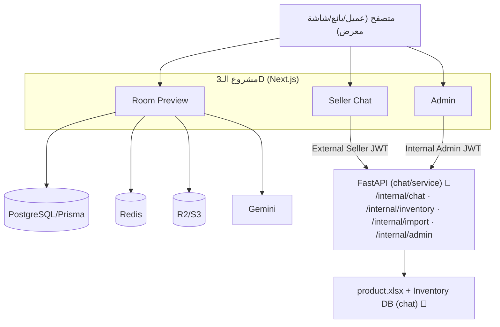

# مراجعة تقنية شاملة وتقرير تسليم — مشروع الـ3D وSeller Chat

> مراجعة (Audit) وتحليل فقط — **لم يُحذف أو يُعدّل أي ملف/كود/قاعدة بيانات**.
> مبنية على فحص الكود الفعلي في `C:\Users\hisha\Downloads\main\3d` ومشروع الشات القديم `C:\Users\hisha\Downloads\main\chat` (يحوي خدمة FastAPI).
> تاريخ المراجعة: 2026-06-22.

## مفاتيح الإثبات
| الرمز | المعنى |
| ----- | ------ |
| ✅ | مؤكد من الكود |
| 🔎 | استنتاج تقني من الكود |
| 🚫 | خارج هذا الـrepository (FastAPI/Python) |
| ❓ | يحتاج تأكيداً |

## ملخص أوامر التحقق المنفّذة (آمنة فقط)
* `git status` → فقط 4 ملفات docs غير متتبَّعة (من مهام سابقة) + هذا الملف. ✅
* `npx tsc --noEmit` → **0 أخطاء** ✅.
* `npx vitest run` → **580 ناجح / 3 فاشل** (ملف واحد: `tests/unit/session-dashboard.test.ts`) ✅.
* لم يُشغَّل `next build` (يتطلب أسراراً/خدمات إنتاج)، ولم تُشغَّل اختبارات Playwright e2e (تحتاج خادماً حيّاً)، ولم تُنفَّذ أي migration أو اتصال إنتاج.

---

## 1. Executive Summary

| المحور | التقييم | السبب المختصر |
| ------ | ------- | ------------- |
| Architecture quality | **جيد** | فصل واضح بين Room Preview / Seller / Admin؛ حدود آمنة بين المتصفح والـFastAPI؛ اعتماد منطقي على Postgres/Redis/Storage. |
| Code organization | **جيد** | بنية `app/components/features/lib/hooks` متّسقة؛ لكن توجد ملفات/أصول scratch في الجذر تشوّش التسليم. |
| Maintainability | **جيد** | TypeScript صارم، أنواع مشتركة، منطق مُجزّأ؛ بعض المكوّنات كبيرة (ResultStep/MobileSessionClient) لكنها مقبولة. |
| Operational readiness | **مقبول** | يعتمد على خدمات خارجية متعددة (FastAPI/Redis/R2/Gemini) + Cron غير مجدول في الكود + لا runbook. |
| Security posture | **جيد** | bcrypt، cookies httpOnly، فصل أسرار مفروض، `.strict()`، server-only secrets، rate-limit، حارس تخزين الإنتاج. (نقاط تحتاج تأكيداً: حماية مسارات diagnostic.) |
| Test coverage | **جيد** | 46 ملف اختبار يغطي seller/admin/room-preview/الـhooks؛ لكن **3 اختبارات فاشلة** (انجراف mock) ولا e2e مشغّل. |
| Documentation readiness | **مقبول** | وثائق غنية حديثة (api/handbook/hosting/SAP) لكن **لا README تشغيلي ولا runbook ولا دليل setup محلي**. |
| Handover readiness | **جاهز مع ملاحظات** | منظّم ويعمل (tsc نظيف)، لكن يحتاج: إصلاح 3 اختبارات، توثيق setup/تشغيل FastAPI، تنظيف أصول scratch، وقرار رسمي حول الشات القديم. |

> **لا توجد نتيجة «عالية الخطورة»** في الكود نفسه؛ أعلى المخاطر **تشغيلية/تسليمية** (اعتماد مخفي على repo الـFastAPI، وغياب runbook).

---

## 2. خريطة المشروع

| المكوّن | داخل/خارج الـ3d | الدور | الحالة |
| ------- | --------------- | ----- | ------ |
| Room Preview / 3D | داخل 3d ✅ | رفع صورة غرفة → اختيار منتج → رندر Gemini → معاينة | المنتج الأساسي |
| Seller Auth | داخل 3d ✅ | دخول البائع + جلسة `seller_session` | يعمل |
| Seller Chat | داخل 3d ✅ | شات مخزون البائع (proxy إلى FastAPI) | يعمل |
| Admin | داخل 3d ✅ | إدارة الشات: import/sellers/showrooms/status/metrics + diagnostics/analytics/render-errors | يعمل |
| FastAPI | **خارج 3d** (`chat/service/`) 🚫 | منطق وبيانات المخزون + Gemini NLU + RAG/technical + voice + audit | **dependency حيّة** |
| PostgreSQL / Prisma | داخل 3d ✅ | بيانات البائع/المعرض/جلسات Room Preview (لا مخزون) | يعمل |
| Redis (ioredis) | خدمة خارجية ✅ | rate-limit + render locks/semaphore + SSE pub/sub | مطلوب في الإنتاج |
| Object Storage (R2/S3) | خدمة خارجية ✅ | صور الغرف + نتائج الرندر (presigned) | مطلوب في الإنتاج |
| Gemini | خدمة خارجية ✅ | توليد صور الرندر | مطلوب |
| Sentry | خدمة خارجية ✅ | error tracking | مفعّل |
| Cron (cleanup) | route داخل 3d ✅ | تنظيف الجلسات | الجدولة غير معرّفة في الكود ❓ |

### المخطط (اتصالات فعلية)

---

## 3. تنظيم الملفات

| المشكلة | الملف/الموقع | الأثر | الأولوية | الاقتراح |
| ------- | ------------ | ----- | -------- | -------- |
| ملفات scratch/عمل في الجذر | `document.md`, `j.md`, `dof.md`, `journeys-diagrams.md`, `clean-code-audit.md`, `deployment.md` | تشويش على فريق الاستلام | P2 | نقلها إلى `docs/` أو أرشفتها بعد تحقق |
| لقطات تحقق في الجذر | `verify-*.png`, `live-gate.png`, `prod-gate.png`, `landing-*.png` | حجم وتشويش | P2 | إزالة من الجذر (ليست أصول تطبيق) |
| مجلدات temp ضخمة | `tmp-role-shots/` (32MB), `tmp-room-preview/` (53MB) | 85MB غير ضروري | P2 | تأكيد أنها مولّدة + حذف (غالباً gitignored) |
| مكوّنات كبيرة | `features/room-preview/mobile/ResultStep.tsx`, `components/room-preview/MobileSessionClient.tsx` | صعوبة قراءة | P3 | تقسيم تدريجي (ليس عاجلاً) |
| لا توجد circular deps واضحة | — | — | — | لم يرصد الفحص دوائر import واضحة 🔎 |
| فصل server-only | `lib/seller/*`, `lib/storage.ts`, `lib/seller/fastapi.ts` تستخدم `import "server-only"` ✅ | حماية جيدة | — | المحافظة عليه |

* فصل Features جيد (`features/room-preview/*`, `components/seller/chat/*`). ✅
* لا يوجد خلط واضح UI/Business في الشات (المنطق في `lib/`). ✅ Room Preview بعض منطق الحالة داخل مكوّنات كبيرة 🔎.

---

## 4. Dead Code Audit

> ملاحظة منهجية: **API routes تُستدعى عبر HTTP لا عبر import** → غياب import لا يعني عدم الاستخدام. صُنّفت كذلك.

| العنصر | التصنيف | الدليل |
| ------ | ------- | ------ |
| `app/api/room-preview/sessions/[sessionId]/test-render` | غالباً غير مستخدم — يحتاج تحقق | لا import؛ اسمه يوحي باختبار رندر يدوي ❓ |
| `app/api/internal/r2-cors-test` | غالباً غير مستخدم — يحتاج تحقق | endpoint تشخيصي لاختبار CORS؛ لا مرجع UI ❓ |
| `app/dev/room-upload-lifecycle/page.tsx` | غالباً غير مستخدم (dev) — يحتاج تحقق | تحت `app/dev/`؛ لا رابط Navigation 🔎 |
| `app/api/room-preview/dev-entry` | مستخدم ديناميكياً (dev) | مُشار إليه في ملف واحد ✅ |
| `app/qr-print`, `app/scan/[code]` | يحتاج تحقق من الروابط | صفحات قائمة بذاتها؛ تأكيد ارتباطها بالـQR ❓ |
| `features/room-preview/mobile/debug.tsx` | غالباً أداة Debug — يحتاج تحقق | اسم debug ❓ |
| `BeforeAfterSlider` (سابقاً) | حُذف فعلياً في عمل سابق | — |
| لقطات/أصول الجذر | مؤكد أنها ليست أصول تطبيق | ليست في `public/`، غير مستوردة ✅ |
| Packages غير مستخدمة | يحتاج تحقق | انظر القسم 16 (`openai`, `recharts`, `@fluentui/*`, `gsap`) |

> **لا أؤكد حذف أي route** قبل فحص الـscripts/الـQR/الـdiagnostics. الأغلب أن `test-render` و`r2-cors-test` و`app/dev/*` أدوات تطوير قابلة للإزالة بعد تأكيد بسيط.

---

## 5. Duplicate Code Audit

| المجال | الحالة | الحكم |
| ------ | ------ | ----- |
| Authentication / JWT | جلستان منفصلتان (seller/admin) + توكنا FastAPI (external/internal) — **مقصود ومنفصل** ✅ | مقبول (حدود ثقة) |
| FastAPI fetch wrappers | `lib/seller/fastapi.ts` (seller) و`lib/admin/fastapi-internal.ts` (admin) | تكرار جزئي مقبول (مفاتيح/جمهور مختلف)؛ يمكن استخراج helper مشترك للـtimeout/abort لاحقاً 🔎 |
| Inventory types | `lib/seller/chat/inventory-types.ts` (3d) منقولة عن chat | مقبول (تكرار متعمّد عبر مشروعين) |
| Validation schemas | Zod في `lib/seller/*` + room-preview validators | متّسق، لا تكرار ضار |
| Error mapping | متّسق في route الشات (تصنيف موحّد) ✅ | جيد |
| Mobile keyboard handling | موحّد في `hooks/use-dismiss-keyboard-on-enter.ts` (بعد توحيد سابق) ✅ | جيد |
| Loading animations / Buttons / Product cards | مكوّنات مشتركة (MobileActionButton, ParticleButton, InventoryProductCard) ✅ | جيد |

**الخلاصة:** التكرار الموجود **غالبه متعمّد ومقبول** (حدود أمنية/مشروعان). فرصة توحيد واحدة منخفضة الأولوية: طبقة fetch مشتركة لاستدعاءات FastAPI.

---

## 6. Route Audit (3d)

| Route | الغرض | محمي؟ | يُستدعى من | الحالة |
| ----- | ----- | ----- | ---------- | ------ |
| `/` , `/login` | هبوط + دخول | لا | عام | مستخدم |
| `/room-preview/*` (start/gate/mobile/screen/activate) | تدفّق المعاينة | جزئي (token/session) | QR/المتصفح | مستخدم |
| `/seller/chat` | شات البائع | نعم (`requireSeller`) | بعد الدخول | مستخدم |
| `/(admin)/admin/*` (login/analytics/chatbot/diagnostics/render-errors) | لوحة الإدارة | نعم (admin session) | الإدارة | مستخدم |
| `/qr-print`, `/scan/[code]` | طباعة/مسح QR | ❓ | QR | يحتاج تحقق من الروابط |
| `/dev/room-upload-lifecycle` | صفحة تطوير | ❓ | — | داخلي/مرشّح للحذف |
| `POST /api/seller/chat`, `GET /api/seller/inventory/code-suggestions` | بوابة الشات | نعم | الواجهة | مستخدم |
| `/api/seller/auth/{login,logout,me}` | مصادقة البائع | متدرّج | الواجهة | مستخدم |
| `/api/admin/chatbot/{import/*,metrics,status,sellers,showrooms}` | إدارة الشات → FastAPI/DB | admin | لوحة الإدارة | مستخدم |
| `/api/admin/{render-performance,screens,system-health}` | تشغيل/صحة | admin | لوحة الإدارة | مستخدم |
| `/api/room-preview/sessions/[id]/*` | دورة حياة الجلسة | token/session | الواجهة/الشاشة | مستخدم |
| `/api/room-preview/cleanup` | تنظيف cron | `CLEANUP_SECRET` ✅ | scheduler | داخلي (جدولة ❓) |
| `/api/room-preview/sessions/[id]/test-render` | رندر اختباري | ❓ | — | مرشّح للحذف (تحقق) |
| `/api/internal/r2-cors-test` | اختبار CORS للتخزين | ❓ | — | مرشّح للحذف (تحقق) |
| `/api/health` | فحص صحة | لا | uptime | مستخدم |

**صفحات/مسارات قديمة-أو-تجريبية محتملة:** `app/dev/room-upload-lifecycle`, `test-render`, `r2-cors-test`, وربما `features/room-preview/mobile/debug.tsx`. **لا توجد "صفحة شات قديمة" داخل 3d** — الشات القديم في مشروع `chat` المنفصل (القسم 10).

---

## 7. Authentication & Authorization Audit

| النقطة | الحالة |
| ------ | ------ |
| Customer/gate | جلسة room-preview بـ`SESSION_TOKEN_SECRET` + tokens للجلسة ✅ |
| Seller session | cookie `seller_session` (HS256, httpOnly, sameSite lax, secure prod, 7 أيام)؛ الادعاءات `sub`+`tokenVersion` فقط ✅ |
| Admin session | `ADMIN_JWT_SECRET` (cookie إدارة) ✅ |
| إعادة اشتقاق الهوية | `getCurrentSeller` → `resolveSellerAccess` من DB كل طلب ✅ |
| Token versioning | `tokenVersion` يُقارن لإبطال الجلسات ✅ |
| Disabled users | `status` يُفحص؛ 403 بعد صحة الاعتماد ✅ |
| External Seller JWT | aud=`fastapi`, ttl ~60s, سرّ منفصل ✅ |
| Internal Admin JWT | `lib/admin/fastapi-internal.ts`, سرّ منفصل ✅ |
| فصل الأسرار | مفروض اختلافها في الإنتاج (`lib/env.ts`) ✅ |
| رفض هوية المتصفح | `.strict()` schema ✅ |

**نقاط القوة:** فصل صارم لثلاث جلسات + توكنين خارجيين، إعادة تحقق من DB، لا اعتماد على ادعاءات الـJWT.
**مخاطر/تحقق ❓:**
* قوة حماية لوحة الإدارة (محاولات الدخول/rate-limit للأدمن) — يحتاج تأكيد مماثل لـseller.
* حماية المسارات التشخيصية (`test-render`, `r2-cors-test`, `dev-entry`) في الإنتاج — تأكيد أنها مقيّدة بـ`NODE_ENV`/سرّ.
* لا اعتماد ظاهر على Client-side checks للأمان ✅ (الحماية على الخادم).

---

## 8. Database & Prisma Audit

| البند | التقييم |
| ----- | ------- |
| Schema organization | منظّم؛ نماذج Seller/Showroom + جلسات/أحداث Room Preview | Safe ✅ |
| Relations | `Seller.showroomId → Showroom` ✅ | Safe |
| Indexes | `@@index([showroomId])`, `@@index([status])` على Seller ✅ | Safe |
| Unique constraints | `sellerCode @unique`, `Showroom.code @unique` ✅ | Safe |
| Enum | `SellerStatus {active, disabled}`, افتراضي disabled ✅ | Safe |
| Migrations | موجودة في `prisma/migrations`؛ `build` يشغّل `generate` فقط (الترحيل خطوة منفصلة) ✅ | Needs review (ضبط الترحيل في النشر) |
| Connection pooling | `@prisma/adapter-pg` + `pg` ✅؛ ملاءمة Serverless | Needs review (pool في الإنتاج) |
| N+1 / query efficiency | لم يُرصد نمط N+1 واضح في مسار الشات 🔎 | Needs review (مسارات admin/dashboard) |
| Chat/inventory boundary | **المخزون ليس في DB الـ3d** (تملكه FastAPI) ✅ | Safe |
| Models قديمة/غير مستخدمة | يحتاج تحقق من استخدام كل model في `app/lib` ❓ | Potentially unused |

> لم تُعدَّل أي migration/schema. تنبيه: **3 اختبارات فاشلة** سببها أن mock الـPrisma لا يُعرّف `groupBy` المستخدم في `getDashboardMetrics` — مؤشّر على **انجراف mock** (مشكلة اختبار) وليس بالضرورة عيب إنتاج (القسم 14).

---

## 9. API & FastAPI Integration Audit

| البند | seller chat | admin |
| ----- | ----------- | ----- |
| Next.js routes | `/api/seller/chat`, `/api/seller/inventory/code-suggestions` ✅ | `/api/admin/chatbot/{import/*,status,metrics,...}` ✅ |
| FastAPI downstream | `/internal/chat`, `/internal/inventory/code-suggestions` ✅ | `/internal/import/inventory/{preview,confirm,history}`, `/internal/admin/{chatbot-status,chatbot-metrics}` ✅ |
| Request validation | `sellerChatSchema.strict()` ✅ | schemas في routes ✅ |
| Response validation | يتحقق من `answer:string` + يحذف `debug` ✅ | `safePreviewResponse` ونحوه ✅ |
| Timeout / Abort | 45s/8s + AbortController ✅ | عبر `internalAdminFetchJson` ✅ |
| Retry | يدوي في الواجهة (زر) ✅؛ لا retry تلقائي 🔎 | — |
| Error mapping | تصنيف آمن 503/504/502/401/400 ✅ | — |
| Secret separation | external vs internal vs session ✅ | ✅ |
| Health checks | `/api/health` + `/api/admin/system-health` + `/internal/admin/chatbot-status` ✅ | ✅ |
| Idempotency | render فيه قفل/تحقّق حالة (semaphore) 🔎 | import عبر preview→confirm (token) ✅ |
| Exposure | لا تسريب URL/JWT/upstream للمتصفح ✅ | ✅ |

**الخلاصة:** واجهة Seller Chat **تعتمد كلياً على FastAPI القديمة** للبيانات؛ وكذلك إدارة الـimport/status/metrics. هذا اعتماد **حيّ وحرج**.

---

## 10. قرار: الشات القديم مقابل Seller Chat المدمج ⭐

> فُحص مشروع `C:\Users\hisha\Downloads\main\chat`: يحوي **(أ) واجهة Next.js مستقلة** + **(ب) خدمة FastAPI** (`service/`) + **(ج) مصدر مخزون Excel** (`product.xlsx` + `import_excel.py`).

### A — أجزاء انتقلت بالكامل إلى الـ3d ✅
* واجهة شات البائع (UI) — `components/seller/chat/*`.
* الـComposer + Product Cards + Code Autocomplete.
* جسر مصادقة البائع (Seller auth) داخل 3d.
* إدارة الـimport/status/metrics (لوحة admin في 3d تستدعي نفس FastAPI).

### B — أجزاء ما زالت مستخدمة من المشروع القديم ✅ (مؤكدة من استدعاءات 3d)
* **FastAPI service** (`chat/service/app`) — تُستدعى من 3d (seller + admin).
* **مصدر المخزون**: استيراد Excel (`import_excel.py`, `product.xlsx`) + قاعدة بيانات المخزون داخل FastAPI.
* **Gemini NLU / answer builder / intent** داخل FastAPI (`app/ai/*`) — منطق إجابة الشات.
* **Code suggestions backend** (`/internal/inventory/code-suggestions`).
* **Admin import + chatbot status/metrics** (`/internal/import/*`, `/internal/admin/*`).

### C — أجزاء قديمة لم تعد مستخدمة من الـ3d (تحتاج قرار أعمال) 🔎
* **واجهة Next.js القديمة بالكامل** (`chat/app/dashboard/*`, `create-account`, `auth/*`) — استُبدلت للبائع بالـ3d.
* مصادقة/مستخدمو الواجهة القديمة (`api/auth/*`, `api/admin/users`).
* ميزات FastAPI **غير المستخدمة من 3d**: `technical-specifications` (RAG/datasheets)، `voice` (transcribe)، `web_knowledge`. **موجودة في FastAPI + الواجهة القديمة فقط**؛ إن كانت الأعمال تحتاجها، فهي **ليست** في الـ3d.

### D — القرار
**«يمكن حذف Frontend القديم فقط» + «يجب إبقاء Backend (FastAPI) كاملاً حالياً».** مع تحفّظ: ميزات technical-specs/voice تعيش في الواجهة القديمة وFastAPI فقط — قرارها للأعمال.

**الأدلة والأجوبة:**
1. **هل Seller Chat الجديد كافٍ للمستخدم النهائي (البائع)؟** نعم لحالة **شات المخزون** ✅. لا يغطي technical-specs/voice/datasheets (لم تُنقل).
2. **هل ما زال يحتاج FastAPI القديم؟** **نعم، اعتماد كامل** ✅ — لا بيانات مخزون ولا NLU بدونها.
3. **هل يحتاج DB/Import من المشروع القديم؟** **نعم** ✅ — قاعدة المخزون واستيراد Excel داخل FastAPI.
4. **ماذا يكسر لو حذفنا المشروع القديم؟** ينكسر **Seller Chat بالكامل** + **admin import/status/metrics** + اقتراحات الأكواد (تعتمد على FastAPI) — وأي استخدام لـtechnical-specs/voice.
5. **الحد الأدنى الواجب الاحتفاظ به:** **خدمة FastAPI (`chat/service/`) + قاعدة بيانات المخزون + منطق استيراد Excel + `product.xlsx`/مصدر المخزون**. (الواجهة القديمة ليست لازمة لتشغيل 3d.)
6. **مستقل أم دمج؟** **يُفضّل إبقاء FastAPI كـrepository/خدمة مستقلة** (حدّ نشر وملكية منفصل، Python مقابل Node)، مع الـ3d كواجهة جديدة. الدمج غير ضروري وعالي المخاطرة الآن.

> ⚠️ **غير آمن حذف أي شيء من `chat/` قبل:** (1) قرار الأعمال حول technical-specs/voice، (2) تأكيد عدم وجود مستهلكين آخرين للواجهة القديمة، (3) تثبيت نشر FastAPI المستقل.

---

## 11. Runtime & Operational Audit

| البند | الحالة |
| ----- | ------ |
| Build | `prisma generate && next build` ✅ (لم يُشغَّل — يتطلب أسراراً/خدمات) ❓ |
| Type checking | `tsc --noEmit` → 0 أخطاء ✅ |
| Tests | 580/583 (3 فاشلة) ✅/❗ |
| Production start | `next start` ✅ |
| Vercel compatibility | مؤشّر Vercel (vercel.json فارغ + `.vercel`) 🔎؛ التخزين المحلي ممنوع في الإنتاج (حارس) ✅ |
| FastAPI hosting | **اعتماد خارجي حيّ** 🚫 — يجب أن تكون قابلة للوصول من خادم 3d |
| PostgreSQL/Redis/R2/Gemini | اعتمادات خارجية مطلوبة في الإنتاج ✅ |
| Cron cleanup | route موجود + محمي؛ **الجدولة غير معرّفة في الكود** (`vercel.json` فارغ) ❓ يحتاج scheduler |
| SSE | `/api/room-preview/sessions/[id]/events` (ReadableStream) + Redis pub/sub ✅ — يحتاج proxy لا يقطع الاتصال الطويل |
| Timeouts/Rate limits | 45s/8s + Redis rate-limit ✅ |
| Background work / Worker | لا Queue/Worker مستقل — قد يلزم مستقبلاً 🔎 |
| غير مناسب لـServerless | تخزين محلي (محمي)؛ rate-limit/SSE يحتاجان Redis عبر instances ✅ |
| غير موثّق | تشغيل FastAPI + الجدولة + النشر ❓ |

---

## 12. Security Audit (Static)

| البند | النتيجة |
| ----- | ------- |
| Exposed secrets | لا أسرار في الكود؛ كلها `process.env` server-only ✅ |
| Client-exposed env | فقط `NEXT_PUBLIC_BASE_URL` علني (مقصود) ✅ |
| Missing authorization | المسارات الحسّاسة محمية؛ **تحقق** من `test-render`/`r2-cors-test`/`dev-entry` في الإنتاج ❓ |
| Unsafe redirects | redirect إلى `/login` ثابت ✅ |
| CORS | يُضبط على bucket التخزين (اختبار r2-cors) ✅ |
| File uploads | **Presigned URL** (رفع مباشر للتخزين) ✅ — تحقق من حد الحجم ونوع الملف ❓ |
| Input validation | Zod `.strict()` في الشات والدخول ✅ |
| SQL injection | Prisma (parametrized) ✅ |
| SSRF | عنوان FastAPI من env ثابت (لا من المستخدم) ✅ |
| XSS | React escaping؛ لا `dangerouslySetInnerHTML` ظاهر في الشات 🔎 |
| Logging sensitive data | تعمّد رسائل آمنة + عدم تسجيل أسرار/توكنات ✅ |
| Password hashing | bcrypt cost 12 + رفض > 72 بايت ✅ |
| Rate limiting | على الدخول (5/60s) ✅ — تأكيد تغطية الأدمن ❓ |
| Admin access | جلسة admin منفصلة ✅ — تأكيد rate-limit/حماية الدخول ❓ |
| Cron protection | `CLEANUP_SECRET` ✅ |
| Debug routes | `test-render`/`r2-cors-test`/`app/dev/*` — تأكيد تقييدها ❓ |

**لا ثغرة حرجة مؤكدة static؛** أعلى البنود تحتاج **تأكيد** (مسارات diagnostic + حماية دخول الأدمن + حد رفع الملفات).

---

## 13. Performance Audit (مرتّب حسب الأثر)

| # | الملاحظة | الأثر | الاقتراح |
| - | -------- | ----- | -------- |
| 1 | اعتماد على FastAPI/Gemini ذات زمن استجابة عالٍ (حتى 45s) | متوسط | تأكيد timeouts الـproxy + UX انتظار |
| 2 | مكوّنات عميلة كبيرة (`MobileSessionClient`, `ResultStep`) `"use client"` | متوسط | تقسيم/تأجيل تحميل (lazy) لاحقاً |
| 3 | SSE + Redis pub/sub لكل جلسة | متوسط | مراقبة إعادة الاتصال وضغط الاتصالات |
| 4 | حزم ثقيلة محتملة غير مستخدمة (`recharts`, `@fluentui/*`, `gsap`, `openai`) | منخفض-متوسط | تأكيد الاستخدام (القسم 16) — تقليل bundle |
| 5 | تزامن Gemini | منخفض | يوجد semaphore ✅ |
| 6 | استعلامات admin/dashboard (groupBy/تجميعات) | منخفض | مراجعة الفهارس عند الحمل |
| 7 | رفع الصور | منخفض | presigned مباشر للتخزين (جيد) ✅ |

لا توجد render loops أو polling متكرر واضح في الشات 🔎 (الشات طلب/استجابة واحد).

---

## 14. Testing Audit

* **Unit (≈26):** session machine/token/status/repository، gemini-provider، render-service، seller (account-access/codes/password/session/fastapi/chat-libs)، particle-button، hooks (mobile/connect/events/render/room/expiry)، validators، sse-cleanup. ✅
* **Integration (≈19):** admin chatbot (import/sellers/showrooms/status/metrics)، seller (chat/login/code-suggestions)، room-preview (sessions/render/connect/cleanup)، health، login-page. ✅
* **E2E (1):** `tests/e2e/room-preview-flow.spec.ts` (Playwright — لم يُشغَّل، يحتاج خادماً) ❓.

**اختبارات فاشلة الآن (❗):** `tests/unit/session-dashboard.test.ts` — 3 اختبارات تفشل بـ`prisma.roomPreviewSession.groupBy is not a function` → **mock الـPrisma لا يعرّف `groupBy`** (انجراف mock). **يجب إصلاحه قبل التسليم** (إما تحديث الـmock أو التأكد من مسار `getDashboardMetrics`).

**اختبارات حرجة مطلوبة/مُغطّاة قبل التسليم:**
| السيناريو | الحالة |
| --------- | ------ |
| Seller login | مغطّى ✅ |
| Seller chat | مغطّى ✅ |
| FastAPI unavailable | مغطّى (seller-fastapi/chat) ✅ |
| Code suggestions | مغطّى ✅ |
| Room Preview flow | مغطّى (unit+integration؛ e2e غير مشغّل) ✅/❓ |
| Gemini render | مغطّى (render-service/gemini-provider) ✅ |
| Mobile Safari behavior | غير مغطّى آلياً (يحتاج جهاز/يدوي) ❓ |
| Admin access | مغطّى (admin-chatbot-*) ✅ |
| Upload/storage | تغطية جزئية ❓ (تأكيد اختبار upload-url) |
| Session expiry | مغطّى (`useSessionExpiryTimer`, session-status) ✅ |
| Cron cleanup | مغطّى (`cleanup-api`, `session-repository-cleanup`, `sse-cleanup`) ✅ |

لا توجد اختبارات تعتمد على خدمات حيّة في مجموعة vitest (mocks) ✅؛ e2e فقط يحتاج خادماً.

---

## 15. Documentation Audit

**موجود وحديث ✅:** `docs/api.md`, `docs/seller-chat-technical-handbook.md`, `docs/hosting-and-infrastructure-requirements.md`, `docs/sap-integration-meeting-guide.md`. وفي مشروع `chat`: `README.md`, `PROJECT_ARCHITECTURE_GUIDE.md`, `MIGRATION_PLAN.md`, `PHASE2_PARITY_AUDIT.md`, `PILOT_CHECKLIST.md`.

**ناقص لفريق الاستلام (❓):**
| المطلوب | الحالة |
| ------- | ------ |
| README تشغيلي للـ3d | `README.md` شبه فارغ ("3d") ❗ ناقص |
| Local setup (3d + FastAPI) | ناقص — لا دليل `.env` + إقلاع FastAPI من جهة 3d |
| Environment variables (مرجع موحّد) | جزئي (`.env.example` + hosting doc) — يُوصى بدمجه |
| Architecture (موحّد عبر المشروعين) | جزئي |
| Deployment / Release process | ناقص ❗ |
| Database migration guide | ناقص (الترحيل خطوة منفصلة) ❗ |
| FastAPI startup | ناقص في 3d (موجود جزئياً في `chat/README`/`run.ps1`) |
| Backup/restore | ناقص ❗ |
| Troubleshooting / Runbook | ناقص ❗ |
| Ownership matrix | ناقص ❗ |

---

## 16. Package Audit (3d)

| الحزمة | ملاحظة | توصية |
| ------ | ------ | ----- |
| `openai` | غير ظاهر استخدامها في مسار الشات/الرندر (Gemini هو المزوّد) ❓ | تأكيد الاستخدام؛ إزالة إن غير مستخدمة |
| `recharts` | غالباً للوحة analytics ❓ | تأكيد الاستخدام في admin/analytics |
| `@fluentui/react-components` | استخدام غير واضح ❓ | تأكيد — حزمة كبيرة |
| `gsap` | أنيميشن — تأكيد الاستخدام ❓ | تحقق |
| `@paper-design/shaders`, `@photo-sphere-viewer/*` | للـ3D/بانوراما 🔎 | غالباً مستخدمة |
| `shadcn` كاعتماد runtime | عادةً أداة CLI لا runtime ❓ | تحقق من موضعها |
| Dev deps في الإنتاج | لم يُرصد تسرّب واضح 🔎 | جيد |
| postinstall خطِر | لا يوجد postinstall مخصّص 🔎 | جيد |
| scripts ناقصة | لا script `typecheck` صريح (يُستخدم `npx tsc`)؛ لا script `start:prod` موثّق | إضافة scripts واضحة |

> لم يُجرَ أي upgrade. القرار النهائي بإزالة أي حزمة يحتاج فحص import + بناء.

---

## 17. Assets & Public Folder Audit

| العنصر | ملاحظة | توصية |
| ------ | ------ | ----- |
| `tmp-role-shots/` (32MB), `tmp-room-preview/` (53MB) | لقطات مؤقتة (85MB) | تأكيد gitignore + حذف من القرص |
| `*.png` في الجذر (`verify-*`, `live-gate`, `prod-gate`, `landing-*`) | لقطات تحقق، ليست أصول تطبيق (ليست في `public/`) | إزالة من الجذر |
| `coverage/` (1.2MB), `test-results/` (137KB) | مخرجات مولّدة | تأكيد gitignore |
| `*.md` scratch في الجذر (`document.md`, `j.md`, `dof.md`, ...) | وثائق عمل | نقل لـ`docs/` أو أرشفة |
| `public/` أصول التطبيق | غير مفحوصة فردياً | فحص لاحق للأصول غير المستخدمة |

> `.gitignore` يحتوي أنماطاً تطابق tmp/coverage/.env (الملف ثنائي/BOM) — يُرجّح أن المجلدات المؤقتة غير متتبَّعة، لكنها تشغل مساحة على القرص.

---

## 18. Environment Variables Audit

> المصدر: `lib/env.ts` (مُتحقَّق عند الإقلاع) + `lib/storage.ts` + `lib/seller/*`. لا قيم.

| Variable | Used by | Required | Environment | Documented? | Risk |
| -------- | ------- | -------- | ----------- | ----------- | ---- |
| `DATABASE_URL` | Prisma | نعم | كل البيئات | ✅ | متوسط |
| `SESSION_TOKEN_SECRET` | room-preview tokens | prod | prod | ✅ | عالٍ (سرّ) |
| `ADMIN_JWT_SECRET` | admin auth | prod | prod | ✅ | عالٍ |
| `SELLER_SESSION_SECRET` | seller auth | prod | prod | ✅ | عالٍ |
| `CHATBOT_FASTAPI_URL` | seller+admin → FastAPI | prod | prod | ✅ | متوسط |
| `EXTERNAL_SELLER_JWT_SECRET` | seller→FastAPI | prod | prod | ✅ | عالٍ |
| `INTERNAL_JWT_SECRET` | admin→FastAPI | prod | prod | ✅ | عالٍ |
| `GEMINI_API_KEY` | render | prod | prod | ✅ | عالٍ |
| `REDIS_URL` | rate-limit/SSE/locks | prod | prod | ✅ | متوسط |
| `STORAGE_PROVIDER` + `R2_*` (5) | object storage | prod | prod | ✅ (.env.example) | عالٍ (مفاتيح) |
| `NEXT_PUBLIC_BASE_URL` | QR/URLs | prod | كل البيئات | ✅ | منخفض (علني) |
| `CLEANUP_SECRET` | cron | prod | prod | ✅ | متوسط |
| `SELLER_CHAT_ENABLED` | feature flag | لا | كل البيئات | ✅ | منخفض |
| `CHATBOT_DATABASE_URL` | **غير مستخدم مباشرة** | لا | — | ⚠️ مذكور وغير مستخدم | منخفض (التباس) |

**ملاحظات:**
* **Development fallbacks خطرة محتملة:** `SELLER_SESSION_SECRET` (وأخواتها) لها fallback في dev؛ مفروض رفضها في prod ✅ (جيد، لكن يجب التأكيد عند النشر).
* **فصل الأسرار** مفروض في prod ✅.
* لا متغيّر مستخدم وغير موثّق ظاهر؛ `CHATBOT_DATABASE_URL` **موثّق لكن غير مستخدم** (يُفضّل إزالته من `.env.example` لتقليل الالتباس).

---

## 19. Handover Risks

| Risk | Impact | Likelihood | Evidence | Recommendation |
| ---- | ------ | ---------- | -------- | -------------- |
| اعتماد مخفي على repo الـFastAPI (`chat/service`) | عالٍ | عالٍ | seller+admin يستدعيان `/internal/*` ✅ | توثيق ملكية/نشر FastAPI كـdependency أولى |
| Missing FastAPI repository عند التسليم | عالٍ | متوسط | كوده خارج 3d 🚫 | تسليم/ربط repo الـFastAPI صراحةً |
| Undocumented deployment + cron schedule | عالٍ | عالٍ | `vercel.json` فارغ؛ لا runbook | كتابة runbook + جدولة cleanup |
| 3 اختبارات فاشلة (mock drift) | متوسط | مؤكد | session-dashboard ❗ | إصلاح قبل التسليم |
| Missing README/setup | متوسط | مؤكد | README ≈ فارغ | دليل setup محلي + env |
| Database migrations في النشر | متوسط | متوسط | build=generate فقط | خطوة migrate موثّقة |
| External services ownership (Redis/R2/Gemini/Sentry) | متوسط | متوسط | اعتمادات خارجية | ownership matrix |
| No production monitoring/alerts | متوسط | متوسط | Sentry موجود؛ لا alerts/uptime | إعداد تنبيهات |
| Single-person knowledge | متوسط | عالٍ | وثائق فردية | Knowledge transfer |
| Dead/diagnostic routes في prod | منخفض-متوسط | متوسط | test-render/r2-cors-test | تقييد/إزالة بعد تأكيد |
| حماية دخول الأدمن | متوسط | منخفض | غير مؤكد rate-limit | تأكيد حماية الأدمن |
| اعتماد SAP المستقبلي | منخفض (الآن) | — | لا ربط حالياً | خطة منفصلة (docs موجودة) |

---

## 20. Cleanup Plan (مراحل — بدون تنفيذ)

### Phase 0 — Backup & Baseline
| Task | Risk | Prerequisites | Validation | Rollback |
| ---- | ---- | ------------- | ---------- | -------- |
| Tag/branch baseline | منخفض | git | tag موجود | حذف tag |
| تشغيل tsc + tests + (build موثّق) | منخفض | بيئة dev | نتائج خضراء | — |
| Route/asset inventory | منخفض | هذا التقرير | جرد مكتمل | — |
| DB backup | منخفض | وصول DB | نسخة قابلة للاستعادة | — |

### Phase 1 — Safe Cleanup (بعد تحقق بسيط)
| Task | Risk | Prerequisites | Validation | Rollback |
| ---- | ---- | ------------- | ---------- | -------- |
| إزالة لقطات الجذر + tmp-* | منخفض | تأكيد أنها مولّدة | build/tsc يمر | git restore |
| نقل docs scratch إلى docs/ | منخفض | — | لا كسر روابط | git restore |
| إصلاح 3 اختبارات session-dashboard | منخفض | فهم getDashboardMetrics | الاختبارات خضراء | git restore |
| تقييد/إزالة `test-render`/`r2-cors-test`/`app/dev/*` | متوسط | تأكيد عدم الاستخدام | لا كسر تشغيل | git restore |

### Phase 2 — Consolidation
| Task | Risk | Prerequisites | Validation | Rollback |
| ---- | ---- | ------------- | ---------- | -------- |
| طبقة fetch مشتركة لـFastAPI | متوسط | اختبارات seller/admin | اختبارات تمر | git |
| تقسيم المكوّنات الكبيرة | متوسط | اختبارات UI | لا كسر سلوك | git |

### Phase 3 — Original Chat Separation
| Task | Risk | Prerequisites | Validation | Rollback |
| ---- | ---- | ------------- | ---------- | -------- |
| قرار أعمال: technical-specs/voice | عالٍ | أصحاب الأعمال | قرار موثّق | — |
| نشر FastAPI كخدمة مستقلة | عالٍ | IT | seller/admin يعملان | إعادة المصدر |
| أرشفة/إيقاف واجهة chat القديمة | متوسط | تأكيد لا مستهلكين | 3d يعمل كاملاً | إعادة التشغيل |

### Phase 4 — Operational Hardening
Monitoring/alerts، runbook، CI/CD (lint+tsc+tests+migrate+deploy)، backups، جدولة cron.

### Phase 5 — Team Handover
Docs setup، ownership matrix، ورشة معرفة، تأكيد env عبر البيئات.

---

## 21. قائمة الملفات المرشّحة للحذف (بدليل)

| File/Folder | سبب الاشتباه | الدليل | Risk | التوصية |
| ----------- | ------------ | ------ | ---- | ------- |
| `tmp-role-shots/`, `tmp-room-preview/` | لقطات مؤقتة (85MB) | اسم tmp + حجم | منخفض | حذف بعد تأكيد gitignore |
| `verify-*.png`, `live-gate.png`, `prod-gate.png`, `landing-*.png` (الجذر) | لقطات تحقق | ليست في public، غير مستوردة | منخفض | إزالة من الجذر |
| `document.md`, `j.md`, `dof.md`, `journeys-diagrams.md`, `clean-code-audit.md` | وثائق scratch | أسماء عامة، خارج docs | منخفض | نقل/أرشفة |
| `app/dev/room-upload-lifecycle/` | صفحة تطوير | تحت app/dev، 0 روابط | متوسط | حذف بعد تأكيد |
| `app/api/room-preview/sessions/[id]/test-render` | endpoint اختباري | 0 import، اسم test | متوسط | تقييد/حذف بعد تأكيد |
| `app/api/internal/r2-cors-test` | endpoint تشخيصي | 0 import | متوسط | تقييد/حذف بعد تأكيد |
| `features/room-preview/mobile/debug.tsx` | أداة debug | اسم debug | متوسط | تأكيد ثم قرار |
| `CHATBOT_DATABASE_URL` (من .env.example) | متغيّر غير مستخدم | لا قراءة في الكود | منخفض | إزالة من المثال |

> **لا حذف فعلي الآن.** كل بند يحتاج خطوة تحقق في Phase 1/3.

---

## 22. قائمة الملفات التي لا يجب حذفها (تبدو قديمة لكنها مطلوبة)

| File/Folder | لماذا يجب الإبقاء |
| ----------- | ----------------- |
| `chat/service/**` (FastAPI) | **dependency حيّة** للشات والإدارة في 3d 🚫✅ |
| `chat/product.xlsx` + `service/app/services/import_excel.py` + نماذج المخزون | مصدر المخزون الفعلي |
| `prisma/migrations/**` | تاريخ الترحيل — ضروري للنشر |
| `scripts/generate-product-qr.js` + `scripts/**` | أدوات تشغيل (مشار إليها في package.json) |
| `app/api/room-preview/cleanup` | cron تنظيف (محمي) |
| `app/api/room-preview/dev-entry` | مدخل تطوير مُستخدم |
| `instrumentation.ts` + `lib/env.ts` | تحقّق env عند الإقلاع |
| `app/api/internal/...` المستخدمة (admin fastapi) | جسر الإدارة → FastAPI |
| `tests/**` | تغطية المشروع (حتى الفاشلة — تُصلَح لا تُحذف) |
| `lib/seller/*`, `lib/admin/fastapi-internal.ts` | جسر FastAPI الأساسي |
| `sentry.*.config.ts` | مراقبة الأخطاء |

---

## 23. النتيجة النهائية

### هل المشروع منظم؟
**نعم لكن يحتاج تحسينات** (تنظيف أصول الجذر + README/runbook + إصلاح اختبارات).

### هل المشروع جاهز لفريق آخر؟
**جاهز مع ملاحظات** — يعمل (tsc نظيف، أغلب الاختبارات خضراء)، لكن يحتاج توثيق تشغيلي وقراراً حول الشات القديم.

### هل توجد مشاكل تشغيلية حرجة؟
لا "حرجة" تمنع التشغيل، لكن **مخاطر تشغيلية مهمة**: اعتماد كامل غير موثّق-كفاية على FastAPI، جدولة cron غير معرّفة، وغياب runbook/alerts.

### هل توجد مشاكل أمنية حرجة؟
**لا ثغرة حرجة مؤكدة static.** بنود تحتاج **تأكيد**: حماية المسارات التشخيصية في الإنتاج، rate-limit دخول الأدمن، وحد رفع الملفات.

### هل يمكن حذف الشات القديم؟
**الواجهة القديمة (Next.js): نعم يمكن إيقافها/أرشفتها** بعد قرار الأعمال حول technical-specs/voice. **الـBackend (FastAPI): لا — يجب إبقاؤه** (اعتماد حيّ).

### ما الذي يجب الاحتفاظ به تحديداً؟
**خدمة FastAPI + قاعدة بيانات المخزون + استيراد Excel (`product.xlsx`) + مسارات `/internal/*` المستخدمة**، كخدمة مستقلة.

### أهم 10 أشياء قبل التسليم
| الأولوية | المهمة |
| -------- | ------ |
| **P0** | توثيق وتسليم/ربط repo الـFastAPI صراحةً كـdependency أولى (نشر + ملكية) |
| **P0** | كتابة README + دليل setup محلي (3d + FastAPI + env) |
| **P0** | إصلاح الاختبارات الـ3 الفاشلة (`session-dashboard`) |
| **P1** | runbook تشغيلي + جدولة cron (cleanup) + تشغيل `next build` موثّق |
| **P1** | تأكيد حماية المسارات التشخيصية + دخول الأدمن + حد رفع الملفات |
| **P1** | قرار أعمال رسمي حول الشات القديم (technical-specs/voice) |
| **P2** | تنظيف أصول الجذر وtmp-* وdocs scratch |
| **P2** | إعداد Monitoring/alerts/uptime (Sentry موجود) + خطة backup |
| **P3** | تأكيد/إزالة الحزم غير المستخدمة + scripts واضحة |
| **P3** | Ownership matrix + Knowledge transfer workshop |

---

## 24. ملخص إداري

* **حالة المشروع:** تطبيق 3d **منظّم ويعمل** (type-check نظيف، 580/583 اختباراً ناجحاً، معمارية أمنية جيدة). **جاهز للتسليم مع ملاحظات** وليس بعد بشكل كامل.
* **أهم المخاطر:** (1) Seller Chat والإدارة **يعتمدان كلياً على خدمة FastAPI** الموجودة في مشروع `chat` المنفصل — يجب تسليمها وتوثيق نشرها؛ (2) **غياب runbook ودليل setup وجدولة cron**؛ (3) **3 اختبارات فاشلة** بسيطة؛ (4) أصول/وثائق scratch تشوّش التسليم.
* **قرار الشات القديم:** **أبقِ خدمة FastAPI + مصدر المخزون (Excel/DB)** كخدمة مستقلة — اعتماد حيّ. **الواجهة القديمة يمكن إيقافها/أرشفتها** بعد قرار الأعمال حول ميزتي technical-specs/voice (غير المنقولتين).
* **ما يحتاج وقتاً قبل التسليم:** توثيق التشغيل والنشر، ربط/تسليم FastAPI، إصلاح الاختبارات، runbook، وتنظيف.
* **ما يمكن للفريق الجديد استلامه الآن:** قاعدة كود 3d نفسها (نظيفة النوع، مختبَرة الغالب، موثّقة معمارياً عبر `docs/`).
* **ما يحتاج Knowledge Transfer:** تشغيل FastAPI ومصدر المخزون (Excel import)، النشر والجدولة، وملكية الخدمات الخارجية (Redis/R2/Gemini/Sentry).

---

> **تذكير:** هذه مرحلة Audit فقط — لم يُحذف/يُعدّل أي ملف أو كود أو قاعدة بيانات، ولم يُنفَّذ Push/Deploy/Migration. كل بند موسوم ❓ يحتاج تأكيداً قبل أي إجراء.
