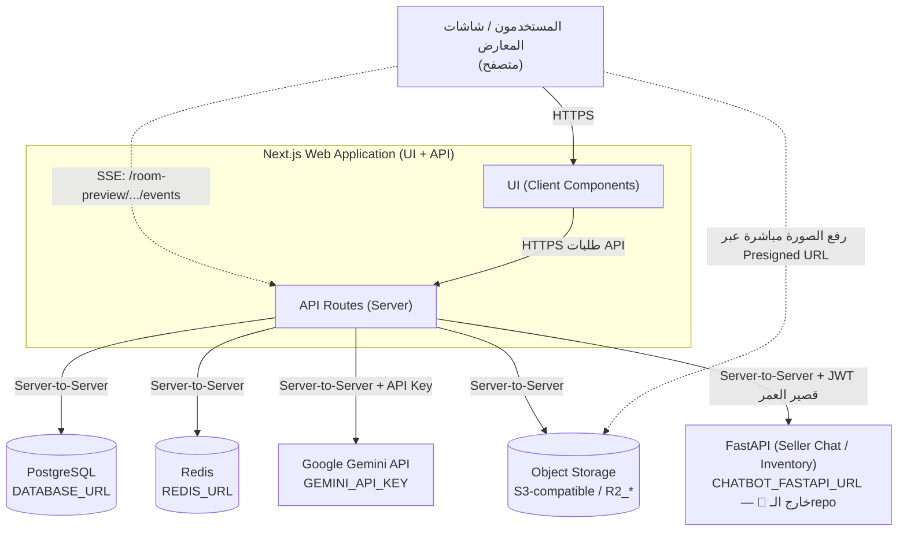

# متطلبات الاستضافة والبنية التحتية — مشروع الـ3D وSeller Chat

> وثيقة رسمية موجّهة إلى **الإدارة وفريق الـIT والبنية التحتية**.
> مبنية على فحص الكود الفعلي والإعدادات في المشروع. لا تعرض أي قيمة سرّية.

## مفاتيح مستوى الإثبات

| الرمز | المعنى |
| ----- | ------ |
| ✅ مؤكد من الكود | مثبت في ملف/إعداد فعلي |
| 🟢 موجود في التشغيل الحالي | يظهر من إعدادات التشغيل/الاستضافة الحالية (استنتاج معقول) |
| 🟡 مقترح للاستضافة | توصية/تقدير أوّلي — ليس قراراً نهائياً |
| ⏳ مطلوب لاحقاً | عمل مستقبلي (غالباً SAP) |
| ❓ يحتاج تأكيداً من فريق IT | غير محسوم في الكود |

> **أرقام CPU/RAM/التخزين أدناه هي «تقدير ابتدائي يحتاج Load Testing قبل Production»**، وليست أرقاماً إلزامية.

---

## 1. الملخص التنفيذي

* المشروع **ليس صفحة ويب ثابتة**؛ هو تطبيق متكامل بخدمات خلفية. ✅
* يتكوّن من: **تطبيق ويب (Next.js)** + **قاعدة بيانات PostgreSQL** + **Redis** + **تخزين ملفات (Object Storage)** + **خدمة AI خارجية (Gemini)** + **خدمة FastAPI منفصلة** للشات. ✅
* التشغيل الكامل **يحتاج أكثر من رفع ملفات على Web Server عادي**: يلزم قاعدة بيانات، وتخزين ملفات سحابي، وRedis، ومفاتيح أسرار، واتصال إنترنت صادر. ✅
* **الحد الأدنى الذي يجب أن توفّره الشركة:** بيئة تشغيل للتطبيق + PostgreSQL + تخزين S3-compatible + Redis + Domain/SSL + مجموعة Environment Variables + إمكانية وصول خادم التطبيق إلى FastAPI. ✅
* **ما يمكن إبقاؤه كخدمة Cloud:** التطبيق وقاعدة البيانات وRedis والتخزين وGemini كلها يمكن أن تبقى خدمات Managed. 🟡
* **ما قد يحتاج استضافة داخل الشركة مستقبلاً:** ليس التطبيق بالضرورة، بل **مسار آمن للاتصال بـSAP** (Middleware/Connector/VPN) عند الربط. ⏳
* **SAP غير مربوطة حالياً إطلاقاً.** ⏳ (لا يوجد أي اتصال SAP في الكود.)
* تفاصيل خدمة **FastAPI الداخلية غير موجودة في هذا الـrepository**؛ نوثّق فقط ما يثبته استدعاء Next.js لها. 🚫

---

## 2. مكوّنات النظام الحالية

| المكوّن | التقنية | وظيفته | أين يعمل حالياً | يحتاج استضافة من الشركة؟ |
| ------- | ------- | ------ | --------------- | ------------------------ |
| Web Application | Next.js 16.2.1، React 19.2.4، TypeScript ✅ | الواجهة + الـAPI الخلفي (Route Handlers) | Cloud (مؤشّر Vercel 🟢) | نعم — حسب خيار الاستضافة |
| Database | PostgreSQL (عبر `DATABASE_URL`) ✅ | تخزين بيانات التطبيق (بائعون/معارض/جلسات Room Preview...) | ❓ | نعم — Managed أو On-prem |
| ORM | Prisma 7 + `pg` + `@prisma/adapter-pg` ✅ | **طبقة وصول** لقاعدة البيانات — **ليست قاعدة بيانات** | داخل التطبيق | لا (مكتبة) |
| Seller Chat Backend | FastAPI (Python) ✅ يُستدعى / كوده 🚫 خارج الـrepo | منطق وبيانات المخزون للشات | 🚫 غير معلوم | نعم — يجب أن تكون قابلة للوصول من خادم Next.js |
| Redis | `ioredis` (عبر `REDIS_URL`) ✅ | Distributed rate limiting + render locks + SSE pub/sub | ❓ (التلميح يذكر Upstash/Redis Cloud) | نعم في الإنتاج |
| Object Storage | S3-compatible (R2/S3) عبر `@aws-sdk/client-s3` ✅ | تخزين الصور المرفوعة ونتائج الرندر | ❓ | نعم في الإنتاج |
| AI Render | Google Gemini (`@google/genai` + `GEMINI_API_KEY`) ✅ | توليد صور Room Preview | Google (خدمة خارجية) | لا — لكن يلزم مفتاح + إنترنت صادر |
| Monitoring/Errors | Sentry (`@sentry/nextjs` + ملفات `sentry.*.config.ts`) ✅ | تتبّع الأخطاء والأداء | Sentry (خارجي) | مفضّل |
| Logging | `pino` ✅ | سجلّات الخادم | داخل التطبيق | — |
| Cron (تنظيف) | `app/api/room-preview/cleanup/route.ts` محمي بـ`CLEANUP_SECRET` ✅ | تنظيف الجلسات منتهية الصلاحية | scheduler غير معرّف في الكود ❓ | يحتاج جدولة (scheduler) |
| Domain / SSL | `NEXT_PUBLIC_BASE_URL` ✅ | الوصول العام + توليد QR | ❓ | نعم |
| Email provider | — | — | ⛔ غير مستخدم (لا توجد مكتبة بريد) | لا |

> ملاحظة مهمة: **Prisma ليست قاعدة البيانات**؛ القاعدة الفعلية هي **PostgreSQL**، وPrisma مجرّد عميل/ORM للوصول إليها. ✅

---

## 3. مخطط المعمارية الحالية



* **اتصالات من المتصفح (Inbound):** HTTPS إلى Next.js، وSSE من مسار الأحداث (`/api/room-preview/sessions/[id]/events`) ✅، ورفع الصور **مباشرة إلى التخزين** عبر **Presigned URL** (مسار `room/upload-url`) ✅.
* **اتصالات Server-to-Server (Outbound من خادم Next.js):** PostgreSQL، Redis، Object Storage، Gemini، وFastAPI. ✅ المتصفح لا يكلّم FastAPI ولا يرى مفاتيح Gemini ولا أسرار التخزين. ✅

---

## 4. خيارات الاستضافة

### الخيار A — Cloud Managed 🟡
* Next.js على منصّة Cloud مناسبة (مثل المنصّة الحالية).
* PostgreSQL كخدمة **Managed**.
* Redis كخدمة **Managed**.
* Object Storage كخدمة **Managed (S3-compatible)**.
* FastAPI على **Cloud Container / VM**.
* **المميزات:** أقل عبء تشغيلي، تحديثات وأمان مُدارة، توسّع أسهل.
* **المخاطر/القيود:** تكلفة شهرية، واعتماد على مزوّد، و**صعوبة الوصول إلى SAP داخل الشبكة** (يُعالَج بالخيار C). ❓

### الخيار B — On-Premises داخل الشركة 🟡
تحتاجه الشركة:
* Linux Server / Virtual Machine.
* Reverse Proxy (إنهاء HTTPS).
* Container runtime (إن رُغب بالحاويات).
* Database server (PostgreSQL).
* Redis server.
* Object Storage (S3-compatible) أو بديل.
* Backup + Monitoring.
* Public access أو VPN + SSL.
* إدارة تحديثات النظام والأمان.
* **ملاحظة:** On-Prem **ليس بالضرورة الأفضل** — يزيد العبء التشغيلي ومسؤولية الأمان والتحديث على فريق IT.

### الخيار C — Hybrid 🟡 ⏳
* يبقى **تطبيق الويب على Cloud**، ويوضع **SAP Connector / Middleware داخل شبكة الشركة**.
* غالباً هو **الأنسب للربط مع SAP** لأن SAP عادةً خلف شبكة الشركة.
* **يحتاج اعتماد فريق الأمن والبنية التحتية** (مسار شبكة آمن، VPN/allowlist).

---

## 5. متطلبات خادم تطبيق Next.js

من الكود/الإعدادات:
* **Build command** ✅: `prisma generate && next build`.
* **Start command** ✅: `next start`.
* **Package manager** 🟢: npm (يوجد `package-lock.json`).
* **Node.js** 🟡: 20.x (استنتاج من `@types/node: ^20` ومتطلبات Next.js 16؛ لا يوجد `.nvmrc` أو `engines` ❓).
* **Operating System** 🟡: Linux (موصى به لتشغيل Node/Next في الإنتاج).
* **Port** 🟡: المنفذ الافتراضي لـNext هو 3000 (مثال `NEXT_PUBLIC_BASE_URL=...:3000` في إعداد التطوير) — في الإنتاج عادةً خلف Reverse Proxy على 443.
* **Reverse Proxy + HTTPS termination** 🟡: مطلوب أمام التطبيق.
* **Containerization** ✅: **لا يوجد Dockerfile/docker-compose** في المشروع — التشغيل بأوامر Node القياسية.
* **عدة Instances** 🟡: ممكن أفقياً **بشرط** أن تكون الحالة مشتركة (DB/Redis/Storage مشتركة). الجلسات قائمة على **JWT في cookies** ✅ (لا توجد جلسة في ذاكرة الخادم) → **لا حاجة إلى Sticky Sessions** للمصادقة 🟢. لكن **SSE وRedis pub/sub** هما ما يضمن عمل الأحداث اللحظية عبر أكثر من Instance ✅.
* **الوصول المطلوب من خادم التطبيق (Outbound):** PostgreSQL، Redis، Object Storage، Gemini (إنترنت)، وFastAPI. ✅

### بيئة اختبار / Pilot (تقدير ابتدائي يحتاج Load Testing قبل Production)

| المورد | الحد الابتدائي المقترح 🟡 | الملاحظة |
| ------ | ------------------------- | -------- |
| vCPU | 1–2 | يكفي لاختبار وظيفي |
| RAM | 2–4 GB | البناء (`next build`) قد يحتاج ذاكرة أعلى مؤقتاً |
| Disk | 10–20 GB | الصور تُخزَّن في Object Storage لا على القرص |
| Network | إنترنت صادر + وصول للخدمات | للوصول إلى FastAPI/Gemini/DB |
| Instances | 1 | بيئة اختبار |

### Production ابتدائي (تقدير ابتدائي يحتاج Load Testing قبل Production)

| المورد | الحد الابتدائي المقترح 🟡 | الملاحظة |
| ------ | ------------------------- | -------- |
| vCPU | 2–4 لكل Instance | يُضبط بعد قياس الحمل |
| RAM | 4–8 GB لكل Instance | حسب الحمل |
| Disk | 20–40 GB | بدون تخزين صور محلي |
| Network | إنترنت صادر ثابت/موثوق | قد يلزم Fixed IP لـSAP لاحقاً ⏳ |
| Instances | 2+ خلف Load Balancer | للتوافر العالي |

> كل الأرقام أعلاه **تقديرات أولية**؛ تُحسم بعد **Load Testing** ومراقبة الاستخدام الفعلي. ❓

---

## 6. متطلبات خدمة FastAPI

> **كود FastAPI خارج هذا الـrepository** — لا نخترع تفاصيله الداخلية. 🚫

ما يمكن إثباته من مشروع الـ3D (✅):
* يحتاج Next.js إلى **Base URL** للوصول إليها (`CHATBOT_FASTAPI_URL`).
* الاتصال **Server-to-Server** (المتصفح لا يصل إليها).
* تُرسَل إليها **JWT قصير العمر** (~60 ثانية) في ترويسة `Authorization: Bearer`.
* يوجد **Timeout** على الاستدعاءات (الشات 45 ثانية، الاقتراحات 8 ثوانٍ).
* الـEndpoints المستخدمة فعلياً: `POST /internal/chat` و`GET /internal/inventory/code-suggestions?q=` (يستخدمها البائع)، وهناك مسارات admin→FastAPI موقّعة بـ`INTERNAL_JWT_SECRET` (import/status/metrics) ✅.
* يجب أن تكون عبر **HTTPS** وأن تكون **قابلة للوصول من خادم Next.js**. 🟡

ما يجب تأكيده من repository الخاص بـFastAPI (❓ — لا نخترعه):
* Python version · Dependencies · Start command · Worker count.
* Required database · مخزن الـExcel/Import · وصول Gemini.
* CPU/RAM · Health endpoint · Log path · Backup requirements.

> ملاحظة من `.env.example`: يوجد `CHATBOT_DATABASE_URL` **لكن الـ3d لا يستعلم قاعدة الـChatbot مباشرة** — «FastAPI owns inventory data». ✅

---

## 7. متطلبات PostgreSQL

* **PostgreSQL** هي قاعدة البيانات الفعلية (`DATABASE_URL`) ✅، و**Prisma** هي ORM/Client ✅.
* **ما يخزّنه المشروع** (من `prisma/schema.prisma`): نماذج المعارض والبائعين (`Showroom`, `Seller`) وجلسات/أحداث Room Preview ونماذج أخرى للتطبيق ✅.
* **بيانات المخزون**: **ليست داخل قاعدة بيانات الـ3D** بحسب الكود الحالي (تملكها FastAPI). ✅

| المتطلب | إلزامي / مفضّل | المسؤول |
| ------- | -------------- | ------- |
| PostgreSQL متوافق مع Prisma 7 / `pg` (نسخة محدّثة مدعومة) 🟡 | إلزامي | IT |
| Connection pooling (مناسب للبيئة Serverless/متعددة Instances) | مفضّل 🟡 | IT + تطوير |
| Encryption in transit (TLS) | إلزامي | IT |
| Private network أو IP allowlist | مفضّل | IT |
| Backup يومي | إلزامي 🟡 | IT |
| Point-in-Time Recovery (إن توفّر) | مفضّل | IT |
| Retention period | يحتاج قراراً ❓ | الإدارة |
| فصل قواعد/Schemas للـDev / Staging / Production | إلزامي | IT + تطوير |
| Migration process (Prisma migrations في `prisma/migrations`) ✅ | إلزامي | تطوير |
| عدم تشغيل migrations عشوائياً على Production | إلزامي | تطوير |

> **`build` يشغّل `prisma generate` فقط (وليس `migrate`)** ✅ → ترحيل قاعدة البيانات خطوة منفصلة يجب ضبطها في عملية النشر. 🟡

---

## 8. متطلبات Redis

Redis مستخدم فعلياً (`ioredis` + `REDIS_URL`)، وأدواره **المثبتة في الكود** (✅):
* **Distributed rate limiting** (مثل حدّ محاولات تسجيل الدخول).
* **Render locks / Gemini semaphore** (التحكم بالتزامن في خط الرندر).
* **SSE pub/sub** للأحداث اللحظية عبر أكثر من Instance.

| المتطلب | الحالة |
| ------- | ------ |
| TLS | مفضّل 🟡 |
| Network access من خادم التطبيق | إلزامي ✅ |
| Memory | تقدير ابتدائي صغير (مفاتيح قصيرة العمر) 🟡 — يُقاس |
| Persistence | غير ضروري للأغراض الحالية (rate-limit/locks/pubsub) 🟡 |
| إذا Redis غير متاح | في الإنتاج: مطلوب (التلميح يقول بدونه تعمل الحدود/الأحداث على **عملية واحدة فقط**) ✅ |
| Polling fallback | ❓ غير مؤكد كمسار كامل — المسار اللحظي المثبت هو **SSE** (مع Redis pub/sub) ✅ |

> `REDIS_URL` **مطلوب في الإنتاج** (مدرج في `lib/env.ts`) ✅. التلميح يقترح Upstash أو Redis Cloud.

---

## 9. متطلبات Object Storage

التخزين عبر **S3-compatible** (`@aws-sdk/client-s3` + Presigned URLs)، يُضبط بـ`STORAGE_PROVIDER` (`local` | `r2` | `s3`) ✅.

* **ما يُخزَّن** ✅: الصور المرفوعة (صور الغرف) ونتائج الرندر (مخرجات الـAI).
* **Presigned upload** ✅: المتصفح يرفع **مباشرة إلى التخزين** عبر رابط موقّع (مسار `room/upload-url`).
* **CORS** ✅: مطلوب على الـbucket (يوجد مسار اختبار `r2-cors-test`).
* **متغيرات الإعداد** ✅: `R2_ENDPOINT`, `R2_BUCKET_NAME`, `R2_ACCESS_KEY_ID`, `R2_SECRET_ACCESS_KEY`, `R2_PUBLIC_URL`.
* **Private vs public** 🟡: الوصول للقراءة العامة عبر `R2_PUBLIC_URL`؛ مفاتيح الكتابة server-only.
* **Retention / Lifecycle cleanup** ⏳ ❓: يحتاج قراراً (سياسة حذف تلقائي).
* **Backup / Replication** 🟡: يُقرَّر حسب الأهمية.
* **Maximum file size** ❓: لم أؤكّد حدّاً رقمياً من الكود — يحتاج تأكيداً.

> ⚠️ **التخزين المحلي على قرص الخادم غير مناسب للإنتاج** (الكود يرمي خطأً في الإنتاج إن لم يكن `STORAGE_PROVIDER=r2|s3`): الملفات تُفقد عند كل نشر/إعادة تشغيل ولا تُرى عبر Instances متعددة. ✅ لذلك **Object Storage إلزامي في الإنتاج**.

---

## 10. خدمات الذكاء الاصطناعي الخارجية

* **الخدمة المثبتة:** Google **Gemini** (`@google/genai` + `GEMINI_API_KEY`) لتوليد صور Room Preview ✅.
* **الخادم هو من يتصل** بالخدمة (Server-side)؛ المفتاح **server-only**. ✅
* يحتاج **اتصال إنترنت صادر (outbound)**. ✅
* توجد **تكلفة واستخدام وحدود (Quota)** على الخدمة الخارجية 🟡.
* **لا تعمل وظيفة الرندر بدون مفتاح صالح** — `GEMINI_API_KEY` مطلوب في الإنتاج ✅.
* يجب تحديد **Budget وQuota وMonitoring** للاستخدام ❓ (قرار إدارة/IT).

> ملاحظة: توجد مكتبة `openai` ضمن التبعيات أيضاً 🟢؛ لكن مزوّد الرندر المؤكد في الإنتاج عبر متغيّر البيئة هو **Gemini**. أي مزوّد بديل يحتاج تأكيداً ❓. (لا أعرض اسم نموذج لم يُثبَت في الإعداد.)

---

## 11. الشبكة والدومين وSSL

ما يجب أن يوفّره فريق IT:

| المطلوب | الحالة |
| ------- | ------ |
| Domain أو Subdomain (يُضبط في `NEXT_PUBLIC_BASE_URL`) ✅ | إلزامي |
| DNS access | إلزامي |
| SSL certificate (أو شهادة تلقائية من المنصّة) | إلزامي |
| HTTPS إجباري | إلزامي |
| Firewall rules | إلزامي |
| Outbound Internet access (Gemini وغيره) ✅ | إلزامي |
| Incoming port (443 خلف Proxy) 🟡 | إلزامي |
| Private connections إلى DB/Redis | مفضّل |
| IP allowlist | مفضّل / حسب الخدمات |
| VPN | ⏳ (غالباً لـSAP) |
| **Fixed outbound IP** | ⏳ ❓ (قد يلزمه SAP/FastAPI) |
| **SSE support** ✅ (مسار `/events`) — على الـProxy ألا يقطع الاتصال الطويل | إلزامي إن استُخدم Room Preview اللحظي |
| Proxy timeout مناسب للطلبات الطويلة 🟡 (الرندر/الشات قد يصل ~45–60 ثانية) | مفضّل |
| Maximum request body size مناسب | 🟡 (الصور تُرفع مباشرة إلى التخزين عبر Presigned URL، فضغط جسم الطلب على التطبيق أقل) |

> لم أثبّت رقم Port أو Timeout كحقيقة إلزامية إلا كاقتراح واضح 🟡؛ والمؤكد فقط أن المنفذ الافتراضي للتطوير 3000، وأن مهلة استدعاء FastAPI 45/8 ثانية ✅.

---

## 12. Environment Variables والأسرار

> الأسماء فقط — **بدون أي قيمة**. مصدرها `lib/env.ts` (مطلوبة عند الإقلاع) و`lib/storage.ts` و`lib/seller/*` و`.env.example`.

| Variable | الخدمة | الغرض | Secret؟ | من يوفّره؟ |
| -------- | ------ | ----- | :-----: | --------- |
| `DATABASE_URL` | Database | اتصال PostgreSQL | نعم | IT |
| `SESSION_TOKEN_SECRET` | Room Preview Auth | توقيع رموز جلسات Room Preview | نعم | IT/تطوير |
| `ADMIN_JWT_SECRET` | Admin Auth | توقيع cookies لوحة الإدارة | نعم | IT/تطوير |
| `SELLER_SESSION_SECRET` | Seller Auth | توقيع `seller_session` JWT | نعم | IT/تطوير |
| `CHATBOT_FASTAPI_URL` | FastAPI | عنوان خدمة FastAPI | لا (لكن server-only) | IT |
| `EXTERNAL_SELLER_JWT_SECRET` | FastAPI | رمز البائع الخارجي إلى FastAPI | نعم | IT/تطوير (يطابق FastAPI) |
| `INTERNAL_JWT_SECRET` | FastAPI (Admin) | رمز admin→FastAPI (import/status/metrics) | نعم | IT/تطوير (يطابق FastAPI) |
| `GEMINI_API_KEY` | AI (Gemini) | مفتاح توليد الرندر | نعم | IT/الإدارة |
| `REDIS_URL` | Redis | اتصال Redis | نعم | IT |
| `STORAGE_PROVIDER` | Object Storage | اختيار `local`/`r2`/`s3` | لا | تطوير/IT |
| `R2_ENDPOINT` | Object Storage | عنوان التخزين | لا (server-only) | IT |
| `R2_BUCKET_NAME` | Object Storage | اسم الـbucket | لا | IT |
| `R2_ACCESS_KEY_ID` | Object Storage | مفتاح وصول | نعم | IT |
| `R2_SECRET_ACCESS_KEY` | Object Storage | سرّ الوصول | نعم | IT |
| `R2_PUBLIC_URL` | Object Storage | عنوان القراءة العام | لا | IT |
| `NEXT_PUBLIC_BASE_URL` | Networking | العنوان العام + توليد QR | لا (**علني**) | IT |
| `CLEANUP_SECRET` | Cron | حماية مسار تنظيف الجلسات | نعم | IT/تطوير |
| `SELLER_CHAT_ENABLED` | Feature Flag | تفعيل/إيقاف الشات | لا | تطوير/IT |
| `CHATBOT_DATABASE_URL` | (مذكور، **غير مستخدم** للاستعلام المباشر) ✅ | — | نعم | — |

> قواعد إلزامية:
> * الأسرار في **Secret Manager** أو منصّة الاستضافة — لا داخل الكود.
> * **عدم وضع `.env` في Git** (يوجد `.env.example` فقط بقيم placeholder).
> * فصل **Development / Staging / Production**.
> * **Rotation** دوري للأسرار، و**Least privilege**.
> * **لا تُرسَل الأسرار عبر البريد أو WhatsApp** — قناة آمنة معتمدة فقط.
> * الثلاثة `SELLER_SESSION_SECRET` و`EXTERNAL_SELLER_JWT_SECRET` و`INTERNAL_JWT_SECRET` **يجب أن تكون مختلفة** (مفروض في الإنتاج) ✅.
> * الفرق بين server-only و`NEXT_PUBLIC_*`: الأخير **يُحقن في حزمة المتصفح ويصبح علنياً** — فلا يُستخدم لأي سرّ. ✅

---

## 13. النسخ الاحتياطي والاستعادة

| العنصر | النسخ الاحتياطي | التكرار (اقتراح 🟡) | مدة الاحتفاظ (اقتراح 🟡) | اختبار الاستعادة |
| ------ | ---------------- | ------------------- | ------------------------ | ---------------- |
| PostgreSQL | Snapshot/Dump + PITR إن توفّر | يومي | 14–30 يوماً ❓ | دوري (ربع سنوي) |
| Object Storage | Versioning/Replication | مستمر/يومي | حسب سياسة الصور ❓ | دوري |
| إعدادات البنية التحتية | نسخة موثّقة (IaC إن وُجد) | عند كل تغيير | — | عند التغيير |
| Secrets recovery | عبر Secret Manager فقط | — | — | اختبار وصول الطوارئ |

* **RPO/RTO** يحتاجان **قراراً من الإدارة** ❓.
* **مسؤولية كل فريق** يجب تحديدها (IT للبنية، تطوير للهجرات).
* **خطة Disaster Recovery** موثّقة ومُختبَرة. 🟡

> القيم أعلاه **اقتراحات أولية** لا تُعتمد إلا بقرار الإدارة. ❓

---

## 14. المراقبة والـLogging

ما يجب مراقبته:
* توفّر التطبيق (Availability) · أخطاء HTTP · اتصالات قاعدة البيانات.
* توفّر FastAPI · توفّر Redis · توفّر Object Storage.
* فشل Gemini · مدة الرندر · زمن استجابة الـAPI.
* Disk / RAM / CPU · فشل Cron · فشل المصادقة · أحداث Rate-limit.

التجهيزات:
* **Sentry موجود** (`@sentry/nextjs`) لتتبّع الأخطاء/الأداء ✅.
* يوجد مسار **`/api/admin/system-health`** يفحص Redis/Storage/Gemini ✅.
* مطلوب إضافةً: **Centralized logs · Uptime checks · Alerts · Dashboard · Log retention** 🟡.
* **عدم تسجيل** Tokens أو Secrets أو كلمات المرور إطلاقاً (الكود يتعمّد رسائل آمنة) ✅.

---

## 15. الأمن (Checklist)

| البند | موجود داخل التطبيق ✅ | مسؤولية فريق IT |
| ----- | :-------------------: | --------------- |
| HTTPS | (إجباري بالنشر) | ✔ |
| Firewall | — | ✔ |
| Private database | — | ✔ |
| Least privilege | (تصميم الأسرار/الصلاحيات) | ✔ |
| Separate service accounts | (أسرار منفصلة) ✅ | ✔ |
| Secret manager | — | ✔ |
| Password hashing (bcrypt) | ✅ | — |
| HttpOnly cookies | ✅ | — |
| Rate limiting (Redis) | ✅ | (توفير Redis) |
| Dependency updates | (تطوير) | مشترك |
| OS / DB patching | — | ✔ |
| Vulnerability scanning | — | ✔ |
| Audit logs | ⛔ غير موجود كنظام مخصّص (logging تشغيلي فقط) | ⏳ |
| Backup encryption | — | ✔ |
| Access review | — | ✔ |
| Production access approval | — | ✔ |

---

## 16. البيئات المطلوبة

| البيئة | Domain | Database | Storage | Redis | Env Vars | SAP مستقبلاً | الوصول | بيانات |
| ------ | ------ | -------- | ------- | ----- | -------- | ------------ | ------ | ------ |
| Development | محلي/Subdomain | DB تطوير | local أو bucket تجريبي | محلي/اختياري | dev | — | تطوير | تجريبية |
| Staging / QA | Subdomain | DB منفصلة | bucket منفصل | منفصل | staging | QA ⏳ | تطوير + IT | تجريبية |
| Production | الدومين الرسمي | DB إنتاج | bucket إنتاج | إنتاج | production | PROD ⏳ | مقيّد + اعتماد | حقيقية |

> **يجب فصل Production عن الاختبار فصلاً تاماً** (قواعد بيانات وأسرار وbuckets مستقلة). ✅ (الكود يفرض أسراراً قوية ومنفصلة في الإنتاج.)

---

## 17. CI/CD والنشر

ما يمكن إثباته:
* **Source repository:** Git (المشروع داخل repo) ✅.
* **Branch الإنتاج:** غير مثبت في الكود ❓ (يُحدَّد في إعداد المنصّة).
* **Build:** `prisma generate && next build` ✅.
* **Tests:** `vitest` (unit/integration) و`playwright` (e2e) ✅.
* **Type check:** `tsc --noEmit` (مستخدم في التطوير) 🟢.
* **Database migration:** Prisma migrations — **خطوة منفصلة** يجب ضبطها في النشر ✅ 🟡.
* **Deployment / Rollback / Environment approvals / صلاحية النشر:** تُدار عبر منصّة الاستضافة ❓.

Workflow مقترح (🟡 غير مطبّق بالضرورة):
```text
Push → Lint + Type check + Tests → Build → Migrate (مُتحكَّم) → Deploy (Staging) → موافقة → Deploy (Production) → Smoke test → (Rollback عند الفشل)
```

---

## 18. Cron jobs والمهام المجدولة

| المهمة | المسار | التكرار الحالي | الحماية | أثر عدم التشغيل |
| ------ | ------ | -------------- | ------- | --------------- |
| تنظيف جلسات Room Preview | `app/api/room-preview/cleanup/route.ts` ✅ | **غير معرّف في الكود** (`vercel.json` فارغ `{}`) ❓ | `CLEANUP_SECRET` ✅ | تراكم جلسات/بيانات منتهية |

* **هل المنصّة تدعم الجدولة المطلوبة؟** ❓ — يحتاج تأكيداً (Vercel Cron أو scheduler خارجي أو Worker).
* **Worker منفصل مستقبلاً؟** 🟡 — قد يلزم إن زادت المهام الخلفية.

> لم أخترع أي Cron — المسار المؤكد الوحيد هو endpoint التنظيف المحمي بـ`CLEANUP_SECRET`.

---

## 19. قابلية التوسع

* **عند زيادة المستخدمين/الشاشات:** التطبيق **Stateless** (الجلسة في JWT cookies) ✅ → يدعم **Horizontal scaling** بزيادة Instances.
* **الموارد المشتركة المطلوبة للتوسّع:** Database مشتركة + **Redis مشترك** (للـrate-limit/locks/SSE pub/sub) + **Object Storage مشترك** ✅.
* **حدود خارجية تؤثّر على التوسّع:** حدود اتصالات PostgreSQL، حدود/تزامن **Gemini** (يوجد semaphore للتحكم) ✅، وعدد عمّال **FastAPI** (🚫 خارج الـrepo).
* **Queue / Background Worker:** ⛔ غير موجود حالياً كخدمة مستقلة — قد يكون **احتياجاً مستقبلياً** إن زادت الأحمال الخلفية ⏳.

> تمييز: ما هو **موجود** (Stateless + Redis + Storage مشتركة) مقابل ما هو **مقترح مستقبلاً** (Queue/Worker مستقل). 

---

## 20. متطلبات الربط المستقبلي مع SAP (مستقبلي فقط ⏳)

> **SAP غير مربوطة حالياً.** هذا القسم خطة مستقبلية ولا يخترع أي SAP Endpoint.

قد يحتاج فريق IT/SAP لتوفير:
* بيئة **SAP DEV/QA**.
* **طريقة التكامل** المعتمدة (OData/REST/RFC-BAPI/IDoc/BTP/Middleware).
* **Middleware أو SAP BTP**.
* **مسار شبكة آمن** (Secure network path).
* **Fixed IP / VPN / Allowlist**.
* **Read-only service account**.
* **Documentation + Sample responses + Certificates**.
* **قناة آمنة لتسليم الأسرار**.
* **Monitoring + Support contact**.

الفرق المهم:
* **استضافة التطبيق** = تشغيل Next.js والخدمات المساندة (موضوع هذه الوثيقة). ✅
* **توفير مسار آمن للاتصال بـSAP** = مسؤولية شبكة/أمن منفصلة قد لا تتحقق من Cloud مباشرة. ⏳ ❓

---

## 21. ما يجب أن توفّره الإدارة وفريق IT

### الإدارة
- [ ] اعتماد نوع الاستضافة (A/B/C)
- [ ] Budget
- [ ] Owners لكل خدمة
- [ ] SLA
- [ ] RPO/RTO
- [ ] Timeline
- [ ] Production approval

### فريق IT
- [ ] Servers أو Cloud subscriptions
- [ ] Domain وDNS
- [ ] SSL
- [ ] Firewall
- [ ] PostgreSQL (Managed/On-prem)
- [ ] Redis
- [ ] Object Storage (S3-compatible)
- [ ] Secrets management
- [ ] Backup
- [ ] Monitoring
- [ ] CI/CD access
- [ ] Network connectivity (وصول التطبيق إلى FastAPI/Gemini/DB)
- [ ] Support

### فريق التطوير
- [ ] Source code
- [ ] Build instructions (`prisma generate && next build`)
- [ ] قائمة Environment Variables (القسم 12)
- [ ] Database migrations
- [ ] Health checks (`/api/admin/system-health`)
- [ ] Deployment verification
- [ ] Documentation

### فريق SAP (مستقبلاً ⏳)
- [ ] Integration documentation
- [ ] QA access
- [ ] Service account (Read-only)
- [ ] Mapping
- [ ] Network requirements
- [ ] Business validation

---

## 22. الحد الأدنى المطلوب للبدء (Minimum Required to Start)

> لتشغيل نسخة **Staging** عاملة:

* Application runtime (Node 20.x لتشغيل Next.js). 🟡
* **PostgreSQL** (`DATABASE_URL`). ✅
* **FastAPI reachable** من خادم التطبيق (`CHATBOT_FASTAPI_URL`). ✅
* **Object Storage** S3-compatible (`STORAGE_PROVIDER=r2|s3` + `R2_*`) — ضروري عملياً للصور. ✅
* **Redis** (`REDIS_URL`) — ضروري في الإنتاج (وللأحداث/الحدود عبر Instances). ✅
* **Domain + HTTPS** (`NEXT_PUBLIC_BASE_URL`). ✅
* **Environment Variables** المطلوبة (القسم 12). ✅
* **Outbound Internet** (Gemini). ✅
* **Monitoring أساسي** (Sentry موجود). 🟢
* **Backup أساسي** لقاعدة البيانات. 🟡

---

## 23. البيئة المقترحة للإنتاج

| الخدمة | الخيار المقترح 🟡 | البديل | من يوفّرها | ملاحظات |
| ------ | ----------------- | ------ | ---------- | ------- |
| Web App | Managed platform لتطبيقات Next.js | VM / Container platform | IT | Stateless، قابل للتوسّع أفقياً |
| Database | Managed PostgreSQL | PostgreSQL على VM | IT | TLS + Backup + PITR |
| Redis | Managed Redis | Redis على VM | IT | للـrate-limit/locks/SSE |
| Object Storage | S3-compatible (مثل R2) | S3 آخر | IT | Presigned uploads + CORS |
| AI | Gemini API (خارجي) | — | الإدارة/IT | مفتاح + Budget + Quota |
| FastAPI | Container / VM قابل للوصول من التطبيق | — | IT (بالتنسيق مع مالك FastAPI) | HTTPS + شبكة خاصة |
| Monitoring | Sentry + Uptime/Alerts | بديل مكافئ | IT | — |
| Secrets | Secret Manager للمنصّة | Vault | IT | فصل البيئات |

> **لا نختار Vendor/مزوّداً معيّناً كقرار نهائي** — هذه أنواع خدمات مقترحة فقط. ❓

---

## 24. أسئلة يجب على المدير إرسالها لفريق IT

* هل تريدون **Cloud أم On-Prem أم Hybrid**؟
* هل توجد بنية **Kubernetes/Docker** حالياً؟
* هل يوجد **Managed PostgreSQL**؟
* هل توجد خدمة **Redis**؟
* هل يوجد **S3-compatible storage**؟
* هل يوجد **Secret Manager**؟
* هل يوجد **Monitoring مركزي**؟
* هل يمكن توفير **Fixed outbound IP**؟
* هل يمكن **الوصول إلى SAP من Cloud**؟ (للمستقبل)
* هل توجد **بيئة QA**؟
* من **مسؤول النشر والدعم**؟
* ما **SLA** المطلوب؟
* ما **سياسات النسخ الاحتياطي**؟
* ما **سياسات الاحتفاظ** بالصور والبيانات؟

---

## 25. ملخص طلب رسمي (قابل للإرسال)

> لتشغيل مشروع الـ3D وSeller Chat بشكل **مستقر وآمن**، نحتاج إلى توفير: **بيئة تشغيل لتطبيق ويب (Next.js)** على Node 20.x خلف HTTPS، و**قاعدة بيانات PostgreSQL مُدارة** مع نسخ احتياطي، و**خدمة Redis**، و**تخزين ملفات متوافق مع S3 (Object Storage)** للصور ونتائج المعاينة، مع **اتصال إنترنت صادر** للوصول إلى خدمة الذكاء الاصطناعي (Gemini)، و**إمكانية وصول خادم التطبيق إلى خدمة FastAPI** الخاصة بالشات. كما نحتاج **Domain وشهادة SSL**، و**إدارة آمنة للأسرار (Secret Manager)**، و**مراقبة ونسخاً احتياطياً أساسياً**، مع فصل بيئات **Staging وProduction**. أما **الربط مع SAP فهو مرحلة مستقبلية** تتطلب لاحقاً مساراً شبكياً آمناً (Middleware/VPN/Allowlist) وحساب قراءة فقط، وتُعتمد تفاصيلها من فريق SAP والبنية التحتية. الأرقام الدقيقة لموارد الخوادم تُحسم بعد **Load Testing**.

---

## 26. Appendix — معلومات تحتاج تأكيداً (❓ / 🚫 / ⏳)

| المعلومة | الحالة |
| -------- | ------ |
| مكان استضافة FastAPI ونسخة Python وWorkers | 🚫 خارج الـrepo / ❓ |
| أحجام الخوادم النهائية (CPU/RAM/Disk) | 🟡 تقدير يحتاج Load Testing |
| عدد المستخدمين/الشاشات المتزامنين | ❓ |
| حجم الصور الشهري وسياسة الاحتفاظ | ❓ |
| SLA وRPO/RTO | ❓ قرار إدارة |
| Fixed outbound IP | ❓ |
| Branch الإنتاج وآلية الترحيل في النشر | ❓ |
| جدولة الـCron (vercel.json فارغ) | ❓ |
| Maximum file size للرفع | ❓ |
| مزوّد AI بديل (وجود مكتبة `openai`) | ❓ |
| مسار شبكة SAP وطريقة التكامل | ⏳ ❓ |
| Production traffic الفعلي | ❓ |

> **تذكير:** أي بند موسوم 🚫 / ❓ / ⏳ **ليس حقيقة نهائية**؛ يُحسم بقرار/تأكيد من الجهة المختصة. وSAP **غير مربوطة حالياً** بأي حال.
