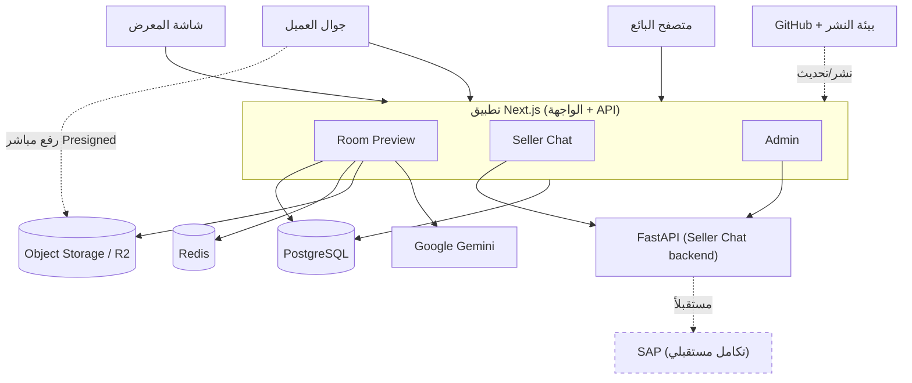

# مخطط معمارية النظام

## شرح الاتصالات
| # | من | إلى | الغرض | الحالة |
| - | --- | --- | ----- | ------ |
| 1 | شاشة المعرض / جوال العميل / البائع | تطبيق Next.js | الوصول للواجهة عبر HTTPS | حالي |
| 2 | Room Preview | PostgreSQL | تخزين جلسات وبيانات المعاينة | حالي |
| 3 | Room Preview | Redis | حدود الطلبات + أقفال التوليد + الأحداث اللحظية | حالي |
| 4 | جوال العميل | Object Storage (R2) | رفع صورة الغرفة مباشرة عبر Presigned URL | حالي |
| 5 | Room Preview | Object Storage (R2) | حفظ/قراءة نتائج المعاينة | حالي |
| 6 | Room Preview | Google Gemini | توليد صورة المعاينة بالذكاء الاصطناعي | حالي |
| 7 | Seller Chat | FastAPI | استعلام المخزون واقتراح الأكواد (خادم‑لخادم) | حالي |
| 8 | Admin | FastAPI | استيراد المخزون وحالة/مقاييس الشات | حالي |
| 9 | GitHub + بيئة النشر | تطبيق Next.js | النشر والتحديث | حالي (التفاصيل تحتاج تأكيد من فريق IT) |
| 10 | FastAPI | SAP | مصدر مخزون معتمد | **مستقبلي — غير مطبّق** |

> ملاحظة: المتصفح لا يتصل بـFastAPI ولا Gemini ولا الأسرار مباشرة؛ كل ذلك عبر خادم Next.js.
