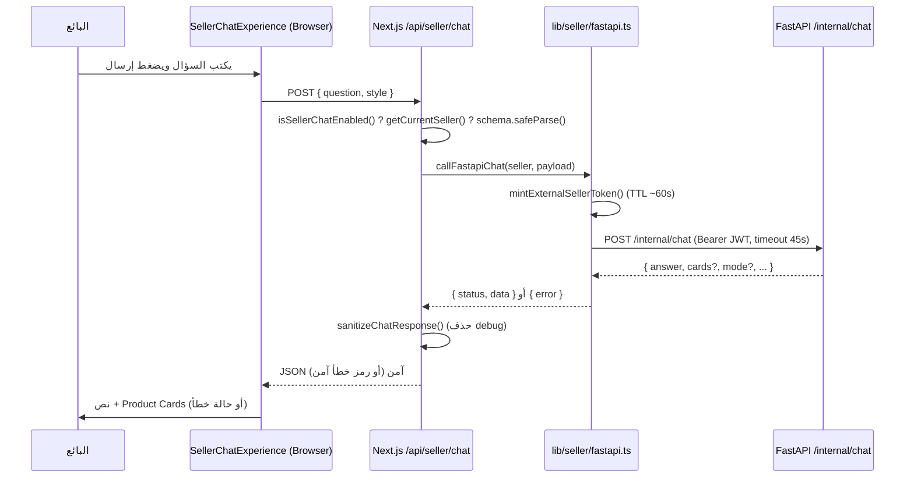

# دليل Seller Chat التقني التعليمي

> مرجع تعليمي شخصي لفهم قسم **Seller Chat** داخل مشروع الـ3D، والرد بثقة في اجتماع مع المدير أو فريق SAP أو البنية التحتية.
> مبني على الكود الفعلي وعلى `docs/api.md` و`docs/sap-integration-meeting-guide.md` (دون نسخها حرفياً).

## مفاتيح مستوى الإثبات (مهمة جداً)

في كل هذا الملف، كل معلومة موسومة بأحد الرموز التالية:

| الرمز | المعنى |
| ----- | ------ |
| ✅ | **مؤكد من الكود** (مثبت في ملف فعلي) |
| 🔎 | **استنتاج تقني من الكود** (منطقي لكنه استنتاج، لا تصريح حرفي) |
| 🚫 | **غير ظاهر في هذا الـrepository** (مثل داخل FastAPI أو SAP) |
| ⛔ | **غير مطبّق حالياً** |
| ⏳ | **مطلوب لاحقاً** (عمل مستقبلي / يحتاج قرار) |

> القاعدة الذهبية: لا أُقدّم استنتاجاً أو فراغاً على أنه حقيقة. ما هو 🚫 أو ⏳ يُقال كذلك صراحةً.

---

## 1. ملخص المشروع بلغة بسيطة

* **تطبيق الـ3D** ✅: تطبيق ويب مبني بـ**Next.js** (الإصدار 16.x) و**React** 19 و**TypeScript**، يضم عدة أقسام (منها Room Preview وقسم البائعين). نحن هنا نركّز على قسم البائعين فقط.
* **Seller Chat** ✅: مساعد محادثة (Chat) باللغة العربية داخل التطبيق، يجيب البائع عن أسئلة **الأصناف والمخزون** (المتوفّر، التوفّر حسب المستودع، الكميات القادمة).
* **لماذا هو داخل نفس المشروع** ✅: لأنه يعيد استخدام **جلسة البائع** و**قاعدة بيانات الـ3D** للهوية والصلاحيات؛ فهو قسم مدمج وليس تطبيقاً منفصلاً.
* **من يستخدمه** ✅: البائع (Seller) بعد تسجيل الدخول إلى منطقة `/seller` المحمية.
* **المشكلة التي يحلها** 🔎: يتيح للبائع سؤالاً نصّياً بدل البحث اليدوي في أنظمة المخزون.
* **علاقته بالمخزون** ✅: الواجهة **لا تتصل بمصدر المخزون مباشرة**، بل تمرّ عبر Next.js API محمي ثم **FastAPI**.
* **علاقة FastAPI** ✅: خدمة منفصلة (الـChatbot) هي التي **تملك بيانات المخزون** فعلياً وتعالج السؤال؛ كودها **خارج هذا الـrepository** 🚫.
* **علاقة SAP المستقبلية** ⏳ ⛔: لا يوجد أي ربط مع SAP حالياً؛ الهدف لاحقاً جعل SAP مصدر بيانات المخزون المعتمد.

### «اشرح مشروعك خلال دقيقة»
> «لدينا تطبيق ويب بـNext.js للبائعين، فيه مساعد محادثة (Seller Chat) يسأل عنه البائع عن المخزون: كم المتوفّر من صنف، التوفّر حسب المستودع، والكميات القادمة. البائع يسجّل دخوله بكود البائع وكود المعرض وكلمة المرور، فتُنشأ له جلسة محمية. عندما يرسل سؤالاً، يذهب إلى Next.js API على الخادم، الذي يتحقق من جلسته ثم يستدعي خدمة FastAPI (هي التي تملك بيانات المخزون) عبر اتصال خادم-لخادم برمز مؤقت. المتصفح لا يرى عنوان FastAPI ولا الأسرار. حالياً مصدر البيانات هو FastAPI، وSAP غير مربوطة بعد، ونخطط لربطها لاحقاً كمصدر معتمد.»

### نسخة 20 ثانية
> «مساعد محادثة للبائعين داخل تطبيق Next.js يجيب عن أسئلة المخزون. الواجهة تمرّ عبر Next.js API محمي ثم FastAPI التي تملك البيانات. الهوية من جلسة البائع، والأسرار على الخادم فقط، وSAP غير مربوطة بعد.»

---

## 2. قاموس المصطلحات التقنية في مشروعي

| المصطلح | معناه ببساطة | أين يُستخدم في مشروعي | مثال من الكود |
| ------- | ------------ | --------------------- | ------------- |
| Frontend (الواجهة) | ما يراه المستخدم ويتفاعل معه | واجهة الشات | `components/seller/chat/*` ✅ |
| Backend (الخادم) | منطق يعمل على الخادم لا المتصفح | مسارات الـAPI | `app/api/seller/**` ✅ |
| Next.js | إطار عمل يجمع الواجهة والخادم في مشروع واحد | كل المشروع | `package.json` → `next` ✅ |
| React | مكتبة بناء الواجهات بمكوّنات | واجهة الشات | `SellerChatExperience.tsx` ✅ |
| TypeScript | JavaScript مع أنواع (types) | كل الملفات `.ts/.tsx` | `inventory-types.ts` ✅ |
| API | طريقة لطلب خدمة عبر الشبكة | استدعاء الشات والاقتراحات | `fetch("/api/seller/chat")` ✅ |
| Endpoint | عنوان محدد لطلب معيّن | مسارات البائع | `POST /api/seller/chat` ✅ |
| Route Handler | دالة Next.js تعالج طلب API | كل ملفات `route.ts` | `export async function POST(req)` ✅ |
| Server Component | مكوّن يُنفَّذ على الخادم | صفحة الشات | `app/seller/chat/page.tsx` (`async` + `requireSeller`) ✅ |
| Client Component | مكوّن يعمل في المتصفح | واجهة الشات التفاعلية | `"use client"` في `SellerChatExperience.tsx` ✅ |
| FastAPI | خدمة Python منفصلة تملك بيانات المخزون | الـbackend الفعلي للمخزون | استُدعيت في `lib/seller/fastapi.ts` ✅ / كودها 🚫 |
| Database | مخزن بيانات دائم | بيانات البائع والمعرض | Prisma + Postgres ✅ |
| PostgreSQL | نوع قاعدة البيانات | تخزين الـ3D | `pg` / `@prisma/adapter-pg` في `package.json` ✅ |
| Prisma | أداة للتعامل مع قاعدة البيانات بأنواع | قراءة البائع | `prisma.seller.findUnique(...)` ✅ |
| Cookie | قيمة صغيرة يحفظها المتصفح | جلسة البائع | `seller_session` ✅ |
| Session (جلسة) | إثبات أن المستخدم مسجّل دخوله | بعد تسجيل الدخول | `lib/seller/session.ts` ✅ |
| JWT | رمز موقّع يحمل معلومات موثوقة | جلسة البائع + رمز FastAPI | `SignJWT` (jose) ✅ |
| Authentication | التحقق «من أنت» | تسجيل الدخول | `verifyPassword` ✅ |
| Authorization | التحقق «بماذا يُسمح لك» | حماية `/seller` | `requireSeller()` ✅ |
| Hashing | تحويل كلمة المرور لقيمة لا تُعكَس | تخزين كلمة المرور | bcrypt في `password.ts` ✅ |
| Environment Variable | إعداد يُقرأ من بيئة التشغيل | الأسرار والروابط | `process.env.CHATBOT_FASTAPI_URL` ✅ |
| Secret | قيمة سرّية (مفتاح/كلمة) | توقيع الـJWT | `EXTERNAL_SELLER_JWT_SECRET` ✅ (القيمة غير معروضة) |
| Server-to-Server | اتصال بين خادمين دون المتصفح | Next.js → FastAPI | `fetch(\`${baseUrl}/internal/chat\`)` ✅ |
| Request | الطلب المُرسَل | سؤال الشات | `{ question, style }` ✅ |
| Response | الرد المُعاد | جواب + بطاقات | `{ answer, cards?, ... }` ✅ |
| JSON | صيغة تبادل البيانات | كل الطلبات/الردود | `req.json()` ✅ |
| HTTP Method | نوع الطلب (GET/POST...) | login=POST, me=GET | `export async function GET/POST` ✅ |
| Status Code | رقم نتيجة الطلب | 200/401/502... | `{ status: 401 }` ✅ |
| Timeout | مهلة قصوى للطلب | استدعاء FastAPI | `REQUEST_TIMEOUT_MS = 45000` ✅ |
| Abort | إلغاء طلب جارٍ | إلغاء المهلة/الاقتراحات | `AbortController` ✅ |
| Feature Flag | مفتاح تشغيل/إيقاف ميزة | تفعيل الشات | `isSellerChatEnabled()` ✅ |
| Rate Limit | حدّ لعدد المحاولات | تسجيل الدخول | `checkIpRateLimit` (5/60s) ✅ |
| Cache | تخزين مؤقت لتسريع/تقليل الطلبات | — | ⛔ غير موجود في الشات |
| Fallback | خطة بديلة عند الفشل | الاقتراحات ترجع `[]` عند الفشل ✅؛ Fallback لمصدر بيانات بديل ⏳ |
| Logging | تسجيل أحداث للتشخيص | سجلّات الشات | `getLogger("seller-chat")` ✅ |
| Monitoring | مراقبة الصحة/الأداء | — | ⛔ لا يوجد نظام مراقبة مخصّص للشات |
| Middleware | طبقة وسيطة في الطلبات | — | ⛔ لا يوجد `middleware.ts` |
| Deployment | نشر التطبيق وتشغيله | تشغيل Next.js | 🔎 (انظر القسم 13) |
| Vercel | منصّة استضافة لتطبيقات Next.js | استضافة محتملة | 🔎 (`vercel.json` فارغ `{}` + مجلد `.vercel`) |
| Production / Development | بيئة الإنتاج / التطوير | فروق الأمان | `process.env.NODE_ENV` ✅ |
| QA | بيئة اختبار | للـPOC مستقبلاً | ⏳ |
| CORS | سياسة وصول عبر النطاقات | — | غير ذي صلة هنا 🔎 (المتصفح يكلّم نفس نطاق Next.js فقط) |
| Webhook | استدعاء وارد من خدمة خارجية | — | ⛔ غير مستخدم في الشات |
| Polling | سؤال متكرر عن التحديث | — | ⛔ غير مستخدم في الشات |
| SSE | بثّ من الخادم للمتصفح | — | ⛔ غير مستخدم في الشات (الرد طلب/استجابة واحد) |
| Source of Truth | المصدر المعتمد للبيانات | حالياً FastAPI ✅ / مستقبلاً SAP ⏳ |
| Adapter | طبقة تعزل المنطق عن مصدر البيانات | مقترح لربط SAP | ⏳ (تصور، غير موجود) |
| Data Mapping | مطابقة حقول/أكواد نظامنا بـSAP | لاحقاً | ⏳ |

> ملاحظة: ما هو موسوم ⛔ هنا (Cache / Middleware / Monitoring / Webhook / Polling / SSE) **غير موجود فعلاً** في مسار Seller Chat — لا تَدّعِ وجوده.

---

## 3. صورة المشروع التقنية

### المخطط العام (من الكود)

```text
Seller (موظف المبيعات)
→ Browser (المتصفح)
→ Next.js UI            components/seller/chat/* + app/seller/chat/page.tsx
→ Next.js API (محمي)    app/api/seller/chat/route.ts
→ FastAPI               {CHATBOT_FASTAPI_URL}/internal/chat   (Bearer JWT)
→ Inventory Source      (داخل خدمة FastAPI — 🚫 خارج هذا الـrepo)
→ Response → Product Card
```

### Browser / UI
* **ماذا يحدث في المتصفح** ✅: يعرض شاشة الشات، يأخذ سؤال البائع، ويرسل طلباً واحداً إلى `POST /api/seller/chat`، ثم يعرض النص و/أو بطاقات المخزون.
* **ما يراه المستخدم** ✅: شاشة ترحيب + اقتراحات + حقل إدخال + رسائل + بطاقات.
* **ما يجب ألا يصل للمتصفح** ✅: عنوان FastAPI، الـSecrets، والـJWT المُرسَل إلى FastAPI — كلها `server-only` (راجع `import "server-only"` في `lib/seller/fastapi.ts` و`session.ts`).

### Next.js
* **لماذا يوجد** 🔎: يجمع الواجهة (UI) وطبقة خادم وسيطة (API routes) في مشروع واحد، فيكون «الوسيط الآمن» بين المتصفح وFastAPI.
* **في الواجهة** ✅: مكوّنات `"use client"` تعرض وتتفاعل.
* **في الخادم** ✅: Route Handlers (`route.ts`) تتحقق من الجلسة وتسكّ الـJWT وتستدعي FastAPI.
* **معنى أن API route محمي** ✅: يستدعي `getCurrentSeller()` وإن لم توجد جلسة صالحة يعيد `401` (في `app/api/seller/chat/route.ts` و`.../inventory/code-suggestions/route.ts`).

### FastAPI
* **لماذا خدمة منفصلة** 🔎: لأنها تملك منطق المخزون والبيانات (الـChatbot)، وتُعاد استخدامها كما هي.
* **ما نعرفه من كود المشروع** ✅: يُستدعى منها مساران فقط — `POST /internal/chat` و`GET /internal/inventory/code-suggestions?q=` — عبر `Authorization: Bearer <token>` و`Content-Type: application/json` (في `lib/seller/fastapi.ts`).
* **ما لا نعرفه** 🚫: بنية FastAPI الداخلية، قاعدة بياناتها، كيف تحسب الأرقام، وأي مصدر فعلي للمخزون — **كودها خارج هذا الـrepository**، فلا أصفه.

### قاعدة بيانات الـ3D
* **ما تخزّنه عن البائع** ✅: نموذج `Seller` (id, sellerCode, name, passwordHash, status, tokenVersion, showroomId) و`Showroom` (id, code, name) في `prisma/schema.prisma`.
* **ما لا تخزّنه** ✅: **لا تخزّن بيانات المخزون** (تعليق `.env.example` صريح: «FastAPI owns inventory… data»)، ولا تخزّن رسائل الشات (⛔ لا يوجد model للرسائل).
* **دور Prisma** ✅: ORM للوصول إلى Postgres؛ مثال `prisma.seller.findUnique(...)` في `login/route.ts` و`account-access.ts`.

### مصدر المخزون
* **أين يوجد بحسب الكود** ✅: داخل/خلف خدمة FastAPI عبر `CHATBOT_FASTAPI_URL`.
* **هل هو SAP؟** ⛔: لا — لا يوجد أي اتصال SAP في الكود.
* **هل هو Excel؟** 🚫: غير معروف من هذا الـrepo؛ نوع المخزن داخل FastAPI خارج نطاقنا، فلا أجزم.
* **ما نستطيع تأكيده** ✅: بالنسبة للـ3D، مصدر المخزون = FastAPI. **ما لا نستطيع تأكيده** 🚫: ما خلف FastAPI فعلياً.

---

## 4. خريطة الملفات

| الملف / المجلد | دوره | Client / Server | متى يُستدعى |
| -------------- | ---- | --------------- | ----------- |
| `app/seller/layout.tsx` | حارس منطقة `/seller` كلها (`requireSeller`) | Server ✅ | عند فتح أي صفحة تحت `/seller` |
| `app/seller/chat/page.tsx` | صفحة الشات؛ تتحقق من الجلسة وتصيّر الواجهة | Server ✅ | عند فتح `/seller/chat` |
| `app/api/seller/auth/login/route.ts` | تسجيل دخول البائع وضبط الـcookie | Server ✅ | `POST` من نموذج الدخول |
| `app/api/seller/auth/logout/route.ts` | مسح cookie الجلسة | Server ✅ | `POST` من زر الخروج |
| `app/api/seller/auth/me/route.ts` | إرجاع بيانات البائع للعرض | Server ✅ | `GET` عند الحاجة |
| `app/api/seller/chat/route.ts` | بوّابة السؤال → FastAPI | Server ✅ | `POST` عند إرسال سؤال |
| `app/api/seller/inventory/code-suggestions/route.ts` | اقتراح أكواد المنتجات | Server ✅ | `GET` أثناء الكتابة |
| `components/seller/chat/SellerChatExperience.tsx` | منسّق الواجهة وحالة المحادثة + استدعاء الشات | Client ✅ | عند تحميل صفحة الشات |
| `components/seller/chat/ChatComposer.tsx` | حقل الإدخال + الـtypeahead للأكواد | Client ✅ | دائماً في الشات |
| `components/seller/chat/ChatMessages.tsx` | عرض الرسائل + بطاقات + Loading/Error | Client ✅ | عند تغيّر الرسائل |
| `components/seller/chat/CodeAutocomplete.tsx` | قائمة الاقتراحات المنبثقة | Client ✅ | أثناء كتابة كود |
| `components/seller/chat/InventoryProductCard.tsx` | بطاقة الصنف/المخزون | Client ✅ | عند وجود `cards` |
| `lib/seller/auth.ts` | `getCurrentSeller` / `requireSeller` | Server ✅ | في الصفحات والـAPI المحمية |
| `lib/seller/session.ts` | سكّ/تحقّق JWT الجلسة + ثوابت الـcookie | Server ✅ | الدخول وكل طلب محمي |
| `lib/seller/account-access.ts` | اشتقاق حالة البائع من قاعدة البيانات | Server ✅ | داخل `getCurrentSeller` والدخول |
| `lib/seller/fastapi.ts` | سكّ JWT خارجي + استدعاء FastAPI + sanitize | Server ✅ | داخل route الشات والاقتراحات |
| `lib/seller/chat-validation.ts` | Zod schema لسؤال الشات (`.strict()`) | Server ✅ | داخل route الشات |
| `lib/seller/validation.ts` | Zod schema لتسجيل الدخول | Server ✅ | داخل route الدخول |
| `lib/seller/password.ts` | bcrypt hashing/verify | Server ✅ | الدخول |
| `lib/seller/codes.ts` | تطبيع الأكواد (`normalizeCode`) | Server ✅ | الدخول والاقتراحات |
| `lib/seller/chat/code-suggest.ts` | منطق كشف/استبدال الكود + fetch الاقتراحات | Client/Server ✅ | في الـComposer |
| `lib/seller/chat/inventory-types.ts` | أنواع `InventoryDTO` + ثوابت المستودعات/الحالات | مشترك ✅ | في البطاقات |

### من يستورد من؟ (مسارات أساسية)
* **بدء تدفّق الشات** ✅: `SellerChatExperience.tsx` ← يستدعي `POST /api/seller/chat`.
* **بدء تسجيل الدخول** ✅: نموذج `/login` ← `POST /api/seller/auth/login/route.ts`.
* **استدعاء FastAPI** ✅: فقط من `lib/seller/fastapi.ts` (`callFastapiChat` / `callFastapiCodeSuggestions`).
* **إنشاء JWT** ✅: جلسة البائع في `lib/seller/session.ts` (`createSellerToken`)؛ ورمز FastAPI في `lib/seller/fastapi.ts` (`mintExternalSellerToken`).

---

## 5. رحلة تسجيل دخول البائع

الملفات: `app/api/seller/auth/login/route.ts` + `lib/seller/{validation,password,session,account-access}.ts`.

1. **ماذا يرسل البائع** ✅: JSON فيه `sellerCode` + `showroomCode` + `password`.
2. **أي Endpoint** ✅: `POST /api/seller/auth/login`.
3. **التحقق من المدخلات** ✅: `sellerLoginSchema` (Zod) يطبّع الأكواد (`normalizeCode`) ويتحقق من طول كلمة المرور بالبايت (UTF-8).
4. **البحث عن البائع** ✅: `prisma.seller.findUnique({ where: { sellerCode } })` مع `showroom`.
5. **التحقق من كلمة المرور** ✅: `verifyPassword` (bcrypt). يُجرى دائماً مقارنة (حتى ضد `DUMMY_PASSWORD_HASH`) لتسطيح زمن الاستجابة ومنع التعداد.
6. **حساب معطّل** ✅: تُجمع كل شروط الاعتماد أولاً؛ ثم — وفقط بعد صحة الاعتماد والعضوية — إن كان `status !== "active"` يعاد `403` مع `code: "disabled"`.
7. **إنشاء Session** ✅: `createSellerToken({ id, tokenVersion })`.
8. **مكان الـCookie** ✅: `res.cookies.set(SELLER_SESSION_COOKIE, token, SELLER_SESSION_COOKIE_OPTIONS)` (الاسم `seller_session`).
9. **محتوى JWT** ✅: فقط `sub` (معرّف البائع) و`tokenVersion`. لا اسم، لا دور، لا معرض داخل الـtoken.
10. **فتح `/seller/chat`** ✅: الرد يحمل `redirectTo: "/seller/chat"`؛ والصفحة محمية بـ`requireSeller()`.
11. **التحقق في كل طلب** ✅: `getCurrentSeller()` يتحقق من توقيع/صلاحية الـtoken ثم **يعيد اشتقاق** الهوية من قاعدة البيانات عبر `resolveSellerAccess` (يقارن `tokenVersion`، يتأكد من وجود المعرض والحالة active).

### الفرق بين الرمزين (Seller Session JWT مقابل FastAPI JWT)

| النقطة | Seller Session JWT | FastAPI (External Seller) JWT |
| ------ | ------------------ | ----------------------------- |
| الغرض | إثبات جلسة البائع في المتصفح | إثبات الهوية لخدمة FastAPI |
| مكان الاستخدام | cookie `seller_session` | ترويسة `Authorization: Bearer` خادم→خادم |
| العمر | 7 أيام ✅ | ~60 ثانية ✅ (قصير جداً) |
| Audience (`aud`) | `seller` ✅ | `fastapi` ✅ |
| Issuer (`iss`) | `3d-app` ✅ | `3d-app` ✅ |
| Secret | `SELLER_SESSION_SECRET` ✅ | `EXTERNAL_SELLER_JWT_SECRET` ✅ (مفتاح منفصل) |
| هل يصل للمتصفح؟ | نعم (داخل cookie httpOnly) ✅ | **لا** — server-only ✅ |
| المحتوى | `sub` (id) + `tokenVersion` ✅ | `sub="3d-seller:<id>"` + `actorType="external_seller"` + `showroomId` ✅ |

> القيم السرّية للمفاتيح **غير معروضة** في هذه الوثيقة.

---

## 6. رحلة سؤال الشات

مثال: «كم المتوفّر من CRPT050.006؟»

1. **قراءة السؤال** ✅: `ChatComposer.tsx` (حقل الإدخال).
2. **إرسال الطلب** ✅: `SellerChatExperience.tsx` يستدعي `fetch("/api/seller/chat", { method: "POST", body: JSON.stringify({ question, style }) })`.
3. **الـEndpoint** ✅: `POST /api/seller/chat`.
4. **شكل الـRequest** ✅: `{ question: string, style: "creative"|"balanced"|"precise" }` (الافتراضي `balanced`).
5. **التحقق من الجلسة** ✅: `getCurrentSeller()`؛ بدونها `401`.
6. **التحقق من السؤال** ✅: `sellerChatSchema.safeParse` بـ`.strict()` (يرفض أي حقول إضافية مثل `sellerId`).
7. **سكّ رمز FastAPI** ✅: `mintExternalSellerToken(seller)` بهوية مشتقّة من قاعدة البيانات.
8. **استدعاء FastAPI** ✅: `POST {CHATBOT_FASTAPI_URL}/internal/chat` بترويسة Bearer.
9. **Timeout** ✅: `AbortController` بمهلة `REQUEST_TIMEOUT_MS = 45000` ميلي ثانية.
10. **التحقق من Response** ✅: 401/403→`upstream_auth`؛ غير 2xx→`upstream_status`؛ JSON غير صالح أو غياب `answer:string`→`upstream_invalid`.
11. **إزالة غير المرغوب** ✅: `sanitizeChatResponse` يحذف الحقل `debug`.
12. **إعادة النص والبطاقات** ✅: تُعاد بقية الكائن كما هي (`answer`, وقد يحتوي `cards`, `mode`, `intent`, `productCode`, `warehouse`).
13. **عرض البطاقات** ✅: `ChatMessages.tsx` → `InventoryProductCard.tsx` لكل عنصر في `cards`. شارة الوضع: `mode === "ai"` → «AI: Gemini»، غير ذلك → «Fallback».
14. **معالجة الخطأ/إعادة المحاولة** ✅: عند `401` إعادة توجيه `/login?type=seller`؛ عند `400` تُعرض رسالة الخطأ؛ غير ذلك حالة خطأ مع زر «إعادة المحاولة». أثناء الانتظار تُعرض «جاري البحث…» ويُعطَّل الإدخال.

### Sequence Diagram (يعكس الكود)



---

## 7. رحلة اقتراح كود الصنف (Code Autocomplete)

الملفات: `ChatComposer.tsx` + `lib/seller/chat/code-suggest.ts` + `app/api/seller/inventory/code-suggestions/route.ts` + `lib/seller/fastapi.ts`.

* **متى يبدأ البحث** ✅: عند كتابة جزء يشبه كوداً داخل الجملة (`detectCodeFragment`).
* **النص المُرسَل** ✅: الجزء المكتوب فقط كـ`q` (بعد تطبيع الأرقام العربية/الفارسية).
* **الـEndpoint** ✅: `GET /api/seller/inventory/code-suggestions?q=...` (الثابت `CODE_ENDPOINT` في `ChatComposer.tsx`).
* **Debounce** ✅: نعم — `debounce(..., 250)` في `ChatComposer.tsx`.
* **Abort** ✅: نعم — يُلغى الطلب السابق عبر `AbortController`؛ وللخادم مهلة `SUGGEST_TIMEOUT_MS = 8000`.
* **عند فشل الطلب** ✅: يرجع `{ ok:false, suggestions: [] }` على العميل، و`[]` على الخادم.
* **هل الفشل يمنع الإرسال؟** ✅: لا — يفشل بصمت (fail-open) دون منع إرسال السؤال.
* **ماذا يعرض الاقتراح** ✅: **الكود والاسم فقط** (`{ code, label }`) — **لا كميات مخزون** إطلاقاً.

---

## 8. البيانات والـData Model

### بيانات البائع (`CurrentSeller` في `account-access.ts`)
* الحقول المستخدمة ✅: `id`, `name`, `sellerCode`, `showroomId`, `showroomCode`.
* أين تُقرأ ✅: من قاعدة البيانات عبر `resolveSellerAccess` على كل طلب محمي.
* ما يأتي من قاعدة البيانات ✅: كل ما سبق (الهوية والحالة).
* ما يأتي من Session ✅: فقط `sub` و`tokenVersion` (مدخلان استرشاديان يُعاد التحقق منهما).

### بيانات سؤال الشات (Request)
* ✅: `question` (1..500 حرف)، `style` (`creative`/`balanced`/`precise`، افتراضي `balanced`). أي حقل آخر **مرفوض** (`.strict()`).

### بيانات الرد (Response)
* **مضمون من جهة الـ3d** ✅: وجود `answer: string` (تتحقق منه `fastapi.ts`)، وحذف `debug`.
* **اختياري/يأتي من FastAPI** 🔎: `cards`, `mode`, `intent`, `productCode`, `warehouse`. البنية النهائية الكاملة 🚫 (تحددها FastAPI).

### Inventory Product Card (`InventoryDTO` في `inventory-types.ts`)

| الحقل | معناه (وصف عام) | مصدره الحالي | مطلوب من SAP لاحقاً؟ |
| ----- | --------------- | ------------ | -------------------- |
| `productCode` | كود الصنف | FastAPI ✅ | ⏳ تأكيد المصدر والـMapping |
| `productName` | اسم الصنف | FastAPI ✅ | ⏳ |
| `warehouse` | المستودع (قيم معرّفة: Riyadh/Jeddah/Dammam ✅) | FastAPI ✅ | ⏳ (Plant أم Storage Location؟) |
| `quantityAvailable` | كمية «المتاح» | FastAPI ✅ | ⏳ + **تعريف الأعمال** |
| `reservedQuantity` | المحجوز | FastAPI ✅ | ⏳ + **تعريف الأعمال** |
| `availableToSell` | المتاح للبيع | FastAPI ✅ | ⏳ (On-hand−Reserved أم ATP؟) |
| `incomingQuantity` | الكمية القادمة | FastAPI ✅ | ⏳ |
| `expectedArrivalDate` | تاريخ الوصول المتوقع | FastAPI ✅ | ⏳ |
| `status` | الحالة (`available`/`low_stock`/`incoming`/`out_of_stock` ✅) | FastAPI/قاعدة محسوبة ✅ | ⏳ |

> ⚠️ التعريف **التجاري** النهائي لـ`availableToSell` و`reservedQuantity` **يحتاج اعتماد قسم الأعمال** — لا أُثبّت معنى نهائياً.
> توجد دالة `computeStatus(availableToSell, incomingQuantity)` ✅ تطبّق قاعدة الحالة دون اختراع قيم.

---

## 9. قاعدة البيانات

من `prisma/schema.prisma` (الأجزاء المرتبطة بالبائع):

* **Models المرتبطة** ✅: `Seller` و`Showroom`.
* **العلاقة** ✅: `Seller.showroomId → Showroom.id` (كل بائع ينتمي لمعرض واحد).
* **تحديد أن البائع Active** ✅: حقل `status` من نوع `enum SellerStatus { active, disabled }`، والافتراضي `disabled` حتى يُفعّله مشرف.
* **`tokenVersion`** ✅: عدّاد (`Int @default(0)`) — يُقارَن في كل طلب محمي؛ تعليق الـschema: «Bumped to revoke all existing sessions» → رفعه يُبطل كل الجلسات القديمة.
* **رسائل الشات** ✅ ⛔: **غير مخزّنة في قاعدة البيانات** — لا يوجد model للرسائل؛ تُحفظ في حالة المكوّن (`useState`) للعرض فقط، وتختفي عند إعادة التحميل 🔎.
* **بيانات المخزون** ✅ ⛔: **ليست في قاعدة بيانات الـ3D** (تعليق `.env.example`: «FastAPI owns inventory… data»).
* **كلمات المرور** ✅: **Hash فقط** (bcrypt، `SALT_ROUNDS = 12`) — لا تُخزَّن كنص واضح (`passwordHash` في الـschema + `password.ts`).

> ملاحظة: قاعدة البيانات تحتوي نماذج أخرى للـ3D (معارض/جلسات/أحداث) لكنها خارج نطاق Seller Chat 🔎.

---

## 10. الأمن (Security)

### الحمايات الموجودة فعلياً ✅

| الحماية | الدليل في الكود |
| ------- | ---------------- |
| HttpOnly Cookie | `SELLER_SESSION_COOKIE_OPTIONS.httpOnly = true` |
| Secure Cookie (إنتاج فقط) | `secure: process.env.NODE_ENV === "production"` |
| SameSite | `sameSite: "lax"` |
| انتهاء JWT | الجلسة 7 أيام؛ رمز FastAPI ~60 ثانية |
| تحقّق الجلسة على الخادم | `getCurrentSeller` يعيد الاشتقاق من قاعدة البيانات |
| Password hashing | bcrypt في `password.ts` |
| Rate limiting | `checkIpRateLimit` على الدخول (5/60s) |
| Feature flag | `isSellerChatEnabled()` |
| Zod validation | `sellerLoginSchema` / `sellerChatSchema` |
| Strict request schema | `.strict()` يرفض الحقول الزائدة |
| Server-only FastAPI URL | `import "server-only"` + `getChatbotFastapiUrl` |
| Server-only secrets | الأسرار تُقرأ على الخادم فقط؛ لا `NEXT_PUBLIC_` |
| Short-lived external JWT | TTL ~60s |
| فصل الأسرار | `EXTERNAL_SELLER_JWT_SECRET` ≠ `SELLER_SESSION_SECRET` ≠ `INTERNAL_JWT_SECRET` (مفروض في الإنتاج) |
| رفض هوية المتصفح | `.strict()` يمنع تمرير `sellerId/showroomId`؛ الهوية من الجلسة |
| إزالة debug | `sanitizeChatResponse` يحذف `debug` |
| رسائل خطأ آمنة | رسائل عربية موحّدة دون تفاصيل upstream |
| Timeout | على الشات (45s) والاقتراحات (8s) |

### ما الذي يحمي منه كل إجراء؟

| الحماية | الخطر الذي تقلّله |
| ------- | ----------------- |
| HttpOnly | سرقة الـcookie عبر JavaScript (XSS) |
| Rate limit على الدخول | تخمين كلمات المرور (brute force) |
| رسالة 401 عامة + dummy hash | تعداد الحسابات (enumeration) واستغلال زمن الرد |
| `.strict()` + هوية من الجلسة | انتحال بائع آخر من المتصفح |
| Server-only secrets/URL | تسريب الأسرار وعنوان FastAPI |
| Short-lived JWT | إعادة استخدام رمز مسروق |
| فصل الأسرار | اختراق حدّ ثقة يجرّ البقية |
| Timeout | تعليق الطلبات عند بطء/تعطّل upstream |

### ما الذي لا يجب أن أقوله
* ❌ لا أقول «النظام آمن 100%».
* ❌ لا أقول إن البيانات «مشفّرة داخل SAP» — لم نتحقق 🚫.
* ❌ لا أعرض أي Secret أو قيمته.
* ❌ لا أرسل token في Screenshot أو Log.
* ❌ لا أصف ضمانات أمنية لـFastAPI الداخلية 🚫.

---

## 11. الأخطاء وحالات الفشل

| الحالة | HTTP Status | ما يراه المستخدم | ما يحدث في الخادم |
| ------ | ----------- | ---------------- | ----------------- |
| لا توجد جلسة | `401` ✅ | إعادة توجيه لتسجيل الدخول (في الشات) | `getCurrentSeller()` = null |
| الجلسة منتهية/مبطلة | `401` ✅ | كما أعلاه | فشل تحقّق التوقيع أو `tokenVersion` |
| البائع Disabled | `403` (الدخول) ✅ | «تم تعطيل هذا الحساب» | `status !== "active"` بعد صحة الاعتماد |
| Feature flag مغلق | `503` ✅ | «خدمة المحادثة غير متاحة حالياً» | `isSellerChatEnabled()` = false |
| سؤال غير صالح | `400` ✅ | رسالة خطأ التحقق | فشل `sellerChatSchema` |
| FastAPI URL غير مضبوط | `503` ✅ | رسالة آمنة | `preflight_config` (غياب `CHATBOT_FASTAPI_URL`) |
| Secret غير مضبوط | `503` ✅ | رسالة آمنة | `preflight_config` (`EXTERNAL_SELLER_JWT_SECRET` ضعيف/غائب) |
| FastAPI غير متاح | `503` ✅ | رسالة آمنة | `unreachable` (خطأ شبكة) |
| Timeout | `504` ✅ | رسالة آمنة | `AbortError` بعد 45s |
| FastAPI status غير متوقع | `502` ✅ | رسالة آمنة | `upstream_status` |
| FastAPI Response غير صالح | `502` ✅ | رسالة آمنة | `upstream_invalid` (JSON سيّئ أو غياب `answer`) |
| فشل اقتراحات الأكواد | — ✅ | لا شيء يكسر؛ لا اقتراحات | يرجع `[]` (fail-open) |
| انقطاع الإنترنت | (شبكة المتصفح) 🔎 | حالة خطأ في الواجهة | `catch` في الـfetch |
| ضغط الإرسال عدة مرات | — 🔎 | لا إرسال مكرر أثناء التحميل | الإدخال يُعطَّل أثناء الطلب |

> لم أخترع أي status — كلها من `route.ts` و`fastapi.ts`.

---

## 12. Environment Variables

| المتغير | أين يُستخدم | الغرض | Client/Server | مطلوب في Production |
| ------- | ----------- | ----- | ------------- | ------------------ |
| `SELLER_SESSION_SECRET` | `lib/seller/session.ts` | توقيع/تحقّق JWT جلسة البائع | Server ✅ | نعم (يوجد fallback للتطوير فقط) |
| `CHATBOT_FASTAPI_URL` | `lib/seller/fastapi.ts` | عنوان خدمة FastAPI | Server ✅ | نعم (يرمي خطأ إن غاب) |
| `EXTERNAL_SELLER_JWT_SECRET` | `lib/seller/fastapi.ts` | توقيع الرمز الخارجي إلى FastAPI | Server ✅ | نعم (≥32 حرف، غير placeholder) |
| `SELLER_CHAT_ENABLED` | `lib/seller/fastapi.ts` | Feature flag للشات | Server ✅ | لتفعيل الميزة في الإنتاج |
| `INTERNAL_JWT_SECRET` | `lib/seller/fastapi.ts` | يُفحَص فقط لفرض اختلاف الأسرار | Server ✅ | يُفحَص في الإنتاج |
| `NODE_ENV` | عدة ملفات | تمييز الإنتاج/التطوير | Server ✅ | قياسي |
| `CHATBOT_DATABASE_URL` | (مذكور في `.env.example`) | غير مستخدم في مسار الشات؛ الـ3d **لا** يستعلم قاعدة الـChatbot مباشرة | Server ✅ | ⛔ لا يلزم للشات |

* **لماذا لا نضع Secrets في Frontend** ✅: أي شيء في المتصفح يمكن قراءته؛ لذلك الأسرار `server-only` ولا تُسبق بـ`NEXT_PUBLIC_`.
* **Server-only مقابل `NEXT_PUBLIC_*`** 🔎: متغيّر بادئته `NEXT_PUBLIC_` يُحقَن في حزمة المتصفح ويُصبح علنياً؛ متغيّرات الشات **ليست** كذلك.
* **لماذا اختلاف الأسرار** ✅: كل سرّ حدّ ثقة مستقل؛ تسريب أحدها لا يجرّ الآخر (مفروض في الإنتاج).
* **غياب متغيّر مطلوب** ✅: `CHATBOT_FASTAPI_URL`/`EXTERNAL_SELLER_JWT_SECRET` يرميان خطأً → يُصنَّف `preflight_config` → `503` آمن.

> لا تُعرض أي قيمة. حتى في `.env.example` القيم placeholders.

---

## 13. Deployment والتشغيل

* **أين يعمل Next.js** ✅: كتطبيق Next.js (سكربتات `dev`/`build`/`start` في `package.json`).
* **دور Vercel** 🔎: يوجد `vercel.json` (فارغ `{}`) ومجلد `.vercel` → **مؤشّر** على استضافة Vercel، لكن لا إعداد صريح يؤكد تفاصيل النشر؛ أصفه كاستنتاج لا حقيقة.
* **أين تعمل FastAPI** 🚫: **غير معلوم من هذا الـrepository**. في التطوير، `.env.example` يذكر مثالاً `http://localhost:8001`، أما الإنتاج فغير محدد هنا.
* **كيف يتصل Next.js بـFastAPI** ✅: من الخادم عبر `fetch` خادم→خادم بترويسة Bearer.
* **هل المتصفح يتصل بـFastAPI مباشرة؟** ✅: **لا**.
* **معنى Server-to-Server** 🔎: خادم Next.js هو من ينادي FastAPI، فلا يرى المتصفح العنوان ولا الرمز.

### مشكلة متوقّعة عند ربط خدمة على الإنترنت بـSAP داخل الشركة ⏳
خدمة مستضافة على الإنترنت (مثل Vercel) قد لا تصل مباشرة إلى SAP خلف شبكة الشركة. الخيارات (تحتاج **قراراً**، وليست تصميماً مطبقاً):

| الخيار | الفكرة |
| ------ | ------ |
| Direct access | وصول مباشر (نادراً ما يُسمح به للإنتاج) ⏳ |
| VPN | نفق آمن إلى شبكة الشركة ⏳ |
| IP Allowlist | السماح لعنوان IP صادر ثابت ⏳ |
| Middleware داخلي | وسيط داخل الشركة يكلّم SAP ⏳ |
| SAP BTP | منصّة تكامل من SAP ⏳ |
| Connector | عميل/خدمة داخل الشبكة تربط الطرفين ⏳ |

> ⚠️ **لا أجزم** أن Vercel يستطيع الوصول إلى SAP — هذا قرار بنية تحتية وأمن.

---

## 14. ما هو موجود وما هو غير موجود

| الميزة | موجود | غير موجود | الدليل |
| ------ | :---: | :-------: | ------ |
| Seller login | ✅ | | `app/api/seller/auth/login/route.ts` |
| Protected seller chat | ✅ | | `requireSeller()` في layout/page |
| Chat API | ✅ | | `app/api/seller/chat/route.ts` |
| Code autocomplete | ✅ | | `code-suggestions/route.ts` + `code-suggest.ts` |
| Product cards | ✅ | | `InventoryProductCard.tsx` |
| Inventory via FastAPI | ✅ | | `lib/seller/fastapi.ts` |
| SAP integration | | ⛔ | لا أثر في الكود |
| Direct SAP connection | | ⛔ | لا أثر في الكود |
| Cache | | ⛔ | لا cache في مسار الشات |
| Circuit breaker | | ⛔ | يوجد timeout فقط (≠ circuit breaker) |
| Audit log | | ⛔ | يوجد logging تشغيلي فقط (`getLogger`) |
| Chat history persistence | | ⛔ | لا model للرسائل؛ state فقط |
| Technical documents | | ⛔ | منقول «MINUS technical-document» |
| Voice | | ⛔ | منقول «MINUS voice» |
| Web knowledge | | ⛔ | منقول «MINUS web» |
| Monitoring | | ⛔ | لا نظام مراقبة مخصّص |
| Retry | ✅ (يدوي في الواجهة) | | زر «إعادة المحاولة» في `ChatMessages.tsx` |
| Timeout | ✅ | | `REQUEST_TIMEOUT_MS` / `SUGGEST_TIMEOUT_MS` |
| Fallback | جزئي ✅ | | الاقتراحات ترجع `[]`؛ لكن لا Fallback لمصدر بيانات بديل ⏳ |

> تمييز دقيق: **وجود Timeout لا يعني Circuit Breaker**؛ و**logging لا يعني Audit Log أو Monitoring**؛ و**retry يدوي لا يعني retry تلقائي**.

---

## 15. كيف سيتم ربط SAP نظرياً بدون تغيير كل المشروع

> تصوّر على مستوى Architecture فقط ⏳ — **ليس قراراً ولا كوداً موجوداً**.

### ما الذي يمكن إبقاؤه (🔎 مرشّح للبقاء)
* واجهة Seller Chat كما هي.
* تسجيل دخول البائع وجلسته.
* Next.js protected routes (نقطة الحقن المثالية للتغيير).
* Product Cards (نفس `InventoryDTO` إن طابقنا الحقول).
* صيغة السؤال (`{ question, style }`).
* عقد الرد (Response contract) — بعد اعتماد Mapping.

### ما الذي قد يتغيّر (⏳)
* مصدر بيانات FastAPI (أو إدخال طبقة جديدة قبله/بعده).
* طبقة **Inventory Adapter** تعزل الشات عن مصدر البيانات.
* الـMapping (أكواد/مستودعات نظامنا ↔ SAP).
* معالجة الأخطاء الخاصة بـSAP.
* Cache وMonitoring.
* اتصال الشبكة والـSecrets ومصادقة SAP.

### المخطط

```text
الوضع الحالي (✅):
Next.js → FastAPI → Current Inventory Source

الوضع المستقبلي المحتمل (⏳ تصوّر):
Next.js → FastAPI → Inventory Adapter → SAP Integration Layer → SAP
```

> هذا **تصوّر** يوضّح أن المعمارية تسمح بإدخال مصدر جديد دون إعادة بناء الواجهة — وليس قراراً نهائياً.

---

## 16. أسئلة تقنية قد يسألني إياها المدير (Q&A)

> لكل سؤال: جواب مختصر / جواب أعمق / ما يحتاج تأكيداً.

1. **أين بيانات المخزون حالياً؟** — مختصر: في خدمة FastAPI ✅. أعمق: الـ3d يستدعي `/internal/chat`؛ الـ3d نفسه لا يخزّن مخزوناً. تأكيد: ما خلف FastAPI 🚫.
2. **هل الشات متصل بـSAP؟** — لا ⛔. أعمق: لا أثر لـSAP في الكود. تأكيد: لا شيء.
3. **هل يمكن ربطه مباشرة بـSAP؟** — تقنياً المعمارية تسمح بإدخال طبقة ⏳. تأكيد: طريقة الاتصال والصلاحيات من فريق SAP/البنية التحتية.
4. **لماذا نحتاج FastAPI؟** — لأنها تملك منطق وبيانات المخزون ونعيد استخدامها 🔎. تأكيد: تفاصيلها الداخلية 🚫.
5. **لماذا لا يستدعي المتصفح SAP/FastAPI مباشرة؟** — لإخفاء العنوان والأسرار وفرض الهوية على الخادم ✅.
6. **كيف يعرف النظام أي بائع يسأل؟** — من جلسة البائع المُعاد اشتقاقها من قاعدة البيانات ✅.
7. **هل يستطيع المستخدم تغيير sellerId؟** — لا ✅: `.strict()` يرفضه والهوية من الجلسة.
8. **كيف نحمي كلمة المرور؟** — bcrypt hash (cost 12)، لا نص واضح ✅.
9. **أين تُحفظ Session؟** — في cookie `seller_session` (httpOnly) كـJWT ✅.
10. **ما الفرق بين Cookie وJWT؟** — Cookie وعاء تخزين في المتصفح؛ JWT محتوى موقّع بداخله ✅.
11. **لماذا JWT ثانٍ لـFastAPI؟** — حدّ ثقة منفصل قصير العمر لإثبات الهوية لخدمة خارجية ✅.
12. **ماذا لو تعطّل FastAPI؟** — رمز خطأ آمن (503/504/502) ورسالة عربية دون تسريب ✅.
13. **ماذا لو تعطّل SAP مستقبلاً؟** — يحتاج خطة Fallback ⏳ (غير مطبّقة).
14. **هل الأرقام Real-time؟** — غير مؤكد من الـ3d 🚫؛ يحدده مصدر FastAPI/SAP.
15. **هل تُخزَّن المحادثات؟** — لا ⛔ (state فقط).
16. **هل يرى كل بائع كل المستودعات؟** — قرار أعمال/صلاحيات ⏳ (الهوية تحمل `showroomId` لكن سياسة العرض تحتاج تحديداً).
17. **هل يوجد Cache؟** — لا ⛔.
18. **هل يوجد Audit Log؟** — لا ⛔ (logging تشغيلي فقط).
19. **هل التطبيق جاهز للإنتاج؟** — جانب التطبيق يعمل ✅، لكن جاهزية SAP/التشغيل تحتاج عملاً ⏳.
20. **ما المطلوب لـPOC؟** — Read-only على QA، عدد محدود من الأصناف/المستودعات، وMapping متفق عليه ⏳.
21. **كم تغيير في الواجهة؟** — قليل غالباً 🔎 (نُبقي الواجهة ونغيّر مصدر البيانات/Adapter)، مرهون بالـMapping.
22. **هل نحتاج Vendor من SAP؟** — قرار إداري ⏳.
23. **هل اتصال Vercel بـSAP آمن؟** — لا أجزم 🚫؛ قرار بنية تحتية/أمن.
24. **ما أكبر المخاطر؟** — Mapping خاطئ، تعريف «المتاح» غير معتمد، صلاحيات أوسع من اللازم (انظر القسم 19).
25. **ما أول خطوة تقنية؟** — تثبيت نوع SAP وطريقة التكامل والبيانات، ثم POC للقراءة فقط ⏳.

---

## 17. أسئلة تقنية قد يسألني إياها فريق SAP (Q&A)

> لكل سؤال: جواب حالي من الكود / ما أحتاج أسأل عنه داخلياً / ما لا أعد به.

* **Application architecture?** — Next.js (UI + API محمي) → FastAPI → مصدر مخزون ✅. أحتاج: مكان استضافة الإنتاج. لا أعد بطريقة اتصال SAP محددة.
* **Where is it hosted?** — Next.js؛ مؤشّر Vercel 🔎. أحتاج: تأكيد بيئة الإنتاج. لا أعد بـIP ثابت قبل التأكد.
* **Who initiates the request?** — خادم Next.js (server-to-server) ✅، لا المتصفح.
* **What protocol do you use?** — HTTPS/JSON عبر `fetch` + Bearer JWT ✅.
* **What authentication do you support?** — حالياً JWT (HS256) موقّع بسرّ مشترك مع FastAPI ✅؛ مع SAP غير محدد ⏳.
* **Real-time data?** — غير مؤكد من جهتنا 🚫؛ قرار أعمال/أداء ⏳.
* **Expected request volume?** — غير محدد في الكود 🚫؛ أحتاج تقديره داخلياً ⏳.
* **What inventory fields?** — حقول `InventoryDTO` (القسم 8) ✅.
* **Expected response time?** — نتحمّل حتى ~45s للشات و~8s للاقتراحات ✅ كحدود مهلة؛ التوقّع الفعلي ⏳.
* **Caching?** — لا حالياً ⛔؛ قابل للإضافة ⏳.
* **Error handling?** — تصنيف آمن للأخطاء (503/504/502/401/400) ✅.
* **Read or write?** — **Read-only** في مرحلتنا الأولى ⏳ (مبدأ متفق عليه داخلياً).
* **Fixed outbound IP?** — غير مؤكد 🚫؛ يعتمد على الاستضافة ⏳.
* **Connect through middleware?** — ممكن ⏳؛ قرار بنية تحتية.
* **Warehouse mapping?** — لدينا Riyadh/Jeddah/Dammam ✅؛ مطابقتها بـSAP ⏳.
* **Restrict by seller/showroom?** — الهوية تحمل `showroomId` ✅؛ سياسة التقييد النهائية ⏳ (أعمال).

---

## 18. أجوبة يجب ألا أخمّنها

إن سُئلت عن أيٍّ من التالي، أقول صراحةً إنها **تحتاج تأكيداً** من الجهة المختصة، ولا أخترع:

* نوع SAP وإصداره · الـModule · SAP APIs · أسماء حقول SAP.
* Real-time أم Cache · تعريف «المتاح/المحجوز» · صلاحيات المستودعات.
* حجم الطلبات · مسار الشبكة · IP ثابت · VPN · مصادقة SAP.
* Production timeline · تكلفة التكامل · متطلبات الـVendor.

### صياغات مهنية بديلة عن «ما بعرف»
* «هذه النقطة **غير مثبتة في النظام الحالي**، ونحتاج تأكيدها من فريق SAP/البنية التحتية.»
* «المعمارية الحالية **تدعم إدخال مصدر بيانات جديد**، لكن **طريقة الاتصال لم تُعتمد بعد**.»
* «أستطيع تأكيد **جانب التطبيق** من الكود، أما **تعريف البيانات** فيجب اعتماده من **قسم الأعمال**.»
* «أفضّل ألا أعِد بهذا قبل **قرار رسمي**؛ سأدوّنه كنقطة مفتوحة في المحضر.»

---

## 19. مخاطر المشروع (Risk Register)

| الخطر | السبب | التأثير | التخفيف | المسؤول |
| ----- | ----- | ------- | ------- | ------- |
| Mapping خاطئ | اختلاف الأكواد/الحقول | أرقام مضلّلة للبائع | جدول Mapping معتمد + اختبار | تقني + أعمال |
| تعريف خاطئ لـ«المتاح» | غياب اعتماد الأعمال | قرارات بيع خاطئة | اعتماد رسمي للتعريف | أعمال |
| صلاحيات أوسع من اللازم | حساب تكامل واسع | مخاطر أمنية | Service Account للقراءة فقط | أمن + SAP |
| تأخّر SAP | اعتماديات تنظيمية | تأخّر المشروع | POC مبكر + جدول | مدير |
| بطء SAP | استعلامات ثقيلة | تجربة سيئة | Cache + حدود مهلة | تقني + SAP |
| انقطاع الاتصال | شبكة/صيانة | تعطّل المخزون | Fallback + رسائل آمنة | بنية تحتية |
| اختلاف الأكواد | ترميز مختلف | عدم تطابق | تطبيع + Mapping | تقني |
| اختلاف المستودعات | Plant مقابل Storage Location | عرض خاطئ | تأكيد المطابقة | SAP + أعمال |
| بيانات قديمة | Cache طويل | أرقام غير محدّثة | سياسة freshness | تقني + أعمال |
| كشف Secrets | سوء تخزين | اختراق | Secret Manager + فصل الأسرار | أمن |
| غياب QA | الاختبار على الإنتاج | مخاطر تشغيلية | توفير بيئة QA | SAP + بنية تحتية |
| لا Business owner | غياب اعتماد | جدل في التعريفات | تعيين معتمِد | مدير |
| AI يعطي أرقاماً غير موثوقة | اعتماد على توليد | ثقة زائفة | الاعتماد على بيانات المصدر لا التوليد | تقني + أعمال |
| عدم تطابق Response contract | تغيّر الحقول | كسر البطاقات | عقد ثابت + اختبارات | تقني |

> لم أخترع أي خطر «خاص بالشركة» كحقيقة — هذه مخاطر عامة قابلة للتطبيق.

---

## 20. Checklist أفهم بها المشروع

### يجب أن أستطيع شرح:
- [ ] وظيفة Seller Chat (القسم 1)
- [ ] الفرق بين Next.js وFastAPI (القسمان 2، 3)
- [ ] تدفّق تسجيل الدخول (القسم 5)
- [ ] تدفّق سؤال الشات (القسم 6)
- [ ] تدفّق Code Suggestions (القسم 7)
- [ ] مكان بيانات البائع (الأقسام 8، 9)
- [ ] مكان بيانات المخزون (الأقسام 3، 6)
- [ ] دور Prisma (الأقسام 2، 9)
- [ ] دور JWT (القسم 5)
- [ ] لماذا يوجد JWTان (القسم 5)
- [ ] حماية الـEndpoints (الأقسام 5، 10)
- [ ] معالجة الأخطاء (القسم 11)
- [ ] Environment Variables (القسم 12)
- [ ] ما الذي يتغيّر عند SAP (القسم 15)
- [ ] ما الذي يبقى كما هو (القسم 15)

### يجب ألا أدّعي:
- [ ] أن SAP مربوطة
- [ ] أن البيانات Real-time
- [ ] أن لدينا SAP API
- [ ] أن Vercel يصل مباشرة إلى SAP
- [ ] أن لـ«المتاح» تعريفاً نهائياً قبل اعتماد الأعمال
- [ ] أن FastAPI الداخلية موثّقة بالكامل (كودها خارج المشروع)

---

## 21. اختبار ذاتي (30 سؤالاً)

### مستوى أساسي
1. ما هو Seller Chat ومن يستخدمه؟
2. أين تعمل واجهة الشات (Client أم Server)؟
3. ما اسم cookie جلسة البائع؟
4. ما الـEndpoint الذي يرسل إليه السؤال؟
5. هل المتصفح يكلّم FastAPI مباشرة؟
6. كيف تُخزَّن كلمة المرور؟
7. هل تُخزَّن رسائل الشات في قاعدة البيانات؟
8. ما القيم المسموحة لـ`style`؟
9. ما الحد الأقصى لطول السؤال؟
10. هل يعرض اقتراح الكود كميات مخزون؟

### مستوى متوسط
11. ما الذي يحمله JWT جلسة البائع فقط؟
12. كيف يُعاد التحقق من الهوية في كل طلب؟
13. لماذا يوجد JWT ثانٍ ومتى ينتهي؟
14. ماذا يفعل `.strict()` في schema السؤال؟
15. ما مهلة استدعاء الشات؟ ومهلة الاقتراحات؟
16. ماذا يحذف `sanitizeChatResponse`؟
17. ما حالات الفشل التي تعيد 503 مقابل 504 مقابل 502؟
18. كيف يفشل اقتراح الكود دون كسر التجربة؟
19. ما الفرق بين متغيّر server-only و`NEXT_PUBLIC_`؟
20. ما `tokenVersion` ولماذا قد يُرفع؟

### مستوى اجتماع تقني
21. اشرح التدفّق الكامل من ضغط الإرسال حتى ظهور البطاقة.
22. لماذا فُصلت الأسرار الثلاثة؟ وما الخطر لو تشاركت؟
23. ما الذي نستطيع تأكيده عن مصدر المخزون وما لا نستطيع؟
24. ما الذي يبقى وما الذي يتغيّر عند ربط SAP؟
25. لماذا قد لا يصل Vercel إلى SAP، وما الخيارات؟
26. ما الفرق بين Timeout وCircuit Breaker في مشروعنا؟
27. هل النظام يوفّر Audit/Monitoring/Cache؟
28. كيف نمنع انتحال بائع لآخر؟
29. ما الأسئلة التي يجب ألا أخمّن إجابتها أمام فريق SAP؟
30. ما أول خطوة تقنية عملية نحو SAP؟

### الإجابات (اختبر نفسك أولاً)
1. مساعد مخزون للبائعين بعد تسجيل الدخول إلى `/seller`. ✅
2. الواجهة Client (`"use client"`)، والـAPI Server. ✅
3. `seller_session`. ✅
4. `POST /api/seller/chat`. ✅
5. لا — كل شيء عبر Next.js خادم→خادم. ✅
6. bcrypt hash (cost 12)، لا نص واضح. ✅
7. لا — في حالة المكوّن فقط. ✅ ⛔
8. `creative` / `balanced` / `precise` (افتراضي balanced). ✅
9. 500 حرفاً. ✅
10. لا — كود واسم فقط. ✅
11. `sub` (id) و`tokenVersion` فقط. ✅
12. عبر `getCurrentSeller` + `resolveSellerAccess` من قاعدة البيانات. ✅
13. لإثبات الهوية لـFastAPI؛ ينتهي بعد ~60 ثانية. ✅
14. يرفض أي حقول إضافية (يمنع تمرير الهوية من المتصفح). ✅
15. الشات 45s، الاقتراحات 8s. ✅
16. الحقل `debug`. ✅
17. 503 = ميزة معطّلة/تعذّر اتصال/إعداد ناقص؛ 504 = timeout؛ 502 = حالة/رد upstream غير صالح. ✅
18. يرجع `[]` (fail-open) دون منع الإرسال. ✅
19. الأخير يُحقن في حزمة المتصفح ويصبح علنياً؛ الأول يبقى على الخادم. ✅ 🔎
20. عدّاد لإبطال كل الجلسات عند رفعه. ✅
21. (القسم 6 — المخطط). ✅
22. كل سرّ حدّ ثقة مستقل؛ التشارك يجعل اختراق واحد يجرّ البقية. ✅
23. نؤكد أن مصدرنا FastAPI؛ ولا نؤكد ما خلفها. ✅ 🚫
24. يبقى: الواجهة/الدخول/الـroutes/البطاقات؛ يتغيّر: مصدر البيانات/Adapter/Mapping/الشبكة. ⏳
25. SAP داخل شبكة الشركة؛ الخيارات VPN/IP allowlist/Middleware/BTP/Connector. ⏳ 🚫
26. لدينا Timeout فقط؛ لا Circuit Breaker. ✅ ⛔
27. لا Audit ولا Monitoring ولا Cache؛ فقط logging تشغيلي. ✅ ⛔
28. الهوية من الجلسة + `.strict()` يرفض هوية المتصفح. ✅
29. نوع SAP/الحقول/Real-time/تعريف المتاح/الشبكة... (القسم 18). ⏳
30. تثبيت نوع SAP وطريقة التكامل والبيانات ثم POC للقراءة فقط. ⏳

---

## 22. ملخص جاهز للطباعة

### النظام الحالي ✅
* **Frontend:** Next.js + React + TypeScript (`components/seller/chat/*`).
* **Backend:** Next.js Route Handlers (`app/api/seller/**`) — وسيط آمن.
* **Authentication:** cookie `seller_session` (JWT HS256، 7 أيام) + إعادة اشتقاق من قاعدة البيانات؛ كلمات المرور bcrypt.
* **Data flow:** Browser → Next.js UI → Next.js API → FastAPI → مصدر المخزون → Response → Product Card.
* **Inventory source:** FastAPI (`CHATBOT_FASTAPI_URL` + `/internal/chat` و`/internal/inventory/code-suggestions`).
* **Hosting:** Next.js (مؤشّر Vercel 🔎)؛ مكان FastAPI 🚫.
* **Main endpoints:** login, logout, me, chat, code-suggestions.

### ما هو غير موجود ⛔
* SAP integration / Direct SAP connection.
* تفاصيل مصدر المخزون داخل FastAPI 🚫.
* SAP credentials / SAP mapping.
* Cache / Circuit Breaker / Audit Log / Monitoring / Chat history persistence / Technical documents / Voice / Web.

### ما أستطيع تأكيده ✅
* المعمارية وتدفّق الطلب، حدود المصادقة والـJWT، الـEndpoints الموجودة، مسؤوليات قاعدة بيانات الـ3d، ومعالجة الأخطاء والأمان — كلها من الكود.

### ما يحتاج تأكيداً 🚫 / ⏳
* نوع SAP وحقوله وطريقة التكامل، Real-time أم Cache، تعريف «المتاح/المحجوز»، صلاحيات المستودعات، مسار الشبكة وIP، ومصدر المخزون الفعلي خلف FastAPI.

### الجواب الذهبي عند عدم المعرفة
> «أستطيع تأكيد ما يخص التطبيق الحالي من الكود. أما هذه النقطة فتعتمد على نظام SAP أو تعريف الأعمال، ولذلك يجب اعتمادها من الفريق المسؤول قبل تنفيذ الربط.»

---

> **تذكير أخير:** أي بند موسوم 🚫 أو ⏳ أو ⛔ في هذا الملف **ليس حقيقة مؤكدة عن SAP/الإنتاج** — يُقال كنقطة مفتوحة أو عمل لاحق، لا كوعد.
