# خرائط رحلة العميل — Room Preview

> **نوع المستند:** رسوم Mermaid تقنية — مبنية على `j.md`  
> **النظام:** Room Preview Showroom  
> **آخر تحديث:** 2026-05-27

---

## 1. الخريطة العامة للنظام

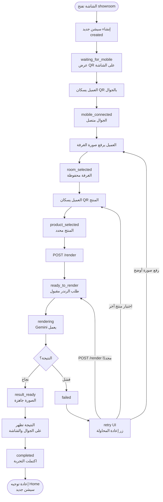

---

## 2. رحلة النجاح الكاملة

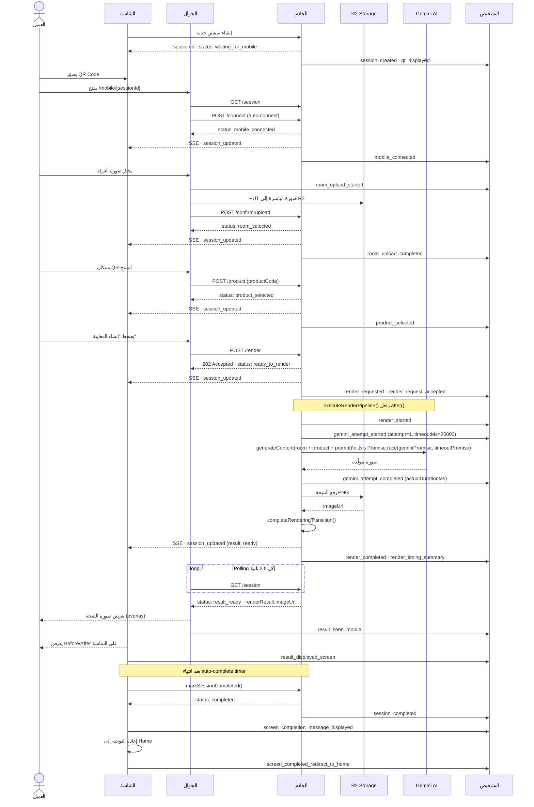

---

## 3. رحلة فشل رفع صورة الغرفة

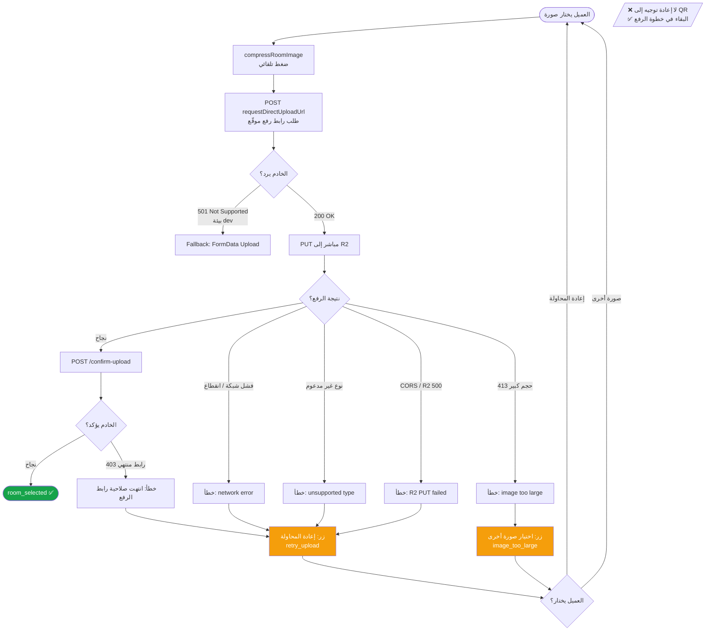

---

## 4. رحلة فشل QR المنتج / اختيار المنتج

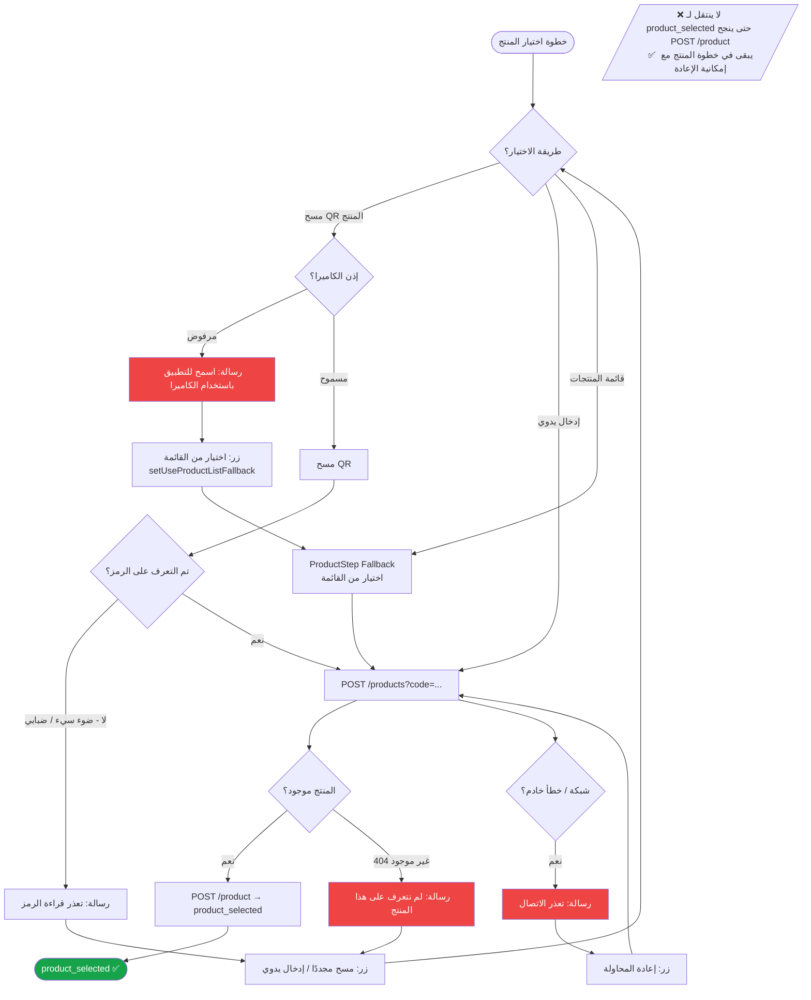

---

## 5. رحلة الرندر الناجح

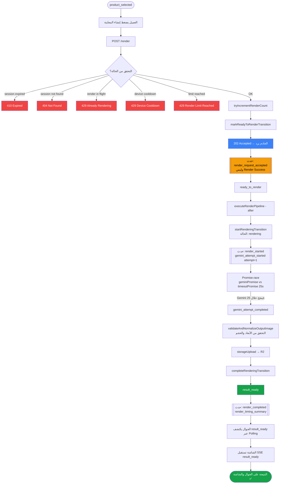

---

## 6. رحلة فشل الرندر

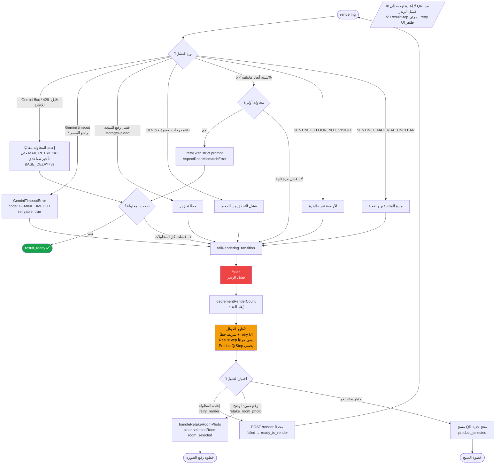

---

## 7. رحلة Gemini Timeout

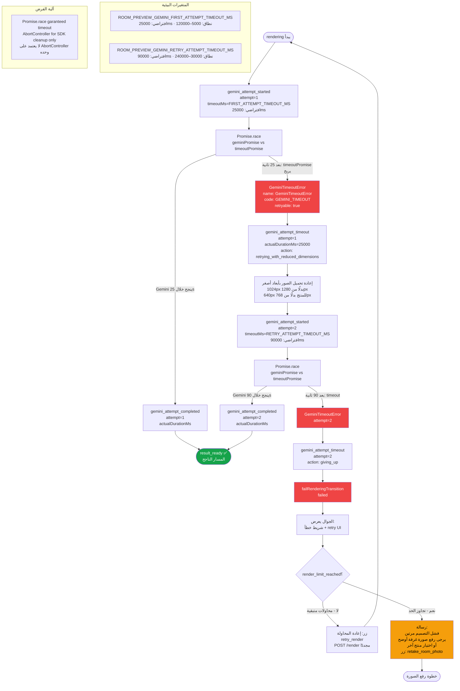

---

## 8. رحلة Hedged Rendering المقترحة

> **ملاحظة:** هذا تصميم مقترح لتحسين مستقبلي، غير مُطبَّق حاليًا.
> الهدف: تقليل وقت الانتظار بتشغيل محاولتين متوازيتين، الأولى تفوز.

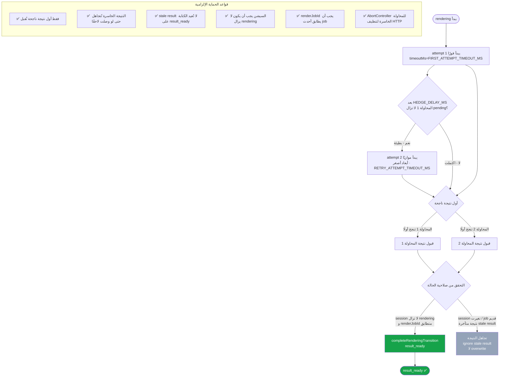

---

## 9. رحلة انتهاء السيشن (Expired)

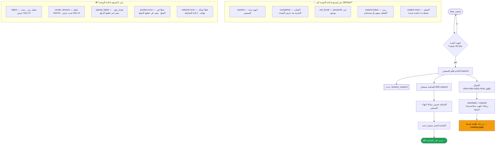

---

## 10. رحلة فشل الاتصال SSE / Realtime

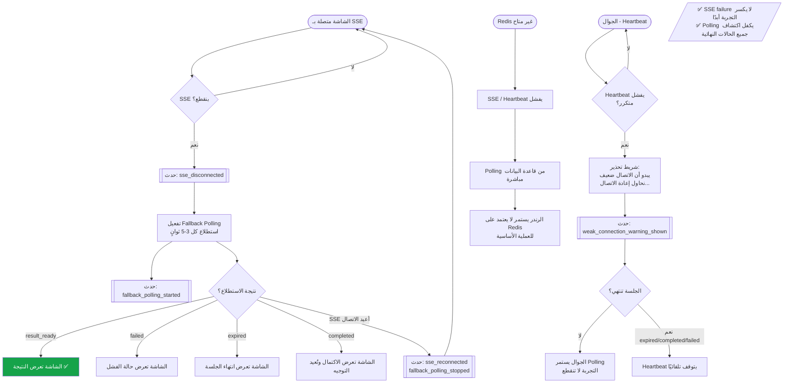

---

## 11. رحلة Back Button / Reload

```mermaid
flowchart TD
    subgraph BACK [Back Button — زر الرجوع]
        A([العميل يضغط Back]) --> B[popstate handler يعترض الحدث]
        B --> C[window.history.pushState — إعادة تثبيت guard]
        C --> D[[حدث: back_pressed]]
        D --> E[fetchRoomPreviewSession\nجلب أحدث حالة للسيشن]
        E --> F{حالة السيشن؟}
        F -->|expired / completed| G[viewState = expired\nرسالة انتهاء الصلاحية]
        F -->|failed| H[viewState = ready\nrecovery = retry_render\nزر إعادة المحاولة]
        F -->|result_ready| I[viewState = ready\nshowResult = true\nعرض النتيجة]
        F -->|product_selected أو غيرها| J[viewState = ready\nخطوة المنتج / الرندر]
        F -->|خطأ شبكة| K[البقاء في الحالة الحالية بصمت]
        G --> L[رسالة مؤقتة:\nأعدناك إلى الخطوة الصحيحة]
        H --> L
        I --> L
        J --> L
    end

    subgraph RELOAD [إعادة تحميل الصفحة]
        M([العميل يُعيد تحميل الصفحة]) --> N[SSR: gate check]
        N -->|gate_ok cookie موجود| O[يدخل مباشرة بدون إعادة فحص]
        N -->|cookie غير موجود| P[إعادة توجيه إلى gate]
        O --> Q[loadSession\nجلب السيشن]
        Q --> R[auto-connect إذا لزم]
        R --> S{حالة السيشن؟}
        S -->|نشط| T[viewState = ready\nخطوة المناسبة]
        S -->|failed| U[viewState = ready\nretry UI مرئي]
        S -->|expired| V[viewState = expired]
        T --> W[[حدث: mobile_rapid_reload_detected\nإذا تكررت الإعادة]]
    end

    subgraph HIDDEN [الصفحة مخفية - Page Hidden]
        X([تطبيق يذهب للخلفية]) --> Y[[حدث: mobile_page_hidden]]
        Y --> Z[Polling يُبطّئ ×4 للبطارية]
        Z --> AA([العميل يعود])
        AA --> BB[[حدث: mobile_page_visible]]
        BB --> CC[Polling يعود لسرعته الطبيعية]
        CC --> DD[sendBeacon: mobile_pagehide]
    end

    style H fill:#f59e0b,color:#000
    style U fill:#f59e0b,color:#000
    note1[/"❌ Back بعد فشل الرندر لا يُعيد المستخدم إلى QR أبدًا"/]
```

---

## 12. خريطة State Machine الكاملة

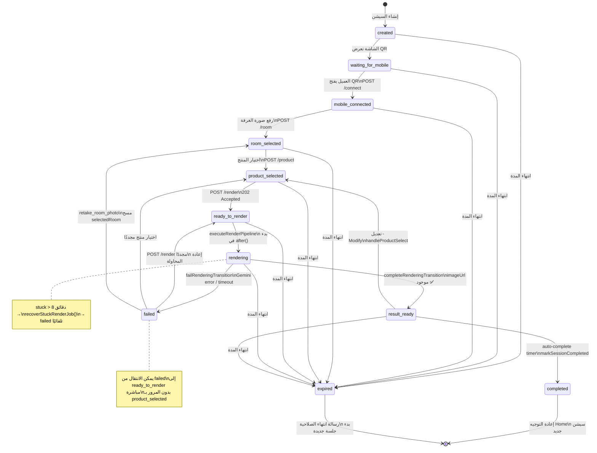

---

## 13. خريطة قرارات Redirect إلى QR/Start

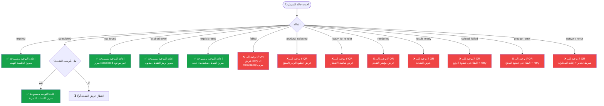

---

## 14. Checklist سريع — قواعد لا تُكسر

```mermaid
flowchart LR
    subgraph RULES [قواعد النظام الصارمة]
        direction TB
        R1["❌ لا QR بعد failed render\nshould​ShowProductQrStep يشترط status ≠ failed"]
        R2["❌ لا Render Completed بدون result_ready + outputImageUrl\ncompleteRenderingTransition فقط مع imageUrl صالح"]
        R3["❌ لا Render Success عند 202 Accepted\nالحدث الصحيح: render_request_accepted فقط"]
        R4["❌ لا rendering للأبد\n> 8 دقائق → recoverStuckRenderJob() → failed"]
        R5["✅ Timeout ظاهر في diagnostics\ngemini_attempt_timeout مع: attempt · timeoutMs · actualDurationMs"]
        R6["✅ Late Gemini result يُتجاهل\nstale result لا تُعيد الكتابة على result_ready"]
        R7["✅ Retry UI يظهر بعد كل فشل\nResultStep مرئي · recoveryMessage ≠ null"]
        R8["✅ Fallback Polling عند انقطاع SSE\nلا تتوقف التحديثات أبدًا"]
        R9["✅ Back button يُعيد للخطوة الصحيحة\nfailed → ready + retry_render · لا SessionStatePanel"]
        R10["✅ Gate check مرة واحدة فقط\nSSR + cookie gate_ok_{sessionId}"]
    end
```

---

*خرائط Mermaid — Room Preview — 2026-05-27 — مبنية على `j.md`*
